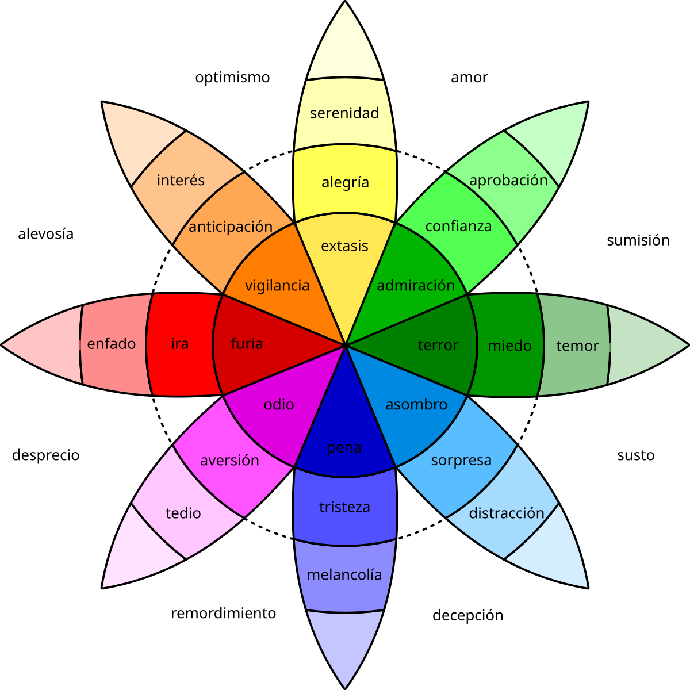

En el presente cuaderno se busca documentar el análisis técnico expuesto en el paper. Para replicar el análisis aquí presente es necesario:

**Primero**, las siguientes librerías

```{r message=FALSE, warning=FALSE}
# ===============================
# 📂 LECTURA Y ESCRITURA DE DATOS
# ===============================
library(readxl)       # Lectura de archivos Excel (.xls, .xlsx)
library(readr)        # Lectura rápida de archivos CSV o texto
library(data.table)   # Lectura y manipulación eficiente de grandes bases de datos
library(openxlsx)     # Exportar o escribir datos a Excel
library(RSocrata)     # Descargar datos desde portales data.gov
library(writexl)      # Exportar data frames a Excel
library(base)         # Funciones básicas de R

# =====================================
# 🧮 MANIPULACIÓN Y TRANSFORMACIÓN DE DATOS
# =====================================
library(dplyr)        # Filtrado, selección, agrupación y resumen de datos
library(tidyr)        # Reorganización y limpieza de datos
library(purrr)        # Aplicación funcional de operaciones sobre listas o columnas
library(stringr)      # Manipulación de cadenas de texto
library(lubridate)    # Manejo y transformación de fechas y horas
library(tibble)       # Data frames mejorados y más consistentes
library(stringi)      # Procesamiento avanzado de texto y codificación
library(Matrix)       # Manejo de matrices grandes o dispersas

# ==========================
# 📊 VISUALIZACIÓN DE DATOS
# ==========================
library(ggplot2)      # Gráficos estáticos de alta calidad
library(ggrepel)      # Etiquetas sin superposición en gráficos ggplot2
library(plotly)       # Gráficos interactivos (zoom, hover, etc.)
library(treemap)      # Diagramas de árbol proporcionales (treemaps)
library(treemapify)   # Extensión para crear treemaps con ggplot2
library(GGally)       # Gráficos de pares y extensiones de ggplot2
library(gridExtra)    # Organización de múltiples gráficos en una figura
library(scales)       # Formatos de escalas y etiquetas en gráficos
library(scatterplot3d)# Visualización 3D de puntos
library(patchwork)    # Unir varios gráficos ggplot2 fácilmente
library(ggcorrplot)   # Visualización de matrices de correlación
library(ggdendro)     # Dendrogramas basados en ggplot2
library(ggraph)       # Visualización de redes o grafos con estilo ggplot2

# ================================
# 🧠 MODELADO Y ANÁLISIS ESTADÍSTICO
# ================================
library(randomForest) # Modelos de bosques aleatorios (clasificación/regresión)
library(stats)        # Funciones estadísticas básicas
library(cluster)      # Algoritmos de clustering (k-means, jerárquico, etc.)
library(factoextra)   # Visualización de PCA, clustering, etc.
library(clusterCrit)  # Evaluación de calidad de clusters (Calinski-Harabasz)
library(bestNormalize)# Normalizaciones robustas
library(rpart)        # Modelos de árbol de decisión
library(rpart.plot)   # Visualización de árboles de decisión
library(ca)           # Análisis de correspondencias

# =====================
# 🗺️ DATOS GEOGRÁFICOS
# =====================
library(sf)           # Manejo, análisis y visualización de datos espaciales

# ===========================
# 🧾 TABLAS Y REPORTES
# ===========================
library(DT)           # Tablas interactivas tipo DataTables (HTML)
library(formattable)  # Formato condicional para tablas
library(flextable)    # Tablas personalizadas para reportes Word/HTML
library(skimr)        # Resumen estadístico rápido de los datos

# ===========================
# 🔤 ANÁLISIS DE TEXTO
# ===========================
library(quanteda)              # Procesamiento de lenguaje natural (corpus, tokens)
library(quanteda.textmodels)   # Modelos estadísticos de texto (Wordfish, etc.)
library(quanteda.textstats)    # Estadísticas de texto (frecuencias, similitud, etc.)
library(quanteda.textplots)    # Visualización de análisis de texto
library(igraph)                # Creación y análisis de redes o grafos (coocurrencia, relaciones)
library(ggraph)                # Visualización de grafos con ggplot2

# ===========================
# 🎯 PAQUETES COMPLEMENTARIOS
# ===========================
library(tidyverse)    # Conjunto de librerías para ciencia de datos en R (incluye ggplot2, dplyr, tidyr, readr, etc.)
library(rlang)        # Soporte de programación y manejo de expresiones en tidyverse


# Otras librerias
# ==== 1) Librerías ====
library(readxl)
library(spacyr)
library(quanteda)
library(igraph)
library(ggraph)
library(Matrix)
library(dplyr)
library(stringr)
library(visNetwork)
library(dplyr)

# Cambiar la opción de impresión para evitar notación científica
options(scipen = 999)

```

# 1) Analisis datos hurtos en Bogota

La localidad de Sumapaz se excluye de las estadísticas y mapas de seguridad de la Secretaría Distrital de Seguridad porque es una zona completamente rural, con muy baja densidad poblacional y sin integración directa con el entorno urbano de Bogotá, lo que la hace no comparable con las otras 19 localidades que sí presentan dinámicas urbanas activas y concentraciones de población donde se focalizan los fenómenos de seguridad y convivencia ciudadana. Los datos son obtenidos de la paguina: <https://scj.gov.co/es/oficina-oaiee/estadisticas-mapas>

## 1.1) Importar y acomodar los datos

En este punto, vamos a acomodar los datos de tal forma que sea lo mas optimo para modelo de agrupación

**Primero**, importamos datos

```{r}
hurtos_personas_localidades <- read_excel("BASES DE DATOS/Hurtos/hurtos_localidades.xlsx", 
    sheet = "hurtos_personas")

hurtos_residencias_localidades <- read_excel("BASES DE DATOS/Hurtos/hurtos_localidades.xlsx", 
    sheet = "hurtos_residencias")


hurtos_motocicletas_localidades <- read_excel("BASES DE DATOS/Hurtos/hurtos_localidades.xlsx", 
    sheet = "hurtos_motocicletas")
```

**Segundo**, sacamos estadisticas descriptivas

```{r}
# Calcular estadísticos por hurto a personas
hurtos_personas_stats <- hurtos_personas_localidades %>%  # Tomamos df original
  rowwise() %>% #Aplicar a todas las filas
  mutate(
    media_personas = mean(c_across(`2024_01`:`2024_10`), na.rm = TRUE),
    mediana_personas = median(c_across(`2024_01`:`2024_10`), na.rm = TRUE),
    desviacion_personas = sd(c_across(`2024_01`:`2024_10`), na.rm = TRUE),
    minimo_personas = min(c_across(`2024_01`:`2024_10`), na.rm = TRUE),
    maximo_personas = max(c_across(`2024_01`:`2024_10`), na.rm = TRUE)
  ) %>%
  ungroup() %>%
  select(Localidad,media_personas,mediana_personas,desviacion_personas,minimo_personas,maximo_personas)


# Calcular estadísticos por hurto a motocicletas
hurtos_motocicletas_stats <- hurtos_motocicletas_localidades %>%  # Tomamos df original
  rowwise() %>% #Aplicar a todas las filas
  mutate(
    media_motocicletas = mean(c_across(`2024_01`:`2024_10`), na.rm = TRUE),
    mediana_motocicletas = median(c_across(`2024_01`:`2024_10`), na.rm = TRUE),
    desviacion_motocicletas = sd(c_across(`2024_01`:`2024_10`), na.rm = TRUE),
    minimo_motocicletas = min(c_across(`2024_01`:`2024_10`), na.rm = TRUE),
    maximo_motocicletas = max(c_across(`2024_01`:`2024_10`), na.rm = TRUE)
  ) %>%
  ungroup() %>%
  select(Localidad,media_motocicletas,mediana_motocicletas,desviacion_motocicletas,minimo_motocicletas,maximo_motocicletas)
  

# Calculas estadisticas para hurto residencias
hurtos_residencias_stats <- hurtos_residencias_localidades %>%  # Tomamos df original
  rowwise() %>% #Aplicar a todas las filas
  mutate(
    media_residencias = mean(c_across(`2024_01`:`2024_10`), na.rm = TRUE),
    mediana_residencias = median(c_across(`2024_01`:`2024_10`), na.rm = TRUE),
    desviacion_residencias = sd(c_across(`2024_01`:`2024_10`), na.rm = TRUE),
    minimo_residencias = min(c_across(`2024_01`:`2024_10`), na.rm = TRUE),
    maximo_residencias = max(c_across(`2024_01`:`2024_10`), na.rm = TRUE)
  ) %>%
  ungroup() %>%
  select(Localidad,media_residencias,mediana_residencias,desviacion_residencias,minimo_residencias,maximo_residencias)


```

**Tercero**, cruzamos los datos mediante las localidades

```{r}

# Cruzamos los datos mediante las localidades
Datos_cruzados_hurtos <- hurtos_personas_stats %>% 
  left_join(hurtos_motocicletas_stats, by="Localidad") %>% 
  left_join(hurtos_residencias_stats, by= "Localidad")

# Vemos el resultado
head(Datos_cruzados_hurtos)

```

## 1.2) Transformacion de los datos

**Primero**, validamos la multicolinealidad de las variables mediante una matriz de correlaciones

```{r fig.height=10, fig.width=10}
Datos_cruzados_hurtos_numerica <- Datos_cruzados_hurtos %>% select(-Localidad)

# Calcular la matriz de correlación
cor_matrix <- cor(Datos_cruzados_hurtos_numerica)

# Crear la gráfica de la matriz de correlación
ggcorrplot(cor_matrix, 
           method = "circle", 
           type = "lower", 
           lab = TRUE, 
           title = "Matriz de Correlación")
```

**Segundo**, aplicamos una tranformacion lineal para evitar la correlación

```{r fig.height=10, fig.width=10}
# Aplicar PCA
pca_result <- princomp(Datos_cruzados_hurtos_numerica)

# Resumen PCA:
get_eigenvalue(pca_result)


# Vemos cuales son los dimensiones cuyo valor de 
fviz_eig(pca_result,choice = c("eigenvalue"), addlabels =  T)


# Grafico de individuos
fviz_pca_ind(pca_result, geom.ind = "point", pointshape = 21, 
             pointsize = 2, fill.ind = "blue", col.ind = "black") +
  labs(title = "Visualización de PCA", x = "PC1", y = "PC2")


# Grafico de variables
fviz_pca_var(pca_result, geom.ind = "point", pointshape = 21, 
             pointsize = 2, fill.ind = "blue", col.ind = "black") +
  labs(title = "Visualización de PCA", x = "PC1", y = "PC2")


# Seleccionar componentes principales que tiene un eginvalue mayor que 1
pca_data <- as.data.frame(pca_result$scores[, 1:11])

# Validamos nuevamente la correlacion
# Calcular la matriz de correlación
cor_matrix_pca <- cor(pca_data)

# Crear la gráfica de la matriz de correlación
ggcorrplot(cor_matrix_pca, 
           method = "circle", 
           type = "lower", 
           lab = TRUE, 
           title = "Matriz de Correlación")
```

## 1.3) Modelamos los datos con K-means

**Primero**, determinamos el numero de clusters

```{r}
# Metodo del codo
set.seed(123)
fviz_nbclust(pca_data, kmeans, method = "wss", k.max = 10) +
  labs(title = "Método del Codo para determinar k óptimo")

#Metodo de silueta
set.seed(123)
fviz_nbclust(pca_data, kmeans, method = "silhouette", k.max = 10) +
  labs(title = "Método de la Silueta para determinar k óptimo con K-means")


```

**Segundo**, aplicamos modelo y evaluemos

```{r}
# Aplicar clustering (K-means)
set.seed(123)
kmeans_result <- kmeans(pca_data, # Tomamos todos los datos menos el ID
                           centers = 2, # Indicamos que son 2 centroides
                           nstart = 1000, # Numero diferente de inicializaciones
                           algorithm = "Hartigan-Wong", # Indicamos tipo de algoritmo para el modelo
                           iter.max  = 300) # Numero diferente iteraciones en inicializaciones

# Evaluacion metrica modelo establecido

# Calcular el valor de la silueta
dist_matrix <- dist(pca_data)
sil <- silhouette(kmeans_result$cluster, dist_matrix)

# Mostrar resumen del valor promedio de la silueta
summary(sil)
```

**Tercero**, Evaluacion grafica

```{r fig.height=12, fig.width=15, message=FALSE, warning=FALSE}
# Agregar los clusters al dataframe
Datos_cruzados_hurtos_clusters <-  pca_data
Datos_cruzados_hurtos_clusters$cluste_kmeans <- as.factor(kmeans_result$cluster)

# Calcular los polígonos (envolventes convexas) por cluste_kmeans
hull_data <- Datos_cruzados_hurtos_clusters %>%
  group_by(cluste_kmeans) %>%
  slice(chull(Comp.1, Comp.2))

# Graficar puntos y polígonos
ggplot(Datos_cruzados_hurtos_clusters, aes(x = Comp.1, y = Comp.2, color = cluste_kmeans)) +
  geom_point(size = 3, alpha = 0.8) +
  geom_polygon(data = hull_data, aes(fill = cluste_kmeans), alpha = 0.2, color = NA) +
  labs(title = "Clusters PAM con polígonos sobre componentes principales",
       x = "Componente Principal 1",
       y = "Componente Principal 2",
       color = "Cluster", fill = "Cluster") +
  theme_minimal() +
  scale_color_brewer(palette = "Set1") +
  scale_fill_brewer(palette = "Set1")
```

Grafico en 3d

```{r fig.height=10, fig.width=10, message=FALSE, warning=FALSE}
library(plotly)
library(dplyr)
library(RColorBrewer)

# 1. Crear dataset con los clusters
Datos_cruzados_hurtos_clusters <- pca_data %>%
  mutate(cluste_kmeans = as.factor(kmeans_result$cluster))

# 2. Calcular envolventes convexas por clúster (en 2D, sobre Comp.1 y Comp.2)
hull_data <- Datos_cruzados_hurtos_clusters %>%
  group_by(cluste_kmeans) %>%
  slice(chull(Comp.1, Comp.2))

# 3. Crear gráfico interactivo 3D
fig <- plot_ly()

# Agregar puntos en 3D
fig <- fig %>%
  add_trace(
    data = Datos_cruzados_hurtos_clusters,
    x = ~Comp.1, y = ~Comp.2, z = ~Comp.3,
    type = 'scatter3d',
    mode = 'markers',
    color = ~cluste_kmeans,
    colors = "Set1",
    marker = list(size = 4),
    text = ~paste("Cluster:", cluste_kmeans),
    hoverinfo = "text"
  )

# Agregar polígonos (envolventes planas) por clúster
for (clus in unique(hull_data$cluste_kmeans)) {
  grupo <- hull_data %>% filter(cluste_kmeans == clus)
  color_rgba <- toRGB(brewer.pal(n = 8, "Set1")[as.integer(clus)], alpha = 0.2)
  
  fig <- fig %>%
    add_trace(
      x = c(grupo$Comp.1, grupo$Comp.1[1]),
      y = c(grupo$Comp.2, grupo$Comp.2[1]),
      z = rep(mean(Datos_cruzados_hurtos_clusters$Comp.3), nrow(grupo) + 1),
      type = "scatter3d",
      mode = "lines",
      fill = "toself",
      fillcolor = color_rgba,
      line = list(color = 'transparent'),
      showlegend = FALSE,
      hoverinfo = "none"
    )
}

# Título y ejes
fig <- fig %>%
  layout(
    title = "Clusters PAM con envolventes convexas (3D - Componentes Principales)",
    scene = list(
      xaxis = list(title = "Componente 1"),
      yaxis = list(title = "Componente 2"),
      zaxis = list(title = "Componente 3")
    )
  )

fig

```

## 1.4 Vemos resultados en terminos de las variables

**Primero**, Como se comportan las localidades en terminos de los hurtos (Sin segmento)

```{r}
library(dplyr)
library(scatterplot3d)

# Calcular promedio por localidad para cada tipo de hurto
prom_personas <- hurtos_personas_localidades %>%
  rowwise() %>%
  mutate(Promedio = mean(c_across(starts_with("2024_")))) %>%
  select(Localidad, Promedio)

prom_residencias <- hurtos_residencias_localidades %>%
  rowwise() %>%
  mutate(Promedio = mean(c_across(starts_with("2024_")))) %>%
  select(Localidad, Promedio)

prom_motos <- hurtos_motocicletas_localidades %>%
  rowwise() %>%
  mutate(Promedio = mean(c_across(starts_with("2024_")))) %>%
  select(Localidad, Promedio)

# Unir todo en un solo dataset
hurtos_3d <- prom_personas %>%
  rename(Personas = Promedio) %>%
  left_join(prom_residencias %>% rename(Residencias = Promedio), by = "Localidad") %>%
  left_join(prom_motos %>% rename(Motocicletas = Promedio), by = "Localidad")

# Gráfico 3D
s3d <- scatterplot3d(
  hurtos_3d$Personas,
  hurtos_3d$Residencias,
  hurtos_3d$Motocicletas,
  pch = 19,
  color = "blue",
  main = "Promedio mensual de hurtos en 2024 por localidad",
  xlab = "Hurtos a Personas",
  ylab = "Hurtos a Residencias",
  zlab = "Hurtos a Motocicletas"
)

# Añadir etiquetas de localidades
text(s3d$xyz.convert(hurtos_3d$Personas,
                     hurtos_3d$Residencias,
                     hurtos_3d$Motocicletas),
     labels = hurtos_3d$Localidad,
     pos = 4, cex = 0.7)


# Gráfico interactivo con plotly
plot_ly(
  hurtos_3d,
  x = ~Personas,
  y = ~Residencias,
  z = ~Motocicletas,
  text = ~Localidad,
  type = "scatter3d",
  mode = "markers",
  marker = list(size = 6, color = ~Personas, colorscale = "Viridis", opacity = 0.8)
) %>%
  layout(
    scene = list(
      xaxis = list(title = "Hurtos a Personas"),
      yaxis = list(title = "Hurtos a Residencias"),
      zaxis = list(title = "Hurtos a Motocicletas")
    ),
    title = "Promedio mensual de hurtos en 2024 por localidad"
  )


```

**Segundo**, Como se comportan las localidades en terminos de los hurtos (Con segmento)

```{r}

Datos_cruzados_hurtos$Segmento <- kmeans_result$cluster

hurtos_3d$Segmento <- kmeans_result$cluster


library(scatterplot3d)

# Asignar colores según segmento
colors <- ifelse(hurtos_3d$Segmento == 1, "red", "blue")

# Gráfico 3D
s3d <- scatterplot3d(
  hurtos_3d$Personas,
  hurtos_3d$Residencias,
  hurtos_3d$Motocicletas,
  pch = 19,
  color = colors,
  main = "Promedio mensual de hurtos por localidad (segmentos)",
  xlab = "Hurtos a Personas",
  ylab = "Hurtos a Residencias",
  zlab = "Hurtos a Motocicletas"
)

# Añadir etiquetas de localidades
text(s3d$xyz.convert(hurtos_3d$Personas,
                     hurtos_3d$Residencias,
                     hurtos_3d$Motocicletas),
     labels = hurtos_3d$Localidad,
     pos = 4, cex = 0.7)

# Leyenda
legend("topright", legend = c("Segmento 1", "Segmento 2"),
       col = c("red", "blue"), pch = 19)


library(plotly)

plot_ly(
  hurtos_3d,
  x = ~Personas,
  y = ~Residencias,
  z = ~Motocicletas,
  color = ~as.factor(Segmento),   # Diferenciar por segmento
  colors = c("red", "blue"),
  text = ~paste("Localidad:", Localidad,
                "<br>Personas:", round(Personas,1),
                "<br>Residencias:", round(Residencias,1),
                "<br>Motocicletas:", round(Motocicletas,1),
                "<br>Segmento:", Segmento),
  type = "scatter3d",
  mode = "markers",
  marker = list(size = 6, opacity = 0.8)
) %>%
  layout(
    scene = list(
      xaxis = list(title = "Hurtos a Personas"),
      yaxis = list(title = "Hurtos a Residencias"),
      zaxis = list(title = "Hurtos a Motocicletas")
    ),
    legend = list(title = list(text = "Segmento")),
    title = "Promedio mensual de hurtos por localidad (segmentos)"
  )


```

**Tercero**, entendemos con un arbol de decision

```{r}

library(rpart)
library(rpart.plot)

# Ajustar árbol de decisión
arbol <- rpart(
  Segmento ~ .,
  data = Datos_cruzados_hurtos %>% select(-Localidad), # quitamos Localidad (categórica nominal)
  method = "class",   # porque Segmento es categórico
  control = rpart.control(cp = 0.01, minsplit = 2)
)


rpart.plot(
  arbol,
  type = 4,          # cajas horizontales más claras
  extra = 104,       # muestra clase, % y número de casos
  under = TRUE,      # pone info debajo del nodo
  faclen = 0,        # no recorta nombres de variables
  cex = 0.9,         # tamaño del texto
  main = "Árbol de decisión - Segmento de hurtos"
)
```

## 1.4) Mapas de calor por localidad

**Primero**, comparamos niveles de hurto promedio

```{r fig.height=12, fig.width=15, message=FALSE, warning=FALSE}
#Importamos la tabla maestra de los codigos de las localidades
Codigo_Localidades <- read_excel("BASES DE DATOS/Complementos greograficos/Codigo_Localidades.xlsx")


# Acomodamos datos de hurtos promedio por localidad
Datos_cruzados_hurtos_promedio <- Datos_cruzados_hurtos %>% 
  select(Localidad,media_personas,media_motocicletas,media_residencias) %>% 
  left_join(Codigo_Localidades,by="Localidad")


# Cargar el shapefile
shapefile_path <- "~/Library/Mobile Documents/com~apple~CloudDocs/Investigacion/Semillero OIKOS/OIKOS/Percepcion de seguridad/Programacion/BASES DE DATOS/Complementos greograficos/Loca.shp"
localidades <- st_read(shapefile_path)

# Unir shapefile con los promedios por localidad
df_mapas_comparativos <- localidades %>%
  left_join(Datos_cruzados_hurtos_promedio, by = "LocCodigo")

# Mapa 1: Hurtos a personas
mapa_personas <- ggplot(df_mapas_comparativos) +
  geom_sf(aes(fill = media_personas)) +
  scale_fill_gradient(low = "yellow", high = "red", na.value = "grey50") +
  theme_minimal() +
  labs(title = "Hurtos a Personas", fill = "Promedio")

# Mapa 2: Hurtos a motocicletas
mapa_motos <- ggplot(df_mapas_comparativos) +
  geom_sf(aes(fill = media_motocicletas)) +
  scale_fill_gradient(low = "yellow", high = "red", na.value = "grey50") +
  theme_minimal() +
  labs(title = "Hurtos a Motocicletas", fill = "Promedio")

# Mapa 3: Hurtos a residencias
mapa_residencias <- ggplot(df_mapas_comparativos) +
  geom_sf(aes(fill = media_residencias)) +
  scale_fill_gradient(low = "yellow", high = "red", na.value = "grey50") +
  theme_minimal() +
  labs(title = "Hurtos a Residencias", fill = "Promedio")

# Combinar los tres mapas uno al lado del otro
mapa_personas + mapa_motos + mapa_residencias +
  plot_layout(ncol = 3) +
  plot_annotation(title = "Comparativo de Promedio de Hurtos por Tipo y Localidad",
                  caption = "Fuente: SIEDCO")

```

**Segundo**, comparamos por niveles de semento

## 1.5) Comportamiento promedio por localidad segun tipo de hurto

```{r fig.height=15, fig.width=15, message=FALSE, warning=FALSE}

Datos_cruzados_hurtos_promedio$segmentos <- kmeans_result$cluster


library(ggplot2)
library(patchwork)
library(viridis)
library(ggplot2)
library(patchwork)
library(viridis)

# Unir shapefile con los datos segmentados
df_mapas_segmentos <- localidades %>%
  left_join(Datos_cruzados_hurtos_promedio, by = "LocCodigo")

# Rango común de escala
max_value <- max(df_mapas_segmentos$media_personas,
                 df_mapas_segmentos$media_motocicletas,
                 df_mapas_segmentos$media_residencias, na.rm = TRUE)

# Mapa personas separado por segmento
mapa_personas_seg <- ggplot(df_mapas_segmentos) +
  geom_sf(aes(fill = media_personas)) +
  scale_fill_viridis_c(option = "magma", direction = -1, limits = c(0, max_value)) +
  facet_wrap(~segmentos) +
  theme_minimal() +
  labs(title = "Hurtos a Personas por Segmento", fill = "Promedio")

# Mapa motos separado por segmento
mapa_motos_seg <- ggplot(df_mapas_segmentos) +
  geom_sf(aes(fill = media_motocicletas)) +
  scale_fill_viridis_c(option = "magma", direction = -1, limits = c(0, max_value)) +
  facet_wrap(~segmentos) +
  theme_minimal() +
  labs(title = "Hurtos a Motocicletas por Segmento", fill = "Promedio")

# Mapa residencias separado por segmento
mapa_residencias_seg <- ggplot(df_mapas_segmentos) +
  geom_sf(aes(fill = media_residencias)) +
  scale_fill_viridis_c(option = "magma", direction = -1, limits = c(0, max_value)) +
  facet_wrap(~segmentos) +
  theme_minimal() +
  labs(title = "Hurtos a Residencias por Segmento", fill = "Promedio")

# Combinar
(mapa_personas_seg | mapa_motos_seg | mapa_residencias_seg) +
  plot_annotation(title = "Comparativo de Promedio de Hurtos por Segmento y Tipo de Delito",
                  caption = "Fuente: SIEDCO")


# Otra opcion
mapa_segmentos <- ggplot(df_mapas_segmentos) +
  geom_sf(aes(fill = factor(segmentos))) +
  scale_fill_manual(values = c("steelblue", "tomato"), name = "Segmento") +
  theme_minimal() +
  labs(title = "Mapa de Segmentos según k-means")
mapa_segmentos

```

# 2) Analisis noticias Google News

Primero,  ajustamos librerías de Python y R, para poder trabajar con ambos de forma simultanea
```{r message=FALSE, warning=FALSE, paged.print=FALSE}

library(reticulate)


# 1. Usar comando "usethis::edit_r_environ()" para indicar 
# RETICULATE_PYTHON="/Users/juanjoseecheverry/Library/Mobile Documents/com~apple~CloudDocs/Python/Librerias/venv-311/bin/python"


# 2. Desde global option escoger el virtual enviroment:
# ~/Library/Mobile Documents/com~apple~CloudDocs/Python/Librerias/venv-311/bin/python3.11

# Usar el Python local
use_python(Sys.getenv("RETICULATE_PYTHON"), required = TRUE)


# Cambiar ruta de librerias
use_virtualenv("/Users/juanjoseecheverry/Library/Mobile Documents/com~apple~CloudDocs/Python/Librerias/venv-311", required = TRUE)

# Confirmar configuración
py_config()


# Instalar los paquetes de Python necesarios
# py_install(c(
#   "numpy",
#   "scipy",
#   "pandas",
#   "seaborn",
#   "matplotlib",
#   "plotly",
#   "scikit-learn",
#   "scikit-learn-extra",   # Para KMedoids
#   "imblearn",             # Para SMOTE y pipelines
#   "statsmodels",          # Modelos estadísticos
#   "factor-analyzer",      # Análisis factorial
#   "pydataset"             # Datasets de ejemplo
# ), pip = TRUE)

```


## 2.1) Librerias y datos necesarios

**Primero**, importar librerias

```{r message=FALSE, warning=FALSE}
options(scipen = 999)
suppressMessages({
      # Lectura y escritura de datos
      # ───────────────────────────────
      # Carga y escritura de datos
      # ───────────────────────────────
      library(data.table)
      library(openxlsx)
      library(readxl)
      library(writexl)
      
      # ───────────────────────────────
      # Ciencia de datos y manipulación
      # ───────────────────────────────
      library(bestNormalize)
      library(lubridate)
      library(skimr)
      library(tidyverse)
      
      # ───────────────────────────────
      # Visualización
      # ───────────────────────────────
      library(GGally)
      library(ggcorrplot)
      library(ggdendro)
      library(ggplot2)
      library(ggrepel)
      library(ggwordcloud)
      library(ggraph)
      library(gridExtra)
      library(patchwork)
      library(plotly)
      library(RColorBrewer)
      library(scales)
      library(scatterplot3d)
      library(treemap)
      library(treemapify)
      
      # ───────────────────────────────
      # Modelado y análisis
      # ───────────────────────────────
      library(ca)
      library(cluster)
      library(clusterCrit)
      library(factoextra)
      library(randomForest)
      library(rpart)
      library(rpart.plot)
      
      # ───────────────────────────────
      # Texto y lenguaje natural
      # ───────────────────────────────
      library(Matrix)
      library(quanteda)
      library(quanteda.textmodels)
      library(quanteda.textplots)
      library(quanteda.textstats)
      library(spacyr)
      library(stopwords)
      library(stringi)
      library(stringr)
      library(stm)
      library(syuzhet)
      library(tm)
      library(wordcloud)
      library(tidytext)
  
      # ───────────────────────────────
      # Redes y grafos
      # ───────────────────────────────
      library(igraph)
      library(visNetwork)
      library(tm)
      library(wordcloud)
      # ───────────────────────────────
      # Espacial y tabular
      # ───────────────────────────────
      library(DT)
      library(flextable)
      library(formattable)
      library(sf)
})

```

**Segundo**, importar datos
Importamos un archivo Excel que reunía diversas tablas de datos no estructurados provenientes de comentarios en línea. Integramos toda la información en un único conjunto y realizamos una estandarización de variables para unificar nombres y formatos. Luego, llevamos a cabo una pequeña limpieza de datos: transformamos la columna de fechas para separarla en mes, año y hora, corregimos valores faltantes o incoherentes, y ajustamos los nombres de usuarios inexistentes. Posteriormente, aplicamos un preprocesamiento de texto a los comentarios para eliminar acentos, mayúsculas, caracteres especiales, emojis, URLs, menciones y cualquier contenido entre paréntesis, llaves o comillas. Con esto, logramos depurar el texto y dejarlo preparado para futuros análisis.

```{r}
df_gn <- read_excel("~/Library/Mobile Documents/com~apple~CloudDocs/Investigacion/Semillero OIKOS/OIKOS/Percepcion de seguridad/Programacion/BASES DE DATOS/google news/NOTICIAS_LOCALIDADES_FINAL.xlsx")

```


## 2.2) Preparacion de los datos

### 2.2.1) Ajustes de la base

```{r}
df_usable <- df_gn %>% 
  select(-cuerpo,
         -enlace,
         -fuente,
         -localidad_en_texto)
```

Se decide eliminar el cuerpo de la noticia debido a que su contenido puede contener patrones lingüísticos, temáticos o de redacción que introducen sesgos en el modelo de análisis. Estos sesgos pueden provenir de la forma en que los medios presentan la información. Mantener este tipo de contenido podría distorsionar los resultados, haciendo que el modelo aprenda relaciones espurias o no representativas del fenómeno que realmente se busca estudiar. Por ello, se conserva únicamente la información relevante como el titular, la fuente, la fecha y otros metadatos, garantizando un análisis más neutral, equilibrado y centrado en los aspectos de interés del proyecto.

### 2.2.2) Limpieza de caracteres especiales


```{r}
# Detectar caracteres especiales 
detectar_caracteres_especiales <- function(texto) {
  stringr::str_detect(texto, "[^\\x00-\\x7F]")
}
```

Se crea una función específica para detectar caracteres especiales dentro del texto, con el objetivo de identificar y posteriormente eliminar o reemplazar aquellos símbolos que puedan interferir en el procesamiento y análisis de los datos.

```{r}
# Detectar en el dataframe caracteres especiales
df_charexp <- df_usable %>%
  mutate(
    tiene_especiales_titulo = detectar_caracteres_especiales(titulo),
    tiene_especiales_resumen = detectar_caracteres_especiales(resumen)
  )
head(df_charexp)
```

Detectar estos caracteres es un paso fundamental dentro del preprocesamiento, ya que su presencia puede alterar los resultados del análisis textual, afectar la tokenización o distorsionar el conteo de palabras y frecuencias.

```{r}
#Limpiar caracteres especiales 

df_usable <- df_usable %>%
  mutate(
    titulo = titulo %>%
      stri_trans_general("Latin-ASCII") %>%   # quitar tildes
      str_to_lower() %>%                      # lowercase
      str_replace_all("[\"'`´]", "") %>%      # quitar comillas de todo tipo
      str_replace_all("[^a-z0-9\\s]", " ") %>% # eliminar emojis y caracteres raros
      str_squish(),                           # eliminar espacios dobles
     
    resumen = resumen %>%
      stri_trans_general("Latin-ASCII") %>%
      str_to_lower() %>%
      str_replace_all("[\"'`´]", "") %>%
      str_replace_all("[^a-z0-9\\s]", " ") %>%
      str_squish(),

    localidad = localidad %>%
      stri_trans_general("Latin-ASCII") %>%
      str_to_lower() %>%
      str_replace_all("[\"'`´]", "") %>%
      str_replace_all("[^a-z0-9\\s]", " ") %>%
      str_squish()
  )

```

Para realizar la limpieza de los caracteres especiales detectados, se emplea la función `stri_trans_general()` del paquete stringi en R. Esta función permite transformar el texto de manera eficiente, eliminando acentos, tildes y otros caracteres no estándar que puedan generar inconsistencias en el análisis.

### 2.2.3) Concatenacion titulo y resumen

```{r}
df_clean_gn <- df_usable %>%
  mutate(cuerpo = str_c(titulo, resumen, sep = " ")) %>%
  select(-titulo, -resumen)
```

Para la construcción del modelo se opta por utilizar una concatenación del título y el resumen de cada noticia. Esta decisión se basa en que ambos elementos, aunque breves, concentran la información más relevante y representativa del contenido general del artículo. El título suele reflejar la idea principal o el enfoque mediático del texto, mientras que el resumen aporta contexto adicional, ampliando los detalles esenciales sin introducir el ruido o los sesgos que pueden encontrarse en el cuerpo completo de la noticia.

## 2.3) Algoritmo de Wordfish


Wordfish es un modelo estadístico no supervisado que posiciona documentos en una dimensión latente (ideológica o semántica) usando la frecuencia de palabras. Parte de que los textos reflejan posiciones subyacentes y modela las cuentas de palabras con una distribución Poisson. A diferencia de Wordscores, no requiere documentos previamente clasificados: detecta patrones por sí solo. Se usa comúnmente en ciencia política para ubicar discursos o manifiestos en ejes como izquierda–derecha, y también identifica qué palabras distinguen cada extremo, facilitando la interpretación.

```{r}
#Crear el corpus a partir de la concatenación del título y resumen
corpus_noticias <- corpus(df_clean_gn, text_field = "cuerpo")

# Crear tokens básicos
GoogleNewToken <- tokens(
  corpus_noticias,
  remove_numbers = TRUE,
  remove_symbols = TRUE
)
# Normalizar a minúsculas
GoogleNewToken <- tokens_tolower(GoogleNewToken)

# Ajuste de stopwords bilingües (ES)
GoogleNewToken <- tokens_remove(
  GoogleNewToken,
  pattern =  stopwords("es")
)
# Convertir a dfm
GoogleNew_dfm <- dfm(GoogleNewToken)

# Trim por cuantiles (5%–95%)
GoogleNew_dfm_trimmed <- dfm_trim(
  GoogleNew_dfm,
  min_docfreq  = 0.05,
  max_docfreq  = 0.95,
  docfreq_type = "quantile"
)
```

Esta matriz representa la frecuencia con la que cada palabra aparece en cada documento; sin embargo, en su estado inicial puede contener términos que distorsionen los resultados analíticos. Las palabras demasiado frecuentes como “noticia”, “día” o “gente” tienden a aparecer en casi todos los textos, por lo que no contribuyen a diferenciar entre ellos. Por otro lado, las palabras muy raras aquellas que aparecen solo en uno o dos documentos suelen corresponder a errores tipográficos, nombres propios o expresiones poco relevantes.

Para optimizar el análisis y mejorar la calidad del modelo, se realiza un proceso de filtrado del vocabulario mediante la `función dfm_trim()` del paquete **quanteda**. Este paso busca eliminar aquellas palabras que aparecen con demasiada o muy poca frecuencia dentro del corpus, ya que ambos extremos suelen aportar ruido o información poco discriminante.

Este comando indica que se conservarán únicamente las palabras que aparecen en entre el 5% y el 95% de los documentos. En otras palabras, se eliminan tanto los términos extremadamente infrecuentes como los que son demasiado comunes. El argumento `docfreq_type = "quantile"` especifica que los valores de `min_docfreq` y `max_docfreq` deben interpretarse como proporciones del total de documentos, no como números absolutos.

```{r}
# Eliminar documentos vacíos tras el trim
doc_sums <- rowSums(GoogleNew_dfm_trimmed)
GoogleNew_dfm_trimmed <- GoogleNew_dfm_trimmed[doc_sums > 0, ]
```

### 2.3.1) Preparamos el Modelo Worfish

```{r}
# Metadatos y utilidades
tit_gn<- docvars(GoogleNew_dfm_trimmed, "localidad")
doc_len_gn <- rowSums(GoogleNew_dfm_trimmed)               
len_cut_gn <- quantile(doc_len_gn, probs = 0.25, na.rm = TRUE)  
```

Extrae metadatos del corpus y calcula estadísticas básicas de longitud de los textos, permitiendo identificar documentos demasiado cortos o analizar la distribución del tamaño textual antes del modelado.


```{r}
pick_anchors_manual <- function(titles_vec, neg_title, pos_title) {
  neg_idx <- which(titles_vec == neg_title)
  pos_idx <- which(titles_vec == pos_title)
  if (length(neg_idx) == 0 || length(pos_idx) == 0) {
    stop("Algún título de anclaje no está presente tras el trim.")
  }
  list(neg = neg_idx[1], pos = pos_idx[1])
}

anchors_manual <- pick_anchors_manual(
  titles_vec = tit_gn,
  neg_title  = "los martires",
  pos_title  = "usaquen"
)
```

La función \texttt{pick\_anchors\_manual} recibe un vector de títulos (\texttt{titles\_vec}) y dos títulos específicos que funcionan como anclas, uno negativo (\texttt{neg\_title}) y uno positivo (\texttt{pos\_title}). Primero busca la posición de cada título en el vector mediante \texttt{which()}, obteniendo los índices donde coinciden exactamente. Luego verifica que ambos títulos estén presentes; si alguno no aparece después del preprocesamiento, la función se detiene y arroja un mensaje de error indicando que falta un ancla. Finalmente, retorna una lista con los índices del ancla negativa y positiva, tomando sólo el primer resultado en caso de que existan múltiples coincidencias. El objetivo principal es fijar manualmente referencias dentro del conjunto de datos para usarlas posteriormente en el análisis.


```{r}
# Automático por diccionario (riesgo vs positivo)
# Ajusta estas listas a tu corpus (puedes ampliarlas con bigramas compuestos que usaste)

# Diccionario de palabras asociadas al riesgo o inseguridad
dict_riesgo <- c(
  "robo", "robos", "asalto", "asaltos", "hurto", "hurtos", "estafa", "estafas",
  "inseguro", "peligroso", "peligrosa", "secuestro", "arma", "cuchillo",
  "crimen", "crímenes", "robar", "robado", "evitar", "sospechoso", "riesgo",
  "riesgos", "amenaza", "amenazas", "agresión", "carterista", "problema",
  "problemas", "conflicto", "conflictos", "incidente", "incidentes"
)

# Diccionario de palabras asociadas a la seguridad o experiencias positivas
dict_seguro <- c(
  "seguro", "segura", "seguros", "seguridad", "protegido", "protegida",
  "tranquilo", "tranquila", "policía", "protocolos", "ordenado", "fácil",
  "conveniente", "agradable", "recomendado", "recomiendo", "recomendada",
  "excelente", "bueno", "buena", "eficiente", "funciona", "funcionó", 
  "claro", "fluido", "satisfactorio"
)

dict <- dictionary(list(neg = dict_riesgo, pos = dict_seguro))

```

Se construyeron dos diccionarios léxicos en español con el propósito de identificar y cuantificar la presencia de vocabulario relacionado con la percepción de seguridad e inseguridad en los textos analizados. El primero, denominado `dict_riesgo`, agrupa palabras asociadas a situaciones de peligro, delito o desconfianza como robo, asalto, estafa, peligroso o amenaza—, mientras que el segundo, `dict_seguro`, reúne términos que reflejan experiencias positivas, tranquilidad o entornos seguros como seguro, tranquilo, protegido, agradable o eficiente. Estos diccionarios permiten analizar cómo se manifiestan las emociones y percepciones vinculadas a la seguridad dentro de los comentarios o noticias, facilitando la medición del tono de los textos.

```{r}
# Puntuar documentos con el diccionario (sin tocar rownames)
scores_df_gn <- convert(dfm_lookup(GoogleNew_dfm_trimmed, dictionary = dict),
                     to = "data.frame") %>%
  rename(docname = doc_id) %>%
  mutate(
    neg = replace_na(as.numeric(neg), 0),
    pos = replace_na(as.numeric(pos), 0)
  )
```

A través de funciones como `dfm_lookup()` del paquete quanteda, permite calcular la frecuencia o proporción de palabras pertenecientes a cada categoría, generando indicadores cuantitativos que pueden emplearse posteriormente en modelos de análisis de sentimiento, percepción o posicionamiento semántico como Wordfish.

```{r}

# Mapear docname 
docname_vec_gn <- docnames(GoogleNew_dfm_trimmed)
idx_map_gn     <- match(scores_df_gn$docname, docname_vec_gn)
if (any(is.na(idx_map_gn))) {
  stop("No se pudieron mapear algunos docname con docnames(DFM). Revisa 'docname' en scores_df.")
}
```

Este fragmento de código se utiliza para verificar y alinear los nombres de los documentos entre dos objetos distintos: el conjunto de resultados (`scores_df`) y la matriz documento-término (`GoogleNew_dfm_trimmed`). En primer lugar, se extraen los nombres de los documentos contenidos en la DFM mediante docnames(`GoogleNew_dfm_trimmed`) y se almacenan en el vector `docname_vec`. Luego, la función `match()` compara los nombres presentes en la columna docname del marco de datos scores_df con los de la DFM, generando un índice (idx_map) que indica la posición correspondiente de cada documento. Este paso es fundamental para asegurar que los resultados obtenidos como puntuaciones, clasificaciones o posiciones del modelo se vinculen correctamente con el texto original.

```{r}
scores_df_gn <- scores_df_gn %>%
  mutate(
    idx     = idx_map_gn,
    doc_len = doc_len_gn[idx],
    Titulo  = tit_gn[idx],
    # Score neto con suavizado para evitar división por 0
    net     = (pos - neg) / (doc_len_gn + 1)
  )

# Elegir extremos entre documentos suficientemente largos
cand_gn <- scores_df_gn %>% filter(doc_len >= len_cut_gn)
if (nrow(cand_gn) == 0) {
  warning("Ningún documento superó el percentil 25% de longitud. Se usa todo el conjunto.")
  cand_gn <- scores_df_gn
}

auto_neg_idx_gn <- cand_gn$idx[which.min(cand_gn$net)]
auto_pos_idx_gn <- cand_gn$idx[which.max(cand_gn$net)]

anchors_auto_gn <- list(neg = auto_neg_idx_gn, pos = auto_pos_idx_gn)
```

Para complementar la información de cada documento y seleccionar los anclajes de manera automática, se incorporaron al marco de datos \texttt{scores\_df} las variables de índice, longitud y título de cada texto. Además, se calculó un puntaje neto (\texttt{net}) obtenido a partir de la diferencia entre la frecuencia de palabras positivas y negativas, normalizada por la longitud del documento más una unidad, con el fin de evitar divisiones por cero. Posteriormente, se filtraron los documentos cuya longitud superara el percentil 25% (\texttt{len\_cut}), garantizando así que los anclajes provinieran de textos suficientemente extensos. En caso de que ningún documento cumpliera este requisito, se utilizó el conjunto completo como alternativa. Finalmente, se seleccionaron de forma automática los documentos con el puntaje neto más bajo y más alto como anclajes negativos y positivos, respectivamente, almacenándose sus índices en la lista \texttt{anchors\_auto}. Este procedimiento permite orientar el eje semántico del modelo, asegurando una representación equilibrada entre los extremos de percepción.

```{r}
# Usar automáticos por diccionario 
neg_anchor_gn <- anchors_auto_gn$neg
pos_anchor_gn <- anchors_auto_gn$pos

# Validación final
if (is.na(neg_anchor_gn) || is.na(pos_anchor_gn)) {
  stop("Los anclajes automáticos resultaron en NA. Considera usar la opción manual o revisar el diccionario.")
}

# Mensaje de diagnóstico
cat("Ancla NEG (idx):", neg_anchor_gn, " | Título:", tit_gn[neg_anchor_gn], " | doc_len:", doc_len_gn[neg_anchor_gn], "\n")
cat("Ancla POS (idx):", pos_anchor_gn, " | Título:", tit_gn[pos_anchor_gn], " | doc_len:", doc_len_gn[pos_anchor_gn], "\n")
```

Una vez identificados los valores extremos del puntaje neto, se asignaron los documentos correspondientes como anclajes negativos y positivos mediante las variables \texttt{neg\_anchor} y \texttt{pos\_anchor}. Estos anclajes representan los textos con las puntuaciones más bajas y más altas, respectivamente, sirviendo como referencias semánticas para el modelo. Posteriormente, se implementó una validación para asegurar que ambos anclajes fueran correctamente detectados; en caso contrario, el proceso se interrumpe y se recomienda realizar una selección manual o revisar los diccionarios empleados. Finalmente, se imprimió un mensaje de diagnóstico que permite visualizar los títulos y longitudes de los documentos seleccionados. En el ejemplo, el anclaje negativo corresponde a una noticia sobre una banda dedicada al hurto de vehículos, mientras que el anclaje positivo describe un barrio caracterizado por su tranquilidad y seguridad, confirmando así la coherencia del procedimiento de selección automática.

### 2.3.2) Aplicamos el Modelo Worfish

```{r}

# Ajuste de anclas

GoogleNew_dfm_grouped <- GoogleNew_dfm_trimmed %>%
  dfm_group(groups = docvars(GoogleNew_dfm_trimmed, "localidad")) %>%
  dfm_trim(min_docfreq = 2, min_termfreq = 5) %>%
  dfm_smooth(smoothing = 0.5)

# los nombres de los documentos ahora son las localidades
tit_gn_grouped <- docnames(GoogleNew_dfm_grouped)
tit_gn_grouped

anchors_manual_gn2 <- pick_anchors_manual(
  titles_vec = tit_gn_grouped,
  neg_title  = "chapinero",
  pos_title  = "candelaria"
)

neg_anchor_gn <- anchors_manual_gn2$neg
pos_anchor_gn <- anchors_manual_gn2$pos


wf_gn <- textmodel_wordfish(
  GoogleNew_dfm_grouped,
  dir = c(neg_anchor_gn, pos_anchor_gn)
)


df_wf_gn <- tibble(
  Localidad = tit_gn_grouped,
  theta  = wf_gn$theta,
  se     = wf_gn$se.theta,
  lower  = theta - 1.96*se,
  upper  = theta + 1.96*se
)

# Verificación de orientación con términos discriminantes
word_effects_gn <- tibble(
  term = featnames(GoogleNew_dfm_grouped),
  beta = wf_gn$beta,
  psi  = wf_gn$psi
)
top_pos_gn <- word_effects_gn %>% arrange(desc(beta)) %>% slice_head(n = 20)
top_neg_gn <- word_effects_gn %>% arrange(beta)      %>% slice_head(n = 20)

# Inspección rápida
head(df_wf_gn)
head(top_neg_gn)
head(top_pos_gn)
```

En esta etapa se aplicó el modelo Wordfish a la matriz de frecuencias ya depurada, utilizando los documentos seleccionados como puntos de anclaje para determinar la dirección del eje latente. Se estimaron los valores theta para cada título, junto con sus errores estándar e intervalos de confianza, lo que permitió ubicar semánticamente los hilos dentro de la dimensión revelada por el modelo. Asimismo, se obtuvieron los coeficientes beta de cada palabra, identificando los términos que mejor distinguen los extremos del eje y facilitando tanto la interpretación de los polos semánticos como la validación de la coherencia del modelo. Por último, se revisaron rápidamente los resultados para comprobar que las posiciones asignadas y los términos clave fueran consistentes con la estructura latente del corpus.


```{r}
df_wf_gn <- df_wf_gn %>%
  filter(!is.na(theta), !is.na(Localidad)) %>%  
  mutate(
    Localidad = as.character(Localidad),           
    Localidad = make.unique(Localidad)              
  )

# Graficar nuevamente
p_theta_gn <- ggplot(df_wf_gn, aes(x = theta, y = fct_reorder(Localidad, theta))) +
  geom_vline(xintercept = 0, linetype = "dashed", color = "gray60") +
  geom_linerange(aes(xmin = lower, xmax = upper), color = "gray50") +
  geom_point(size = 3, color = "steelblue") +
  theme_minimal(base_size = 12) +
  labs(
    title    = "Wordfish - GoogleNews",
    subtitle = "Posicionamiento semántico de las localidades",
    x        = "Theta (dimensión latente: negativo ↔ positivo)",
    y        = "Localidades"
  )

p_theta_gn
```

```{r}
# Gráfico de términos más discriminantes por extremo
plot_terms <- dplyr::bind_rows(
  top_neg_gn %>% dplyr::mutate(extremo = "Negativo (β < 0)"),
  top_pos_gn %>% dplyr::mutate(extremo = "Positivo (β > 0)")
) %>%
  group_by(extremo) %>%
  slice_head(n = 15) %>%
  ungroup()

p_terms <- ggplot(plot_terms, aes(x = reorder(term, beta), y = beta, fill = extremo)) +
  geom_col(show.legend = FALSE) +
  coord_flip() +
  facet_wrap(~extremo, scales = "free_y") +
  theme_minimal(base_size = 12) +
  labs(
    title = "Términos más discriminantes (β de Wordfish)",
    x     = "Término",
    y     = "β"
  )

print(p_terms)
```

En este paso se realizó la visualización de los términos más discriminantes identificados por el modelo Wordfish, agrupando y comparando las palabras con los coeficientes beta más altos y más bajos, correspondientes a los extremos positivo y negativo de la dimensión latente. Se construyó un gráfico de barras facetado que muestra, para cada extremo, los quince términos con mayor peso explicativo, permitiendo interpretar de manera clara cuáles palabras caracterizan los polos semánticos del corpus y facilitando la validación conceptual del eje detectado por el modelo.

## 2.4) Colocaciones 

### 2.4.1) Preparar texto y corpus

```{r}
# 1) Extraer vector de textos (por documento del corpus)
texts_coc <- as.character(corpus_noticias)

# 2) Limpieza robusta: URLs, emails, @menciones, #hashtags, emojis, acentos, espacios
texts_clean_coc <- texts_coc %>%
  str_replace_all("http[s]?://\\S+|www\\.\\S+", " ") %>%      # URLs
  str_replace_all("[A-Za-z0-9._%+-]+@[A-Za-z0-9.-]+\\.[A-Za-z]{2,}", " ") %>% # emails
  str_replace_all("@\\w+", " ") %>%                           # menciones
  str_replace_all("#\\w+", " ") %>%                           # hashtags
  str_replace_all("-\\s+", "") %>%                            # guiones por corte de línea
  str_replace_all("[\\p{Extended_Pictographic}]", " ") %>%    # emojis (si PCRE soporta)
  stri_trans_general("Latin-ASCII") %>%                       # quitar acentos (á->a)
  str_to_lower() %>%
  str_squish()

# 3) Construir corpus limpio
corp_coc <- corpus(texts_clean_coc)
```


En este fragmento de código se realiza la preparación de los textos para su análisis. Primero se extrae el vector de documentos del corpus original y luego se aplica un procedimiento de limpieza exhaustivo que remueve URLs, correos electrónicos, menciones (@), hashtags, saltos o guiones de línea, emojis y otros caracteres innecesarios. También se normaliza el contenido eliminando tildes, convirtiendo todo a minúsculas y reemplazando múltiples espacios por uno solo, con el objetivo de unificar el formato del texto. Finalmente, con los textos ya depurados, se genera un nuevo corpus limpio y listo para ser analizado.


```{r}
 # 1) Tokenización robusta 
toks_coc <- tokens(
  corp_coc,
  what = "word",
  remove_punct = TRUE,
  remove_symbols = TRUE,
  remove_numbers = FALSE,        # <- importante: mantener números (e.g., "parque 93")
  remove_separators = TRUE
) %>%
  tokens_tolower() %>%
  tokens_remove(pattern = c(stopwords("en"), stopwords("es"))) %>%
  tokens_select(min_nchar = 2) %>%
  tokens_keep(pattern = "^[[:alnum:]_]+$", valuetype = "regex")       # permitir letras, dígitos y "_"
```

Este bloque de código realiza una tokenización robusta del corpus corp_coc utilizando la librería quanteda. Primero divide el texto en palabras (tokens) y aplica filtros iniciales eliminando puntuación, símbolos y separadores, pero manteniendo los números para conservar referencias relevantes (por ejemplo, “parque 93”). Luego convierte todos los tokens a minúsculas y elimina las palabras vacías en español e inglés. Después descarta tokens demasiado cortos (menos de dos caracteres) para evitar ruido. Finalmente, conserva únicamente los tokens que coinciden con el patrón de caracteres alfanuméricos o guiones bajos, garantizando un conjunto limpio y estandarizado para análisis posteriores.

### 2.4.2) Calcular collocations (n-grams; por ejemplo bigrams)

**Primero**, Identificamos n-gramas

```{r}
min_count_bigram  <- 5
min_count_trigram <- 3

colloc_bi_lambda_coc <- textstat_collocations(
  toks_coc, size = 2, min_count = min_count_bigram, method = "lambda", tolower = FALSE
)

colloc_tri_lambda_coc <- textstat_collocations(
  toks_coc, size = 3, min_count = min_count_trigram, method = "lambda", tolower = FALSE
)

```

En esta etapa se identifican colocaciones, es decir, combinaciones de palabras que aparecen juntas con alta frecuencia y relevancia estadística dentro del corpus; para ello, se establecen umbrales mínimos de aparición (5 para bigramas y 3 para trigramas) y se aplica la función textstat_collocations de quanteda utilizando el método de “lambda”, lo que permite calcular asociaciones significativas sin alterar las mayúsculas originales; como resultado, se generan dos listas, una con bigramas y otra con trigramas, que representan las secuencias léxicas más relevantes y recurrentes del texto analizado.

**Segundo**, Métricas alternativas: PMI y t-score (bigrams)

```{r}
# Unigramas
dfm_uni_gn  <- dfm(toks_coc)
freq_uni_gn <- colSums(dfm_uni_gn)
N_uni_gn   <- sum(freq_uni_gn)

# Bigramas
toks_bi_gn  <- tokens_ngrams(toks_coc, n = 2)
dfm_bi_gn   <- dfm(toks_bi_gn)
freq_bi_gn  <- colSums(dfm_bi_gn)
N_bi_gn     <- sum(freq_bi_gn)

bi_terms_gn <- tibble(bigram = names(freq_bi_gn), f12 = as.numeric(freq_bi_gn)) %>%
  separate(bigram, into = c("w1","w2"), sep = "_", remove = FALSE) %>%
  mutate(
    f1   = as.numeric(freq_uni_gn[w1]),
    f2   = as.numeric(freq_uni_gn[w2]),
    p12  = f12 / pmax(N_bi_gn, 1),
    p1   = f1  / pmax(N_uni_gn, 1),
    p2   = f2  / pmax(N_uni_gn, 1),
    PMI  = log2( (p12 + 1e-12) / (p1 * p2 + 1e-12) ),
    E12  = (f1 * f2) / pmax(N_uni_gn, 1),
    t_score = (f12 - E12) / sqrt(pmax(f12, 1))
  )

colloc_bi_lambda_slim_gn <- colloc_bi_lambda_coc %>%
  transmute(bigram = gsub(" ", "_", collocation), count, lambda, z)

# Intersección robusta: lambda ∩ (PMI / t-score), con filtros mínimos
colloc_bi_robust_gn <- bi_terms_gn %>%
  inner_join(colloc_bi_lambda_slim_gn, by = "bigram") %>%
  filter(f12 >= min_count_bigram) %>%
  arrange(desc(lambda), desc(PMI), desc(t_score))

```

En este bloque se construyen y analizan unigramas y bigramas a partir de los tokens del corpus, primero generando sus matrices de frecuencias (dfm) y conteos totales, y luego creando un marco de datos con los bigramas y sus frecuencias relativas; a partir de estas, se calculan métricas de asociación como las probabilidades marginales, la medida de información mutua puntual (PMI), la frecuencia esperada (E12) y el t-score, que permiten evaluar la fuerza y relevancia de cada combinación de palabras; posteriormente, los resultados se cruzan con las colocaciones obtenidas mediante el método lambda, construyendo una intersección robusta que integra las dos perspectivas (estadística y de asociación) y filtrando por un número mínimo de apariciones, con lo que se obtiene un conjunto más confiable de bigramas significativos.

Este proceso permite identificar y seleccionar colocaciones (bigrams) que no solo aparecen frecuentemente en el corpus, sino que también muestran una asociación estadística significativa entre sus componentes, lo que aumenta la robustez y relevancia de los patrones léxicos detectados para análisis lingüístico, semántico o de tendencias en el texto.Las colocaciones normales se seleccionan solo por frecuencia, mientras que el enfoque robusto que implementaste combina frecuencia con métricas de asociación estadística (como PMI y t-score), permitiendo identificar pares de palabras que no solo aparecen juntas a menudo, sino que además muestran una relación significativa y no trivial en el corpus. Así, el análisis robusto filtra el ruido y resalta las expresiones realmente relevantes y características del contexto.

**Tercero**,Trigramas: complemento con lambda (y PMI promedio par-a-par opcional)

```{r}

toks_tri_gn  <- tokens_ngrams(toks_coc, n = 3)
dfm_tri_gn   <- dfm(toks_tri_gn)
freq_tri_gn  <- colSums(dfm_tri_gn)
N_tri_gn     <- sum(freq_tri_gn)

tri_terms_gn <- tibble(trigram = names(freq_tri_gn), f123 = as.numeric(freq_tri_gn)) %>%
  separate(trigram, into = c("w1","w2","w3"), sep = "_", remove = FALSE) %>%
  mutate(
    f1   = as.numeric(freq_uni_gn[w1]),
    f2   = as.numeric(freq_uni_gn[w2]),
    f3   = as.numeric(freq_uni_gn[w3]),
    # Aproximación: PMI promedio para (w1,w2) y (w2,w3)
    PMI_avg = 0.5 * (
      log2( ( (f123 / pmax(N_tri_gn,1)) + 1e-12 ) / ( (f1/pmax(N_uni_gn,1))*(f2/pmax(N_uni_gn,1)) + 1e-12 ) ) +
        log2( ( (f123 / pmax(N_tri_gn,1)) + 1e-12 ) / ( (f2/pmax(N_uni_gn,1))*(f3/pmax(N_uni_gn,1)) + 1e-12 ) )
    )
  )

colloc_tri_lambda_slim_gn <- colloc_tri_lambda_coc %>%
  transmute(trigram = gsub(" ", "_", collocation), count, lambda, z)

colloc_tri_robust_gn <- tri_terms_gn %>%
  inner_join(colloc_tri_lambda_slim_gn, by = "trigram") %>%
  filter(f123 >= min_count_trigram) %>%
  arrange(desc(lambda), desc(PMI_avg))

```


En este bloque se generaron trigramas a partir de los tokens del corpus y se calcularon sus frecuencias absolutas y totales, permitiendo identificar las combinaciones de tres palabras más recurrentes en el texto. Para cada trigram, se recuperaron las frecuencias individuales de sus componentes y se estimó una métrica de asociación estadística (PMI promedio) que evalúa la fuerza de relación entre las palabras consecutivas del trigram, comparando la probabilidad conjunta con la esperada bajo independencia. Finalmente, se integraron estos resultados con los valores de lambda obtenidos previamente, filtrando por frecuencia mínima y ordenando por significancia estadística, con el objetivo de seleccionar trigramas que sean no solo frecuentes, sino también relevantes y robustos en el contexto del corpus analizado.

**Cuarto**,Unir y preparar TOP-N finales


```{r}
topN_gn <- 300

collocs_final_bi_gn  <- colloc_bi_robust_gn  %>% slice_head(n = topN_gn)
collocs_final_tri_gn <- colloc_tri_robust_gn %>% slice_head(n = topN_gn)

# Para KWIC necesitamos las frases con espacios (no con "_")
top_phrases_bi_gn  <- collocs_final_bi_gn  %>% transmute(collocation = gsub("_"," ", bigram))  %>% pull(collocation)
top_phrases_tri_gn <- collocs_final_tri_gn %>% transmute(collocation = gsub("_"," ", trigram)) %>% pull(collocation)

```


En este bloque se seleccionaron los 300 bigramas y trigramas más relevantes según las métricas de robustez previamente calculadas, extrayendo las colocaciones con mayor frecuencia y asociación estadística. Para facilitar el análisis de concordancias (KWIC), se transformaron los bigramas y trigramas compuestos con guion bajo en frases con espacios, generando listas de colocaciones en formato adecuado para su búsqueda contextual dentro del corpus.

**Quinto**, Extraer concordancias (KWIC) para las collocations top

```{r}
top_n_kwic_gn <- 20
kwic_df_gn <- kwic(toks_coc, pattern = phrase(c(top_phrases_bi_gn, top_phrases_tri_gn)), window = 7) %>%
  as.data.frame() %>%
  as_tibble() %>%
  mutate(context = paste(pre, keyword, post)) %>%
  select(docname, from, to, keyword, context)

# Vistas rápidas
message(">>> Top 20 bigramas (robustos):")
print(collocs_final_bi_gn %>% select(bigram, f12, lambda, PMI, t_score) %>% slice_head(n = 20))

message(">>> Top 20 trigramas (lambda + PMI_avg):")
print(collocs_final_tri_gn %>% select(trigram, f123, lambda, PMI_avg) %>% slice_head(n = 20))

message(">>> Muestra KWIC:")
print(head(kwic_df_gn, 20))
```

En este bloque se ejecutó un análisis de concordancias (KWIC) para las colocaciones seleccionadas, configurando una ventana de contexto de ±7 palabras alrededor de cada frase objetivo (bigrams y trigramas) y convirtiendo el resultado a un tibble que consolida, para cada ocurrencia, el documento, las posiciones y un campo context con el texto previo, la colocación (keyword) y el texto posterior; además, se estandarizaron las colocaciones a formato con espacios para su búsqueda, y se generaron vistas rápidas que reportan los 20 bigramas más robustos (mostrando frecuencia f12, lambda, PMI y t_score), los 20 trigramas con mayor soporte (con lambda y PMI_avg) y una muestra de 20 filas del KWIC, lo que permite validar de forma inmediata tanto la relevancia estadística de las colocaciones como su uso real en el contexto del corpus.


### 2.4.3) Construir DFM (document-feature matrix) y FCM (feature co-occurrence matrix)

**Primero**, convertimos a dfm

```{r}
# ================================
# DFM y FCM (robustas)
# ================================


# --- A) DFM con poda controlada ---
# 1) Podar términos muy raros y muy ubicuos
dfm_obj_gn <- dfm(toks_coc) %>%
  dfm_trim(min_termfreq = 5, termfreq_type = "count") %>%                 # ≥5 apariciones globales
  dfm_trim(min_docfreq = 0.01, max_docfreq = 0.90, docfreq_type = "prop") # en 1%–90% de docs

# 2) (Opcional) limitar el tamaño del vocabulario a los Top-K por frecuencia
K_gn <- 5000
top_feats_gn <- names(topfeatures(dfm_obj_gn, K_gn))
dfm_obj_gn <- dfm_select(dfm_obj_gn, pattern = top_feats_gn)

# --- B) FCM por ventana de contexto (mejor que cross-producto por documento) ---
# - context = "window": coocurrencias en una ventana deslizante
# - window = 5: +/- 5 posiciones; weights atenúan pares más lejanos
fcm_obj_gn <- fcm(
  toks_coc,
  context = "window",
  window  = 5,
  tri     = FALSE,                     # matriz completa
  count   = "weighted",
  weights = 1 / (1:5)                  # más peso a vecinos cercanos
)

# Mantener en la FCM solo las features que sobrevivieron en la DFM
fcm_obj_gn <- fcm_select(fcm_obj_gn, pattern = featnames(dfm_obj_gn))

# --- C) Simetrizar y asegurar esparsidad ---
# Con conteo direccional y pesos puede no ser perfectamente simétrica:
fcm_sym_gn <- fcm_obj_gn
# Simetrización conservadora
fcm_sym_gn <- (fcm_sym_gn + t(fcm_sym_gn)) / 2
# (Opcional) eliminar auto-coocurrencias
diag(fcm_sym_gn) <- 0

# --- D) Inspección básica (sin densificar) ---
dfm_obj_gn
fcm_sym_gn[1:6, 1:6]   # imprime submatriz esparsa


```

En esta sección se construyó una DFM y una FCM robustas: primero se generó la DFM desde los tokens y se aplicó un podado bicriterio, conservando solo términos con frecuencia global $\mathrm{tf}(w)\ge 5$ y con proporción de documentos en el rango $0.01 \le \mathrm{df}(w)/D \le 0.90$, además de un recorte opcional a las $K=5000$ características más frecuentes; luego se calculó la FCM por ventana de contexto de ancho $h=5$ con pesos decrecientes $w_d=1/d$ (para $d=1,\dots,h$), de modo que la coocurrencia ponderada entre términos $i$ y $j$ queda como $c_{ij}=\sum_{t=1}^{T}\sum_{d=1}^{h} w_d,[\mathbf{1}{x_t=i,,x_{t+d}=j}+\mathbf{1}{x_t=i,,x_{t-d}=j}]$; posteriormente se alineó el vocabulario de la FCM al de la DFM para asegurar consistencia, se simetrizó la matriz con $\mathbf{C}=\tfrac{1}{2}\left(\mathbf{F}+\mathbf{F}^{\top}\right)$ y se anuló la diagonal $\mathrm{diag}(\mathbf{C})=\mathbf{0}$ para eliminar autocoincidencias, manteniendo toda la estructura en formato esparso para eficiencia computacional y dejando ambas matrices listas para métricas posteriores (p. ej., $\mathrm{PMI}$, $\mathrm{PPMI}$, $\chi^2$ o similitud coseno).

**Segundo**, Crear tabla larga de co-ocurrencias (formato tidy) usando dplyr

```{r}

# ================================
# Pasar FCM a formato 'tidy' (compatible dgCMatrix)
# ================================


# fcm_sym es una dgCMatrix tras la simetrización ( (fcm_obj + t(fcm_obj)) / 2 )
# 1) Extraer tripletas (i, j, x) sin densificar
trip_gn  <- Matrix::summary(fcm_sym_gn)     # i = fila, j = columna, x = valor
vocab_gn <- colnames(fcm_sym_gn)            # featnames() NO aplica a dgCMatrix

# 2) Construir tabla 'tidy' de co-ocurrencias
cooc_df_gn <- tibble(
  Term     = vocab_gn[trip_gn$i],
  CoocTerm = vocab_gn[trip_gn$j],
  Freq     = as.numeric(trip_gn$x)
) %>%
  # quitar auto-coocurrencias
  filter(Term != CoocTerm) %>%
  # normalizar pares para evitar duplicados (i,j) y (j,i)
  mutate(
    Term_min  = pmin(Term, CoocTerm),
    Term_max  = pmax(Term, CoocTerm)
  ) %>%
  group_by(Term_min, Term_max) %>%
  summarise(Freq = sum(Freq), .groups = "drop") %>%
  rename(Term = Term_min, CoocTerm = Term_max) %>%
  arrange(desc(Freq))

# Vista rápida
cooc_df_gn %>% slice_head(n = 10)


# Marginales con nombres (necesarios para indexar por término)
row_tot_gn <- Matrix::rowSums(fcm_sym_gn); names(row_tot_gn) <- rownames(fcm_sym_gn)
col_tot_gn <- Matrix::colSums(fcm_sym_gn); names(col_tot_gn) <- colnames(fcm_sym_gn)
N_gn       <- sum(row_tot_gn)

cooc_stats_gn <- cooc_df_gn %>%
  mutate(
    a = Freq,
    b = pmax(row_tot_gn[Term]     - a, 0),
    c = pmax(col_tot_gn[CoocTerm] - a, 0),
    d = pmax(N_gn - (a + b + c), 0),
    p_xy = a / N_gn,
    p_x  = (a + b) / N_gn,
    p_y  = (a + c) / N_gn,
    PMI  = log2((p_xy + 1e-12) / (p_x * p_y + 1e-12)),
    PPMI = pmax(PMI, 0),
    chi2 = ((a * d - b * c)^2) * (a + b + c + d) /
      pmax((a + b) * (c + d) * (a + c) * (b + d), 1e-12),
    phi  = sqrt(chi2 / (a + b + c + d)),
    p_chi2     = pchisq(chi2, df = 1, lower.tail = FALSE),
    p_chi2_adj = p.adjust(p_chi2, method = "BH")
  ) %>%
  filter(Freq >= 5, PPMI > 0, p_chi2_adj < 0.05) %>%
  arrange(desc(PPMI), desc(Freq))

cooc_stats_gn %>% slice_head(n = 30)


```

Una DFM (Document–Feature Matrix) es una matriz $\mathbf{X}\in\mathbb{R}^{D\times V}$ donde cada fila representa un documento y cada columna una característica léxica (palabra, bigrama, etc.); la celda $X_{dv}$ suele contener la frecuencia del término $v$ en el documento $d$ (o una versión ponderada como TF–IDF, binaria, normalizada), y se usa para tareas como clasificación, topics, o modelos como Wordfish. En cambio, una FCM (Feature Co‑occurrence Matrix) es una matriz $\mathbf{C}\in\mathbb{R}^{V\times V}$ entre características, donde cada celda $C_{ij}$ cuenta cuántas veces co‑aparecen los términos $i$ y $j$ en un contexto (p. ej., ventana de $\pm h$ palabras) y puede ponderarse por distancia ($w_d=1/d$); típicamente se simetriza ($\mathbf{C}=(\mathbf{F}+\mathbf{F}^\top)/2$) y se anula la diagonal. La DFM modela la relación documento–término (qué términos usan los documentos), mientras que la FCM modela la relación término–término (qué términos aparecen juntos), base para métricas como PMI/PPMI, similitud coseno, grafos léxicos y embeddings distribucionales.

**Tercero**, Métricas de asociación

```{r}

# ================================
# Métricas de asociación
# ================================


# Marginales con nombres (necesarios para indexar por término)
row_tot_gn <- Matrix::rowSums(fcm_sym_gn); names(row_tot_gn) <- rownames(fcm_sym_gn)
col_tot_gn <- Matrix::colSums(fcm_sym_gn); names(col_tot_gn) <- colnames(fcm_sym_gn)
N_gn      <- sum(row_tot_gn)

cooc_stats_gn <- cooc_df_gn %>%
  mutate(
    a = Freq,
    b = pmax(row_tot_gn[Term]     - a, 0),
    c = pmax(col_tot_gn[CoocTerm] - a, 0),
    d = pmax(N_gn - (a + b + c), 0),
    p_xy = a / N_gn,
    p_x  = (a + b) / N_gn,
    p_y  = (a + c) / N_gn,
    PMI  = log2((p_xy + 1e-12) / (p_x * p_y + 1e-12)),
    PPMI = pmax(PMI, 0),
    chi2 = ((a * d - b * c)^2) * (a + b + c + d) /
      pmax((a + b) * (c + d) * (a + c) * (b + d), 1e-12),
    phi  = sqrt(chi2 / (a + b + c + d)),
    p_chi2     = pchisq(chi2, df = 1, lower.tail = FALSE),
    p_chi2_adj = p.adjust(p_chi2, method = "BH")
  ) %>%
  filter(Freq >= 5, PPMI > 0, p_chi2_adj < 0.05) %>%
  arrange(desc(PPMI), desc(Freq))

cooc_stats_gn %>% slice_head(n = 30)


```

Este fragmento de código calcula métricas de asociación entre términos a partir de una matriz de coocurrencias simétrica (fcm_sym). Primero obtiene las sumas marginales por filas y columnas para indexar cada término, así como el total de ocurrencias (N). Luego, sobre el marco de datos cooc_df, se construyen las frecuencias observadas (a) y los valores complementarios (b, c, d) que representan la ausencia o presencia de términos en combinaciones posibles. A partir de estas cantidades se derivan probabilidades conjuntas y marginales (p_xy, p_x, p_y) que permiten calcular el Pointwise Mutual Information (PMI), su versión positiva (PPMI), y medidas estadísticas adicionales como el estadístico chi-cuadrado, el coeficiente phi y el valor-p asociado, con ajuste por el método de Benjamini–Hochberg para controlar el error de tipo I. Finalmente, se filtran las coocurrencias con frecuencia mínima de 5, PPMI positivo y significancia estadística (p_chi2_adj \< 0.05), y se ordenan los resultados priorizando mayor PPMI y frecuencia, mostrando los 30 pares de términos más relevantes.

**Cuarto**, PPMI y similitud coseno

```{r}

# ================================
# PPMI y similitud coseno 
# ================================


# --- 1) (Opcional pero recomendado) construir PPMI de forma esparsa y estable ---
# Evita crear E denso. Calcula PPMI solo en las celdas no-cero:
rs_gn <- Matrix::rowSums(fcm_sym_gn); names(rs_gn) <- rownames(fcm_sym_gn)
cs_gn <- Matrix::colSums(fcm_sym_gn); names(cs_gn) <- colnames(fcm_sym_gn)
N_gn <- sum(rs_gn)

trip_gn  <- Matrix::summary(fcm_sym_gn)   # i, j, x  (no densifica)
logN_gn  <- log2(N_gn+ 1e-12)
logrs_gn <- log2(rs_gn + 1e-12)
logcs_gn <- log2(cs_gn + 1e-12)

PMI_vals_gn <- log2(trip_gn$x + 1e-12) - logrs_gn[trip_gn$i] - logcs_gn[trip_gn$j] + logN_gn
PPMI_vals_gn <- pmax(PMI_vals_gn, 0)

PPMI_mat_gn <- sparseMatrix(
  i = trip_gn$i, j = trip_gn$j, x = PPMI_vals_gn,
  dims = dim(fcm_sym_gn),
  dimnames = dimnames(fcm_sym_gn)
)

```

Este bloque de código construye una matriz de Positive Pointwise Mutual Information (PPMI) de manera eficiente y esparsa para evitar el manejo de objetos densos y costosos en memoria, y luego calcula la similitud coseno entre un conjunto de términos seleccionados. En la primera parte, se obtienen las sumas marginales de filas y columnas de la matriz de coocurrencias (fcm_sym) y se calcula el total de ocurrencias (N). Usando la representación esparsa (Matrix::summary), se derivan los valores de PMI aplicando logaritmos en base 2 y corrigiendo con constantes pequeñas para evitar indefiniciones, y posteriormente se transforman en valores PPMI (forzando a cero los negativos). Con estos resultados se construye una matriz dispersa PPMI_mat, que luego se convierte a un objeto dfm de quanteda, en el cual cada columna corresponde a un término del vocabulario. A continuación, se define un subconjunto de términos de interés (por ejemplo, “monserrate”, “taxi”, “candelaria”, “parque_93”, “zona_t”), verificando cuáles están presentes en el vocabulario y reportando los que faltan. Finalmente, se calcula la similitud coseno entre estos términos usando textstat_simil, generando una tabla con las medidas de cercanía semántica entre los términos seleccionados.


### 2.4.4) Graficamos

**Primero**, Visualización — Setup

```{r}


# ===== Helper etiquetas SI (compatibilidad scales >=/< 1.2.0) =====
if (utils::packageVersion("scales") < "1.2.0") {
  lab_si <- scales::label_number_si()
} else {
  lab_si <- scales::label_number(
    scale_cut   = scales::cut_si(" "),  # k, M, G, …
    big.mark    = ".",                  # formato es-CO
    decimal.mark= ","
  )
}

# Paleta discreta para comunidades
pal_com <- scales::hue_pal(l = 70, c = 100)(12)

# Helper para acortar etiquetas largas
shorten <- function(x, n = 28) ifelse(nchar(x) > n, paste0(substr(x, 1, n - 1), "…"), x)

# ================================
# Parámetros de visualización
# ================================
TOP_TERMINOS_BARRAS <- 20   # barras
TOP_TERMINOS_RED    <- 30   # nodos en red (vocabulario reducido)
MAX_ARISTAS_RED     <- 300  # límite superior de aristas (para legibilidad)
UMBRAL_FREQ_ARISTA  <- 5    # filtra aristas por co-ocurrencia mínima
UMBRAL_PPMI_ARISTA  <- 0    # filtra por asociación positiva (PPMI > 0)

# Elegir matriz base para el grafo: "PPMI" (recomendado) o "FCM"
BASE_GRAFO <- "PPMI"  # opciones: "PPMI" o "FCM"
set.seed(42)          # reproducibilidad del layout

# ================================
# Verificaciones mínimas
# ================================
stopifnot(exists("dfm_obj_gn"), exists("fcm_sym_gn"), exists("cooc_df_gn"), exists("cooc_stats_gn"))

# ================================
# Si no existe PPMI_dfm, construirlo de forma esparsa (robusto)
# ================================
if (!exists("PPMI_dfm_gn")) {
  rs_gn <- Matrix::rowSums(fcm_sym_gn); names(rs_gn) <- rownames(fcm_sym_gn)
  cs_gn <- Matrix::colSums(fcm_sym_gn); names(cs_gn) <- colnames(fcm_sym_gn)
  N_gn  <- sum(rs_gn)
  
  trip_gn  <- Matrix::summary(fcm_sym_gn)   # i, j, x (no densifica)
  logN_gn  <- log2(N_gn + 1e-12)
  logrs_gn <- log2(rs_gn + 1e-12)
  logcs_gn <- log2(cs_gn + 1e-12)
  
  # OJO: usar trip$j (no trip[j])
  PMI_vals_gn  <- log2(trip_gn$x + 1e-12) - logrs_gn[trip_gn$i] - logcs_gn[trip_gn$j] + logN_gn
  PPMI_vals_gn <- pmax(PMI_vals_gn, 0)
  
  PPMI_mat_gn <- Matrix::sparseMatrix(
    i = trip_gn$i, j = trip_gn$j, x = PPMI_vals_gn,
    dims = dim(fcm_sym_gn),
    dimnames = dimnames(fcm_sym_gn)
  )
  
  PPMI_dfm_gn <- quanteda::as.dfm(PPMI_mat_gn)  # dfm con features=columnas
}

```

**Segundo**, Barras (A): suma de co-ocurrencias (FCM)

```{r}
top_cooc_summary_gn <- cooc_df_gn %>%
  dplyr::group_by(CoocTerm) %>%
  dplyr::summarise(Fuerza = sum(Freq), .groups = "drop") %>%
  dplyr::arrange(dplyr::desc(Fuerza)) %>%
  dplyr::slice_head(n = TOP_TERMINOS_BARRAS)

p_barras_fcm_gn <- ggplot2::ggplot(top_cooc_summary_gn,
                                ggplot2::aes(x = reorder(CoocTerm, Fuerza), y = Fuerza)) +
  ggplot2::geom_col(fill = "#2a9d8f") +
  ggplot2::coord_flip() +
  ggplot2::scale_y_continuous(labels = lab_si) +   # patch SI labels
  ggplot2::labs(title = "Términos con mayor suma de co-ocurrencias",
                subtitle = "Fuente: FCM (suma de co-ocurrencias por término)",
                x = NULL, y = "Suma de co-ocurrencias") +
  ggplot2::theme_minimal(base_size = 12)

p_barras_fcm_gn

```

**Tercero**, Barras (B): suma de PPMI con vecinos (más semántico)

```{r}
M_gn <- as(Matrix::Matrix(PPMI_dfm_gn), "dgCMatrix")
ppmi_strength <- Matrix::colSums(M_gn)  # suma PPMI por término

top_ppmi_summary_gn <- tibble::tibble(term = colnames(M_gn), FuerzaPPMI = as.numeric(ppmi_strength)) %>%
  dplyr::arrange(dplyr::desc(FuerzaPPMI)) %>%
  dplyr::slice_head(n = TOP_TERMINOS_BARRAS)

p_barras_ppmi_gn <- ggplot2::ggplot(top_ppmi_summary_gn,
                                 ggplot2::aes(x = reorder(term, FuerzaPPMI), y = FuerzaPPMI)) +
  ggplot2::geom_col(fill = "#3f37c9") +
  ggplot2::coord_flip() +
  ggplot2::scale_y_continuous(labels = lab_si) +
  ggplot2::labs(title = "Términos con mayor fuerza PPMI",
                subtitle = "Fuente: PPMI (suma de asociación con vecinos)",
                x = NULL, y = "Suma PPMI") +
  ggplot2::theme_minimal(base_size = 12)

p_barras_ppmi_gn
```

**Cuarto**, Preparar edge list para la red (PATCH ROBUSTO)

```{r}
# 1) Base de aristas desde cooc_stats (trae Freq y PPMI)
edges_base_gn <- cooc_stats_gn %>%
  dplyr::filter(Freq >= UMBRAL_FREQ_ARISTA, PPMI > UMBRAL_PPMI_ARISTA) %>%
  dplyr::transmute(from = Term, to = CoocTerm,
                   weight_freq = as.numeric(Freq),
                   weight_ppmi = as.numeric(PPMI)) %>%
  dplyr::filter(is.finite(weight_freq), is.finite(weight_ppmi))

# 2) Reducir vocabulario a TOP_TERMINOS_RED para mejorar legibilidad
top_vocab_gn <- names(topfeatures(dfm_obj_gn, n = TOP_TERMINOS_RED))
edges_top_gn <- edges_base_gn %>%
  dplyr::filter(from %in% top_vocab_gn, to %in% top_vocab_gn)

# 3) Elegir métrica de peso según BASE_GRAFO y limitar número de aristas
if (BASE_GRAFO == "PPMI") {
  edges_top_gn <- edges_top_gn %>% dplyr::arrange(dplyr::desc(weight_ppmi))
  sel_weight <- "PPMI"
} else {
  edges_top_gn <- edges_top_gn %>% dplyr::arrange(dplyr::desc(weight_freq))
  sel_weight <- "Freq"
}
edges_top_gn <- edges_top_gn %>%
  dplyr::slice_head(n = MAX_ARISTAS_RED)

# 4) Construir grafo SOLO si hay aristas tras filtros
if (nrow(edges_top_gn) == 0) {
  
  warning("No hay aristas para la red con los umbrales actuales. ",
          "Sube TOP_TERMINOS_RED o baja UMBRAL_FREQ_ARISTA/UMBRAL_PPMI_ARISTA.")
  p_red_gn <- NULL  # por si luego lo usas
  
} else {
  
  # 5) Grafo y atributos
  g_gn <- igraph::graph_from_data_frame(
    d = edges_top_gn,
    directed = FALSE,
    vertices = sort(unique(c(edges_top_gn$from, edges_top_gn$to)))
  )
  
  # Atributos de arista: siempre guarda ambos y el 'weight' elegido
  E(g_gn)$weight_freq <- edges_top_gn$weight_freq
  E(g_gn)$weight_ppmi <- edges_top_gn$weight_ppmi
  E(g_gn)$weight <- if (sel_weight == "PPMI") E(g_gn)$weight_ppmi else E(g_gn)$weight_freq
  
  # Saneamiento: NA/Inf -> 0, remover aristas de peso 0 si las hay
  E(g_gn)$weight[!is.finite(E(g_gn)$weight)] <- 0
  g_gn <- igraph::delete_edges(g_gn, E(g_gn)[which(E(g_gn)$weight <= 0)])
  
  # Quitar aislados (nodos de grado 0)
  g_gn <- igraph::delete_vertices(g_gn, V(g_gn)[degree(g_gn) == 0])
  
  # 6) Si tras limpieza no quedan aristas: abortar con aviso
  if (ecount(g_gn) == 0) {
    
    warning("Tras limpieza de pesos, el grafo quedó sin aristas. ",
            "Ajusta umbrales o cambia BASE_GRAFO (PPMI/Freq).")
    p_red_gn <- NULL
    
  } else {
    
    # 7) Centralidades (con vector de pesos correcto)
    V(g_gn)$degree   <- igraph::degree(g_gn)                 # no ponderado
    V(g_gn)$strength <- igraph::strength(g_gn, weights = E(g_gn)$weight)  # ponderado
    
    # 8) Escalas de visualización como atributos (para ggraph)
    E(g_gn)$w_scaled     <- scales::rescale(E(g_gn)$weight, to = c(0.3, 2.5))
    V(g_gn)$size_scaled  <- scales::rescale(V(g_gn)$strength, to = c(3, 12))
    V(g_gn)$label        <- shorten(V(g_gn)$name, 18)
    
    # 9) Comunidades (Louvain) y layout reproducible
    com <- igraph::cluster_louvain(g_gn, weights = E(g_gn)$weight)
    V(g_gn)$cluster <- factor(membership(com))
    
    lay_gn <- igraph::layout_with_fr(g_gn, weights = E(g_gn)$weight, niter = 1000)
    
    # 10) Grafo con ggraph
    p_red_gn <- ggraph(g_gn, layout = "manual", x = lay_gn[,1], y = lay_gn[,2]) +
      geom_edge_link(aes(width = w_scaled),
                     color = "#6c757d", alpha = 0.35, lineend = "round") +
      geom_node_point(aes(color = cluster, size = size_scaled)) +
      geom_node_text(aes(label = label),
                     repel = TRUE, size = 3.2, max.overlaps = 50) +
      scale_color_manual(values = pal_com) +
      guides(size = "none", width = "none",
             color = guide_legend(override.aes = list(size = 5))) +
      theme_void(base_size = 12) +
      labs(
        title = "Red de co-ocurrencia por comunidades (Louvain)",
        subtitle = ifelse(BASE_GRAFO == "PPMI",
                          "Peso de arista = PPMI; tamaño de nodo = fuerza (suma PPMI)",
                          "Peso de arista = Frecuencia; tamaño de nodo = fuerza (suma Freq)"),
        color = "Comunidad"
      )
    
    print(p_red_gn)
  }
}


```

**Quinto**, Dendrograma (Ward) de términos TOP — base PPMI

```{r fig.height=17, fig.width=15}
N_DENDRO_gn <- 30
top_terms_dendro_gn <- names(topfeatures(dfm_obj_gn, n = N_DENDRO_gn))

M_ppmi_gn <- as(Matrix::Matrix(PPMI_dfm_gn), "dgCMatrix")
# asegurar que existen en PPMI:
top_terms_dendro_gn <- intersect(top_terms_dendro_gn, colnames(M_ppmi_gn))
M_sub_gn  <- as.matrix(M_ppmi_gn[top_terms_dendro_gn, top_terms_dendro_gn, drop = FALSE])

# Distancia coseno (1 - coseno)
cosine <- function(X) {
  X <- as.matrix(X)
  nrm <- sqrt(rowSums(X * X))
  sim <- (X %*% t(X)) / (outer(nrm, nrm) + 1e-12)
  1 - sim
}

dist_m_gn<- as.dist(cosine(M_sub_gn))
hc_gn     <- hclust(dist_m_gn, method = "ward.D2")

plot(hc_gn, hang = -1, main = "Dendrograma de términos (Ward, base PPMI)")

```

**Sexto**, Correspondence Analysis (CA) — DFM podada

```{r fig.height=17, fig.width=17}


  # --- LIMPIEZA PREVIA PARA EVITAR EL ERROR SVD ---
  dfm_clean <- dfm_obj_gn[, colSums(dfm_obj_gn) > 0]
  dfm_clean <- dfm_clean[rowSums(dfm_clean) > 0, ]
  mat_ca <- as.matrix(dfm_clean)
  mat_ca[!is.finite(mat_ca)] <- 0

  # --- ANÁLISIS DE CORRESPONDENCIAS ---
  ca_res <- ca::ca(mat_ca)

  col_coords <- as.data.frame(ca_res$colcoord)
  col_coords$term <- rownames(col_coords)

  var_exp <- round((ca_res$sv^2 / sum(ca_res$sv^2))[1:2] * 100, 1)

  # --- GRÁFICO ---
  # --- 1. Seleccionar términos más relevantes para etiquetar  ---
 
  n_labels <- 200   # cantidad de términos a etiquetar (
  
  col_coords_lab <- col_coords %>%
    slice_max(abs(Dim1) + abs(Dim2), n = n_labels)
  
  # --- 2. Gráfico CA mejorado ---
  p_ca_gn <- ggplot(col_coords, aes(x = Dim1, y = Dim2)) +
    geom_point(color = "#1f78b4", alpha = 0.55, size = 1.8) +
    
    ggrepel::geom_text_repel(
      data = col_coords_lab,
      aes(label = term),
      size = 3,
      max.overlaps = Inf,
      box.padding = 0.5,
      point.padding = 0.2,
      segment.alpha = 0.5
    ) +
    
    geom_hline(yintercept = 0, linetype = "dashed", color = "grey70") +
    geom_vline(xintercept = 0, linetype = "dashed", color = "grey70") +
    
    labs(
      title = "Análisis de Correspondencias (Términos)",
      subtitle = "Solo se muestran los términos con mayor contribución a las dos primeras dimensiones",
      x = paste0("Dim1 (", var_exp[1], "%)"),
      y = paste0("Dim2 (", var_exp[2], "%)")
    ) +
    
    theme_minimal(base_size = 13) +
    theme(
      plot.title    = element_text(face = "bold", size = 15),
      plot.subtitle = element_text(size = 11, color = "grey40"),
      panel.grid.minor = element_blank(),
      axis.title = element_text(face = "bold"),
      plot.margin = ggplot2::margin(10, 10, 10, 10)
    )
  
  p_ca_gn


```


## 2.5) Analisis con spaCy

```{r}
# Usar la columna 'Comentario'
texts_gn <- df_clean_gn$cuerpo
texts_gn <- texts_gn[!is.na(texts_gn)]                # eliminar NAs
texts_gn <- str_squish(texts_gn)                   # eliminar espacios extra
```

En este bloque se realiza la lectura y preparación inicial de los datos que servirán como insumo para el análisis de entidades. Se selecciona la columna resumen, que contiene el texto de la noticia , y se asigna a la variable texts. A continuación, se eliminan los valores faltantes (NA) para evitar errores en el procesamiento lingüístico y, finalmente, se aplica la función str_squish() para limpiar los espacios en blanco redundantes, garantizando que cada comentario quede con un formato de texto coherente y listo para el análisis posterior con spaCy.

```{r}
  # ==== Parámetros ====
  LANG_MODEL_gn <- "es_core_news_md"              # modelo de spaCy en SPA
  KEEP_TYPES_gn <- c("PER", "ORG", "LOC", "GPE","FAC" )  # tipos de entidades relevantes
  TOP_N_gn <- 30
  MAX_EDGES_gn <- 200
```

En este bloque se definen los parámetros principales del análisis. La variable LANG_MODEL especifica el modelo lingüístico de spaCy que se utilizará, en este caso en_core_web_md, entrenado para procesar texto en ingles con buena precisión y velocidad. El vector KEEP_TYPES indica los tipos de entidades nombradas que se conservarán para la construcción de la red —personas (PER), organizaciones (ORG), ubicaciones (LOC) y entidades geopolíticas (GPE)—, excluyendo otras categorías menos relevantes. Por su parte, TOP_N establece el número máximo de entidades más frecuentes que se visualizarán en el grafo, permitiendo centrar el análisis en los nodos más significativos, mientras que MAX_EDGES define el límite de conexiones o aristas que se considerarán en la red para mantener una visualización legible y analíticamente manejable.


Esta instrucción inicializa el entorno de procesamiento lingüístico de *spaCy* en R, cargando el modelo especificado en la variable `LANG_MODEL` (por ejemplo, `es_core_news_md` para texto en español). Al ejecutar `spacy_initialize()`, se activa la conexión entre R y la biblioteca de *spaCy* en Python, permitiendo realizar tareas de análisis de lenguaje natural como el reconocimiento de entidades nombradas (NER), la segmentación por oraciones, la tokenización y el etiquetado gramatical. En resumen, este comando prepara el motor lingüístico necesario para que las funciones posteriores puedan analizar los textos de manera estructurada y basada en el idioma seleccionado

```{r}
spacy_initialize(model = LANG_MODEL_gn)
```

Esta instrucción inicializa el entorno de procesamiento lingüístico de *spaCy* en R, cargando el modelo especificado en la variable `LANG_MODEL` (por ejemplo, `es_core_news_md` para texto en español). Al ejecutar `spacy_initialize()`, se activa la conexión entre R y la biblioteca de *spaCy* en Python, permitiendo realizar tareas de análisis de lenguaje natural como el reconocimiento de entidades nombradas (NER), la segmentación por oraciones, la tokenización y el etiquetado gramatical. En resumen, este comando prepara el motor lingüístico necesario para que las funciones posteriores puedan analizar los textos de manera estructurada y basada en el idioma seleccionado.

### 2.5.1) Parsear y extraer entidades

```{r}
parsed_gn <- spacy_parse(texts_gn,lemma = FALSE, entity = TRUE)

ents_gn <- entity_extract(parsed_gn) %>%
  filter(entity_type %in% KEEP_TYPES_gn) %>%
  mutate(entity = str_replace_all(entity, "\\s+", "_"))  # une nombres compuestos

if (nrow(ents_gn) == 0) stop("No se detectaron entidades. Revisa el modelo o los textos.")
```

En este bloque se realiza el análisis lingüístico de los textos y la extracción de entidades nombradas. Primero, la función `spacy_parse(texts, entity = TRUE)` procesa el contenido de cada comentario, segmentándolo en oraciones y tokens, y asignando etiquetas que permiten identificar entidades como personas, organizaciones o lugares. Luego, `entity_extract(parsed)` obtiene únicamente las entidades detectadas, las cuales se filtran con `filter(entity_type %in% KEEP_TYPES)` para conservar solo los tipos de interés definidos previamente (por ejemplo, `PER`, `ORG`, `LOC`, `GPE`). Posteriormente, `mutate(entity = str_replace_all(entity, "\\s+", "_"))` reemplaza los espacios en los nombres compuestos por guiones bajos, garantizando que expresiones como “San Andrés” o “Banco Mundial” sean tratadas como una sola unidad analítica. Finalmente, la instrucción `if (nrow(ents) == 0) stop(...)` actúa como control de validación: detiene la ejecución del script si no se detectan entidades, evitando continuar con una red vacía y alertando al usuario sobre posibles problemas en el modelo o en la calidad del texto.

### 2.5.2) Agrupar entidades por oración

```{r}
ents_by_sent_gn <- ents_gn %>%
  group_by(doc_id, sentence_id) %>%
  summarise(
    entities = paste(unique(entity), collapse = " "),
    n_ent = n(),
    .groups = "drop"
  ) %>%
  filter(n_ent > 1)

ents_by_sent_gn$doc_id <- paste0("doc", seq_len(nrow(ents_by_sent_gn)))
```

En este bloque se agrupan las entidades extraídas según su contexto dentro de cada documento y oración. Utilizando `group_by(doc_id, sentence_id)`, se organiza la información de modo que cada grupo corresponda a una oración específica dentro de un comentario. Luego, mediante `summarise()`, se combinan las entidades únicas detectadas en esa oración usando `paste(unique(entity), collapse = " ")`, lo que genera una cadena de texto con las entidades separadas por espacios, y se calcula `n_ent` como el número total de entidades presentes. La opción `.groups = "drop"` asegura que el resultado se devuelva como un marco de datos plano sin jerarquías adicionales. Posteriormente, `filter(n_ent > 1)` elimina las oraciones que contienen solo una entidad, ya que no aportan coocurrencias útiles para la construcción de la red. Finalmente, `ents_by_sent$doc_id <- paste0("doc", seq_len(nrow(ents_by_sent)))` genera identificadores únicos para cada oración procesada, garantizando que cada registro pueda ser tratado como un documento independiente en el análisis posterior de coocurrencias.

### 2.5.3) Construir matriz de coocurrencia

```{r}
corp_ents_gn <- corpus(ents_by_sent_gn, text_field = "entities", docid_field = "doc_id")
toks_ents_gn <- tokens(corp_ents_gn)
fcm_ents_gn <- fcm(toks_ents_gn, context = "document", tri = TRUE)
```

En este bloque se construye la representación lingüística que servirá de base para el análisis de coocurrencias entre entidades. Primero, `corpus(ents_by_sent, text_field = "entities", docid_field = "doc_id")` crea un corpus de *quanteda* a partir del conjunto de oraciones procesadas, donde cada documento corresponde a una oración (`doc_id`) y el texto asociado contiene las entidades detectadas (`entities`). Luego, `tokens(corp_ents)` transforma ese corpus en una lista de tokens, es decir, unidades lingüísticas individuales que en este caso corresponden a las entidades nombradas previamente identificadas. Finalmente, `fcm(toks_ents, context = "document", tri = TRUE)` genera una *feature co-occurrence matrix* (FCM), o matriz de coocurrencia de entidades, en la cual cada celda cuantifica cuántas veces dos entidades aparecen juntas dentro de la misma oración. Esta matriz constituye la estructura numérica que permitirá construir la red de relaciones entre entidades en etapas posteriores del análisis.

### 2.5.4) Filtrar entidades más frecuentes

```{r}
term_strength_gn <- Matrix::colSums(fcm_ents_gn)
term_strength_gn <- sort(term_strength_gn, decreasing = TRUE)
top_terms_gn <- names(term_strength_gn)[1:min(TOP_N_gn, length(term_strength_gn))]
fcm_sel_gn <- fcm_select(fcm_ents_gn, pattern = top_terms_gn)
```

En este bloque se identifican y seleccionan las entidades más relevantes para la visualización de la red. Primero, `Matrix::colSums(fcm_ents)` calcula la suma de cada columna de la matriz de coocurrencia, lo que representa la **fuerza o frecuencia total** con que cada entidad aparece junto a otras en el corpus. Luego, `sort(term_strength, decreasing = TRUE)` ordena esas frecuencias de manera descendente para priorizar las entidades con mayor presencia o conectividad. A continuación, `top_terms <- names(term_strength)[1:min(TOP_N, length(term_strength))]` selecciona las `TOP_N` entidades más frecuentes (según el valor definido previamente en los parámetros), garantizando que se consideren únicamente los nodos más significativos para la red. Finalmente, `fcm_select(fcm_ents, pattern = top_terms)` filtra la matriz original de coocurrencias (`fcm_ents`), conservando solo las entidades incluidas en `top_terms`, con el fin de reducir la complejidad del grafo y facilitar una visualización más clara y analíticamente relevante.

### 2.5.5) Construir red

```{r}
fcm_df_gn <- as.data.frame(Matrix::summary(fcm_sel_gn)) %>%
  mutate(
    from = rownames(fcm_sel_gn)[i],
    to   = colnames(fcm_sel_gn)[j],
    weight = as.numeric(x)
  ) %>%
  filter(from != to, weight > 0)

if (nrow(fcm_df_gn) == 0) stop("No hay conexiones suficientes para graficar.")

nodes_gn <- data.frame(name = unique(c(fcm_df_gn$from, fcm_df_gn$to)))
g_gn2 <- graph_from_data_frame(fcm_df_gn[, c("from", "to", "weight")],
                           vertices = nodes_gn,
                           directed = FALSE) %>%
  simplify()
```

En este bloque se transforma la matriz de coocurrencia filtrada en una estructura de datos adecuada para construir la red de entidades. Primero, `Matrix::summary(fcm_sel)` convierte la matriz dispersa de coocurrencias en formato largo, donde cada fila representa una relación entre dos entidades; luego, `as.data.frame()` la transforma en un marco de datos manipulable en R. Con `mutate()`, se añaden tres columnas: `from` y `to`, que identifican las entidades conectadas (origen y destino de cada relación), y `weight`, que cuantifica la intensidad o frecuencia de coocurrencia entre ambas. La instrucción `filter(from != to, weight > 0)` elimina conexiones redundantes o nulas, dejando solo enlaces válidos entre entidades distintas. El control `if (nrow(fcm_df) == 0)` detiene la ejecución si no hay relaciones suficientes para graficar, evitando errores posteriores. A continuación, `nodes <- data.frame(name = unique(c(fcm_df$from, fcm_df$to)))` crea un listado único de nodos o entidades presentes en la red. Finalmente, `graph_from_data_frame()` construye un objeto de tipo *igraph* a partir del conjunto de conexiones (`edges`) y nodos (`vertices`), definiendo una red no dirigida y simplificada con `simplify()`, que elimina duplicados y consolida relaciones múltiples entre las mismas entidades.

### 2.5.6) Graficar

**Primero**, grafico estatico

n este bloque se genera la visualización final de la red de coocurrencia de entidades nombradas mediante el paquete **ggraph**, una extensión de *ggplot2* para el análisis de grafos. La instrucción `set.seed(42)` garantiza la reproducibilidad del diseño al fijar una semilla aleatoria que controla la disposición de los nodos en el plano. Luego, `ggraph(g, layout = "fr")`inicializa el gráfico a partir del objeto de red `g`, utilizando el algoritmo de **Fruchterman-Reingold** (`"fr"`) para distribuir los nodos de forma equilibrada según sus conexiones. Con `geom_edge_link(aes(width = sqrt(weight)), alpha = 0.4, color = "gray70")` se dibujan las aristas o enlaces entre entidades, donde el grosor refleja la fuerza de coocurrencia (`weight`), y la transparencia y el color gris proporcionan una visualización suave. A continuación, `geom_node_point(size = 5, color = "steelblue")` representa cada entidad como un nodo circular, mientras que `geom_node_text(aes(label = name), repel = TRUE, size = 3)` añade las etiquetas de texto correspondientes, evitando superposiciones entre nombres. Finalmente, `theme_void()` elimina los elementos visuales innecesarios del fondo para destacar la estructura del grafo, y `ggtitle()` asigna un título descriptivo que identifica el propósito del análisis: mostrar la **Red de Coocurrencia de Entidades Nombradas** en los comentarios de TripAdvisor.

```{r}
set.seed(42)
ggraph(g_gn2, layout = "fr") +
  geom_edge_link(aes(width = sqrt(weight)), alpha = 0.4, color = "gray70") +
  geom_node_point(size = 5, color = "steelblue") +
  geom_node_text(aes(label = name), repel = TRUE, size = 3) +
  theme_void() +
  ggtitle("Red de Coocurrencia de Entidades Nombradas (Google News)")
```

**Segundo**, grafico dinamico

```{r}
# ============================================================
# Red Interactiva de Coocurrencia de Entidades Nombradas (Google News)
# ============================================================

library(visNetwork)

nodes_vis_gn <- data.frame(id = unique(c(fcm_df_gn$from, fcm_df_gn$to)), label = unique(c(fcm_df_gn$from, fcm_df_gn$to)))
edges_vis_gn <- fcm_df_gn[, c("from", "to", "weight")]
colnames(edges_vis_gn) <- c("from", "to", "value")

# Asegurar unicidad de los nodos
nodes_vis_gn <- nodes_vis_gn %>%
  distinct(id, .keep_all = TRUE)

# Graficar red interactiva
visNetwork(nodes_vis_gn, edges_vis_gn, width = "100%", height = "700px") %>%
  
  # NODOS
  visNodes(
    shape = "dot",
    borderWidth = 1,
    color = list(
      border = "#555555",
      highlight = "#2b7bba"
    ),
    scaling = list(min = 10, max = 40),
    font = list(size = 14, face = "arial", color = "#333333")
  ) %>%
  
  # ARISTAS
  visEdges(
    smooth = FALSE,
    width = 1,
    color = list(
      color = "#cccccc",
      highlight = "#2b7bba",
      hover = "#2b7bba"
    )
  ) %>%
  
  # OPCIONES DE LAYOUT (mejor distribución)
  visLayout(
    improvedLayout = TRUE,
    randomSeed = 42
  ) %>%
  
  # FÍSICA (evita solapamientos)
  visPhysics(
    solver = "forceAtlas2Based",
    forceAtlas2Based = list(
      gravitationalConstant = -50,   # más repulsión
      centralGravity = 0.01,         # menos atracción al centro
      springLength = 120,            # más distancia entre nodos
      springConstant = 0.05
    ),
    minVelocity = 0.75
  ) %>%
  
  # INTERACCIÓN (más limpio)
  visInteraction(
    dragNodes = TRUE,
    dragView = TRUE,
    zoomView = TRUE,
    hover = TRUE,
    tooltipDelay = 50,
    hideEdgesOnDrag = TRUE,
    hideNodesOnDrag = FALSE
  ) %>%
  
  # OPCIONES: selección + highlight
  visOptions(
    highlightNearest = list(
      enabled = TRUE,
      degree = 1,
      hover = TRUE,
      labelOnly = TRUE
    ),
    nodesIdSelection = list(
      enabled = TRUE,
      useLabels = TRUE
    )
  ) %>%
  
  # LEYENDA
  visLegend(
    addNodes = data.frame(
      label = c("Persona", "Organización", "Lugar", "Entidad geopolítica"),
      color = c("#0072B2", "#E69F00", "#009E73", "#CC79A7")
    ),
    useGroups = FALSE,
    position = "right",
    width = 0.25,
    main = "Tipos de entidades"
  )


```

En este bloque se construye una visualización interactiva de la red de coocurrencia de entidades nombradas utilizando el paquete **visNetwork**, que permite explorar dinámicamente las relaciones entre personas, organizaciones, lugares y entidades geopolíticas mencionadas en los comentarios de TripAdvisor. Primero, se garantiza la unicidad de los nodos mediante `distinct(id, .keep_all = TRUE)` para evitar errores por duplicados. Luego, la función `visNetwork()` genera el gráfico a partir de los nodos (`nodes_vis`) y las conexiones (`edges_vis`), definiendo la forma, tamaño y fuente de los nodos con `visNodes()`, y el estilo de las aristas con `visEdges()`. El diseño se estabiliza y se hace reproducible con `visLayout(randomSeed = 42)` y `visPhysics(stabilization = TRUE)`, mientras que `visInteraction()` habilita la manipulación directa del grafo (arrastrar, hacer zoom o resaltar elementos). Además, `visOptions()` permite resaltar los nodos más cercanos y seleccionar entidades específicas por nombre. Finalmente, `visLegend()` agrega una leyenda lateral que diferencia los tipos de entidades por color, brindando una interfaz intuitiva para la exploración visual de la red semántica.

## 2.6) Analisis STP

### 2.6.1) Procesamiento de lo datos textuales

```{r}


# 2) Preprocesamiento STM (manteniendo texto alineado en meta)
stops <- c(stopwords("es"), stopwords("en"))

tp_gn <- textProcessor(
  documents         = df_clean_gn$cuerpo,
  metadata          = data.frame(texto = df_clean_gn$cuerpo),  # meta con el texto original
  lowercase         = TRUE,
  removestopwords   = TRUE,
  removenumbers     = TRUE,
  removepunctuation = TRUE,
  stem              = FALSE,
  wordLengths       = c(3, Inf),
  customstopwords   = stops
)

ndoc_raw_gn  <- length(tp_gn$documents)
lower_thr_gn <- if (ndoc_raw_gn < 2000) 5 else 15

pd_gn <- prepDocuments(
  documents   = tp_gn$documents,
  vocab       = tp_gn$vocab,
  meta        = tp_gn$meta,        # conserva 'texto' alineado (meta$texto)
  lower.thresh= lower_thr_gn
)

docs_gn  <- pd_gn$documents
vocab_gn <- pd_gn$vocab
meta_gn  <- pd_gn$meta                # meta$texto está alineado con 'docs'
ndoc_gn  <- length(docs_gn)

if (ndoc_gn == 0) stop("No quedaron documentos tras el preprocesamiento.")

cat(sprintf("\nDocs tras preprocesamiento: %d | Vocab: %d términos\n",
            ndoc_gn, length(vocab_gn)))
```

Este bloque realiza el preprocesamiento del texto para el modelo STM, asegurando que el corpus esté limpio y alineado: primero, define una lista de stopwords en español e inglés y utiliza la función textProcessor para normalizar los comentarios (minúsculas, sin números, puntuación ni palabras vacías, sin stemming, y con longitud mínima de palabra), además de guardar el texto original como metadato para mantener la alineación entre documentos y comentarios. Luego, calcula el umbral de frecuencia mínima para filtrar términos poco frecuentes y aplica prepDocuments para obtener los objetos finales: la lista de documentos tokenizados, el vocabulario filtrado y el metadato alineado. Finalmente, verifica que haya documentos suficientes tras el preprocesamiento y muestra en consola cuántos textos y términos quedaron listos para el análisis de tópicos.

### 2.6.2) Búsqueda de K (solo contenido)

```{r}
#

# 3) Búsqueda de K (solo contenido) — pasar data 'dummy' consistente
data_stub_gn <- data.frame(intercept = rep(1, ndoc_gn))
K_grid_gn <- if (ndoc_gn < 400) c(6, 8, 10, 12) else c(12, 16, 20, 24)

ksearch_gn <- suppressWarnings(
  suppressMessages(
    searchK(
      documents  = docs_gn,
      vocab      = vocab_gn,
      K          = K_grid_gn,
      prevalence = ~ 1,
      data       = data_stub_gn,
      init.type  = "Spectral"
    )
  )
)


# Guardar gráfico de searchK (evita errores de márgenes)
if (!dir.exists("outputs")) dir.create("outputs", recursive = TRUE)
png("outputs/searchK.png", width = 1600, height = 1200, res = 180)
par(mar = c(5,4,2,1))
plot(ksearch_gn)  # (base graphics; no usar + ggtitle)
dev.off()
cat("✅ Gráfico guardado: outputs/searchK.png\n")

# Heurística simple para elegir K (z-scores; sin funciones auxiliares)
res_gn <- as.data.frame(ksearch_gn$results, stringsAsFactors = FALSE)
res_gn$K        <- as.integer(res_gn$K)
res_gn$exclus   <- as.numeric(res_gn$exclus)
res_gn$semcoh   <- as.numeric(res_gn$semcoh)
res_gn$residual <- as.numeric(res_gn$residual)

z_exclus_gn   <- (res_gn$exclus   - mean(res_gn$exclus,   na.rm = TRUE)) / sd(res_gn$exclus,   na.rm = TRUE)
z_semcoh_gn   <- (res_gn$semcoh   - mean(res_gn$semcoh,   na.rm = TRUE)) / sd(res_gn$semcoh,   na.rm = TRUE)
z_residual_gn <- (res_gn$residual - mean(res_gn$residual, na.rm = TRUE)) / sd(res_gn$residual, na.rm = TRUE)

res_gn$score <- z_exclus_gn + z_semcoh_gn - z_residual_gn
K_best_gn <- res_gn$K[which.max(res_gn$score)]
if (is.na(K_best_gn)) K_best_gn <- K_grid_gn[1]  # respaldo
cat("\nTabla K (heurística):\n")
print(res_gn[, c("K","exclus","semcoh","residual","score")], row.names = FALSE)
cat("\nK sugerido por heurística:", K_best_gn, "\n")
```

### 2.6.3) Ajuste del grafico

```{r}
# 4) Ajuste del STM (solo contenido)
fit_stm_gn <- stm(
  documents  = docs_gn,
  vocab      = vocab_gn,
  K          = K_best_gn,
  prevalence = ~ 1,
  data       = data_stub_gn,     # mantener coherencia doc~data
  init.type  = "Spectral",
  max.em.its = 100,
  reportevery= 10
)

# (A) Mostrar gráfico en pantalla (si hay GUI)
plot.STM(
  fit_stm_gn,
  type = "summary",
  n = 12,
  main = sprintf("STM GoogleNews (K=%s) — Prevalencia de tópicos", K_best_gn)
)
```

### 2.6.4) Etiquetas y comentarios representativos

```{r}
# 5) Etiquetas y comentarios representativos (usar meta$texto alineado)
labs_gn <- labelTopics(fit_stm_gn, n = 12)   # prob, FREX, etc.
print(labs_gn)

thoughts_gn <- findThoughts(fit_stm_gn, texts = meta_gn$texto, n = 5)

cat("\n--- Comentarios representativos — Tópico 1 ---\n")
if (length(thoughts_gn$docs) >= 1 && length(thoughts_gn$docs[[1]]) > 0) {
  cat(paste0("* ", thoughts_gn$docs[[1]]), sep = "\n\n")
} else {
  cat("No hay suficientes representativos para el tópico 1.\n")
}

```
### 2.6.5) Gráfico: Términos principales por tópico (barras con pesos)

```{r}


# =========================================================
# Paso 7 — Gráfico: Términos principales por tópico (barras con pesos)
# Requisitos previos en el entorno: fit_stm (modelo STM) y vocab (de prepDocuments)
# =========================================================


# 1) Comprobaciones mínimas
if (!exists("fit_stm_gn")) stop("No existe 'fit_stm_gn' en el entorno.")
if (!exists("vocab_gn"))   stop("No existe 'vocab_gn' en el entorno.")

# 2) Reset de dispositivos gráficos por si quedó alguno abierto
# (evita que el dibujo se vaya a un dispositivo antiguo o cerrado)
try(graphics.off(), silent = TRUE)

# 3) Crear carpeta de salida (por si guardamos PNG)
if (!dir.exists("outputs")) dir.create("outputs", recursive = TRUE)

# 4) Parámetros del gráfico
terms_per_topic_gn <- 8L
K_gn <- fit_stm_gn$settings$dim$K

# 5) Matriz de probabilidades (K x |V|) y DataFrame de top términos por tópico
#    Nota: en STM sin content covariates, hay una sola matriz logbeta [[1]]
logbeta_gn <- fit_stm_gn$beta$logbeta[[1]]
beta_gn    <- exp(logbeta_gn)
colnames(beta_gn) <- vocab_gn

top_list_gn <- lapply(seq_len(K_gn), function(k) {
  b <- beta_gn[k, ]
  if (all(is.na(b))) return(data.frame(Topico = integer(0), Termino = character(0), Peso = numeric(0)))
  n <- min(terms_per_topic_gn, length(b))
  ix <- order(b, decreasing = TRUE)[seq_len(n)]
  data.frame(
    Topico  = k,
    Termino = names(b)[ix],
    Peso    = as.numeric(b[ix]),
    stringsAsFactors = FALSE
  )
})

df_beta_gn <- dplyr::bind_rows(top_list_gn)
if (nrow(df_beta_gn) == 0) stop("df_beta está vacío. Revisa que el modelo tenga tópicos y vocabulario no vacío.")

# 6) Construir el gráfico
p_gn <- ggplot(df_beta_gn, aes(x = Peso, y = reorder(Termino, Peso), fill = factor(Topico))) +
  geom_col(show.legend = FALSE) +
  facet_wrap(~ Topico, scales = "free_y") +
  labs(
    title = sprintf("Términos principales por tópico (K = %d)", K_gn),
    x = "Probabilidad dentro del tópico",
    y = NULL
  ) +
  theme_minimal(base_size = 12) +
  theme(strip.text = element_text(face = "bold"))

# 7) Mostrar o guardar, según el modo de ejecución
if (interactive()) {
  # En RStudio/GUI debería aparecer en el panel Plots
  print(p_gn)
} else {
  # En modo script/batch, guardar a PNG
  out_path <- sprintf("outputs/stm_terms_weighted_K%d.png", K_gn)
  ggsave(filename = out_path, plot = p_gn, width = 12, height = 8, dpi = 180)
  message("✅ Gráfico guardado: ", out_path)
}

```

## 2.7) Analisis de sentimientos


### 2.7.1) Cargar datos 

**Primero**, cargamos tabla de datos

```{r}
cuerponot_gn <- df_clean_gn$cuerpo
```

### 2.7.2) Limpieza de los datos

**Primero**, limpieza de los caracteres:

```{r}
# Limpieza básica
cuerponot_limpio_gn <- cuerponot_gn %>%
  str_to_lower() %>%
  str_replace_all("http\\S+|www\\S+", " ") %>%
  str_replace_all("@\\w+", " ") %>%
  str_replace_all("#\\w+", " ") %>%
  str_replace_all("[^[:alnum:]\\s]", " ") %>%
  str_replace_all("[0-9]+", " ") %>%
  str_replace_all("\\s+", " ") %>%
  str_trim()

```


**Segundo**, limpieza de stopwords:

```{r}
# Filtrado de stopwords en español
stopwords_es <- stopwords("es")
cuerponot_limpio_gn <- sapply(cuerponot_limpio_gn, function(x) {
  palabras <- stringr::str_split(x, "\\s+")[[1]]
  palabras <- palabras[!palabras %in% stopwords_es]
  paste(palabras, collapse = " ")
})
```

### 2.7.3) Aplicamos NCR

```{r}
# 3. Análisis de sentimientos NRC en español
nrc_emociones_gn <- get_nrc_sentiment(cuerponot_limpio_gn, language = "spanish")
DF_Clean_Text_gn <- cbind(df_clean_gn, nrc_emociones_gn)

```


### 2.7.4)  Gráfico  de emociones NRC
```{r}
# 4. Gráfico  de emociones NRC
emociones_totales_gn <- colSums(nrc_emociones_gn[, 1:8])
emociones_df_gn <- data.frame(
  emocion = names(emociones_totales_gn),
  frecuencia = as.numeric(emociones_totales_gn)
)
ggplot(emociones_df_gn, aes(x = reorder(emocion, frecuencia), y = frecuencia, fill = emocion)) +
  geom_bar(stat = "identity", show.legend = FALSE) +
  geom_text(aes(label = frecuencia), hjust = -0.1, size = 5) +
  coord_flip() +
  scale_fill_brewer(palette = "Set2") +
  labs(title = "Frequency of Emotions in News",
       x = "Emotion",
       y = "Frequency") +
  theme_minimal(base_size = 14)
```
### 2.7.5)  Gráfico  de polaridad NRC
```{r}
# 5. Gráfico  de polaridad NRC
polaridad_df_gn <- data.frame(
  polaridad = c("Negative", "Positive"),
  frecuencia = c(sum(nrc_emociones_gn$negative), sum(nrc_emociones_gn$positive))
)
ggplot(polaridad_df_gn, aes(x = polaridad, y = frecuencia, fill = polaridad)) +
  geom_col(show.legend = FALSE) +
  geom_text(aes(label = frecuencia), vjust = -0.5, size = 6) +
  scale_fill_brewer(palette = "Set1") +
  labs(title = "Distribution of Polarities in News",
       x = "Polarity",
       y = "Frequency") +
  theme_minimal(base_size = 14)
```

### 2.7.6)  Nube de palabras por emociónes negativas
```{r message=FALSE, warning=FALSE}

# 1. Convertir comentarios a un data frame de palabras individuales
df_palabras_gn <- data.frame(
  texto = cuerponot_limpio_gn,
  stringsAsFactors = FALSE
)

df_palabras_gn <- df_palabras_gn %>%
  mutate(id = row_number()) %>%        # ID del comentario
  unnest_tokens(word, texto)           # 1 palabra por fila

# 2. Traer el lexicón NRC (tidytext)
nrc <- get_sentiments("nrc")

# 3. Fusionar palabras con el NRC (solo palabras con emoción)
df_emociones_gn <- df_palabras_gn %>%
  inner_join(nrc, by = "word") %>%     # Solo palabras con emoción
  filter(sentiment %in% c("anger", "disgust", "fear", "sadness"))

# 4. Crear un vector por emoción: SOLO palabras asociadas a esa emoción
palabras_ira_gn      <- df_emociones_gn %>% filter(sentiment == "anger")    %>% pull(word)
palabras_aversión_gn <- df_emociones_gn %>% filter(sentiment == "disgust")  %>% pull(word)
palabras_miedo_gn   <- df_emociones_gn %>% filter(sentiment == "fear")     %>% pull(word)
palabras_tristeza_gn <- df_emociones_gn %>% filter(sentiment == "sadness")  %>% pull(word)

# 5. Crear corpus SOLO con palabras asociadas a la emoción
nube_emociones_vector_gn <- c(
  paste(palabras_ira_gn, collapse = " "),
  paste(palabras_aversión_gn, collapse = " "),
  paste(palabras_miedo_gn, collapse = " "),
  paste(palabras_tristeza_gn, collapse = " ")
)

nube_corpus_gn <- Corpus(VectorSource(nube_emociones_vector_gn))

# 6. Matriz término-documento
nube_tdm_gn <- TermDocumentMatrix(nube_corpus_gn)
nube_tdm_gn <- as.matrix(nube_tdm_gn)

# Renombrar según emociones
colnames(nube_tdm_gn) <- c("Ira", "Aversión", "Miedo", "Tristeza")

# 7. Graficar (sin ruido ni palabras neutrales)
par(mar = c(0.1, 0.1, 0.1, 0.1))
set.seed(757)

comparison.cloud(
  nube_tdm_gn,
  random.order = FALSE,
  colors = c("green", "red", "orange", "blue"),
  title.size = 1,
  max.words = 1000,   # puedes subir o bajar
  scale = c(2.5, 1.2),
  rot.per = 0.4
)

```

```{r message=FALSE, warning=FALSE}
# Auditamos una palabra en especifico:
nrc %>% 
  filter(word == "criminal")


```

### 2.7.7) Nube de palabras por emociónes positivas

```{r}

# 1. Filtrar SOLO emociones positivas
emociones_positivas_gn <- c("joy", "surprise", "trust", "anticipation")

df_emociones_pos_gn <- df_palabras_gn %>%
  inner_join(nrc, by = "word") %>%     # solo palabras con emoción
  filter(sentiment %in% emociones_positivas_gn)

# 2. Crear vectores de palabras por emoción
palabras_alegria_gn       <- df_emociones_pos_gn %>% filter(sentiment == "joy")          %>% pull(word)
palabras_sorpresa_gn      <- df_emociones_pos_gn %>% filter(sentiment == "surprise")     %>% pull(word)
palabras_confianza_gn     <- df_emociones_pos_gn %>% filter(sentiment == "trust")        %>% pull(word)
palabras_anticipacion_gn <- df_emociones_pos_gn %>% filter(sentiment == "anticipation") %>% pull(word)

# 3. Crear corpus SOLO con palabras asociadas a cada emoción
nube_emociones_sen_posit_gn <- c(
  paste(palabras_alegria_gn, collapse = " "),
  paste(palabras_sorpresa_gn, collapse = " "),
  paste(palabras_confianza_gn, collapse = " "),
  paste(palabras_anticipacion_gn, collapse = " ")
)

nube_corpus_sen_posit_gn <- Corpus(VectorSource(nube_emociones_sen_posit_gn))

# 4. Crear matriz término-documento
nube_tdm_sen_posit_gn <- TermDocumentMatrix(nube_corpus_sen_posit_gn)
nube_tdm_sen_posit_gn <- as.matrix(nube_tdm_sen_posit_gn)

# Renombrar columnas
colnames(nube_tdm_sen_posit_gn) <- c("Alegría", "Sorpresa", "Confianza", "Anticipación")

# 5. Graficar nube comparativa
par(mar = c(0.1, 0.1, 0.1, 0.1))
set.seed(757)

comparison.cloud(
  nube_tdm_sen_posit_gn,
  random.order = FALSE,
  colors = c("green", "red", "orange", "blue"),
  title.size = 1,
  max.words = 400,
  scale = c(2.5, 1.2),
  rot.per = 0.4
)


```

### 2.7.8) Nubes de palabras agrupadas por polaridad
```{r message=FALSE, warning=FALSE}


# 3. Fusionar palabras con su polaridad
df_polaridad_gn <- df_palabras_gn %>%
  inner_join(nrc, by = "word") %>%      # solo palabras con polaridad
  filter(sentiment %in% c("positive", "negative"))

# 4. Crear vectores de palabras según polaridad
palabras_neg_gn <- df_polaridad_gn %>% filter(sentiment == "negative") %>% pull(word)
palabras_pos_gn <- df_polaridad_gn %>% filter(sentiment == "positive") %>% pull(word)

# 5. Construir corpus SOLO con palabras clasificadas
nube_emociones_polarity_gn <- c(
  paste(palabras_neg_gn, collapse = " "),
  paste(palabras_pos_gn, collapse = " ")
)

nube_corpus_polarity_gn <- Corpus(VectorSource(nube_emociones_polarity_gn))

# 6. Matriz término-documento
nube_tdm_polarity_gn <- TermDocumentMatrix(nube_corpus_polarity_gn)
nube_tdm_polarity_gn <- as.matrix(nube_tdm_polarity_gn)

# Renombrar columnas
colnames(nube_tdm_polarity_gn) <- c("Negativo", "Positivo")

# 7. Graficar la nube comparativa
par(mar = c(0.1, 0.1, 0.1, 0.1))
set.seed(757)

comparison.cloud(
  nube_tdm_polarity_gn,
  random.order = FALSE,
  colors = c("red", "blue"),
  title.size = 1,
  max.words = 400,
  scale = c(2.5, 1.2),
  rot.per = 0.4
)

```


# 3) Analisis datos TripAdvisors

## 3.1) Importar datos

Importamos excel en el que tomé diferentes tablas de datos no estructurados obtenidas de comentarios en línea, las integré en un solo conjunto y realicé un trabajo de homogenización de variables para que tuvieran nombres y formatos consistentes; luego limpié y transformé la columna de fechas para descomponerla en mes, año y hora, reemplazando valores faltantes o inconsistentes con información coherente, y ajusté los nombres de usuarios inexistentes. Posteriormente, apliqué un preprocesamiento de texto en los comentarios para eliminar acentos, mayúsculas, caracteres especiales, emojis, URLs, menciones, así como contenidos entre paréntesis, llaves y comillas, logrando depurar el texto y dejarlo listo para análisis posteriores. Finalmente, exporté la base de datos ya estructurada y limpia a un archivo de Excel.

```{r}
DF_Clean_Text <- read_excel("BASES DE DATOS/TripAdvisor/Clean_Data.xlsx")


```

## 3.2) Algoritmo Wordfish

El algoritmo Wordfish es un modelo estadístico de texto que sirve para ubicar documentos en una dimensión latente (generalmente ideológica o semántica) a partir de la frecuencia de palabras. Se basa en la idea de que los textos reflejan posiciones subyacentes: quienes usan más ciertas palabras tienden a estar en un extremo, y quienes usan otras, en el otro. Matemáticamente, asume que las cuentas de palabras siguen una distribución Poisson y estima parámetros que relacionan documentos y palabras con esa dimensión.

Se le llama Wordfish porque es una analogía con Wordscore (otro modelo famoso y supervisado). Mientras que Wordscores “pesca” palabras en documentos de referencia ya clasificados, Wordfish es no supervisado: no necesita etiquetas previas, sino que “nada solo” en el mar de palabras para encontrar patrones latentes. La metáfora de “fish” resalta que el algoritmo busca, dentro de los textos, la estructura escondida sin guía externa.

En la práctica, Wordfish se usa mucho en ciencia política para ubicar discursos parlamentarios, manifiestos de partidos o artículos de prensa en un eje (ej. izquierda–derecha, pro–contra). La clave es que no solo posiciona documentos, sino que también identifica qué palabras son más discriminantes en cada extremo de la escala, lo que lo hace útil tanto para clasificación como para interpretación.

### 3.2.1) Acomodamos los datos por cada titulo

```{r}

# Concatenar comentarios por Titulo (unidad de análisis = hilo)
text_by_comments <- DF_Clean_Text %>%
  group_by(Titulo) %>%
  dplyr::summarise(text = str_c(Comentario, collapse = " "), .groups = "drop")

# Orden deseado de títulos
orden_deseado <- c(
  "Staying safe in Bogota",
  "Is carrera 7 and Calle 57 safe for an individual",
  "Sunday Ciclovia",
  "Is is safe (right now) to travel to Bogota",
  "Uber experience in Bogota",
  "Is There Anywhere Safe in Bogota?",
  "Form for reporting crime does not work",
  "Solo traveler arriving BOG past midnight, safe to take taxi?",
  "Bogota Historical center at 6 a.m.?",
  "Night clubs and safe hotels?"
)

# 🔧 AJUSTE 3.1-A: validar que los títulos existan antes de reordenar
presentes <- intersect(orden_deseado, unique(text_by_comments$Titulo))
if (length(presentes) == 0) {
  stop("Ningún título del orden deseado está presente en DF_Clean_Text$Titulo.")
}

# Reordenar sólo con los títulos realmente presentes
text_by_comments <- text_by_comments %>%
  mutate(Titulo = fct_relevel(as.factor(Titulo), presentes))
```

Aquí lo que hice fue agrupar la base de datos limpia por el campo Título, concatenando en un solo texto todos los comentarios asociados a cada tema para consolidar la información, y luego reorganicé el orden de los títulos con fct_relevel para que aparecieran en una secuencia específica y lógica definida por mí, dejando así un conjunto estructurado donde cada tema reúne sus comentarios en un solo bloque de texto y se mantiene un orden preestablecido para facilitar el análisis.

### 3.2.2) Limpiamos los datos para el modelo

```{r}
# ======================================
# LIMPIEZA / TOKENS / DFM / TRIM
# ======================================

# 🔧 AJUSTE 3.2-A: especificar el campo de texto al crear el corpus
TripAdvisor_corpus <- corpus(text_by_comments, text_field = "text")

# Crear tokens básicos
TripAdvisor_tokens <- tokens(
  TripAdvisor_corpus,
  remove_numbers = TRUE,
  remove_punct   = TRUE,
  remove_symbols = TRUE
)

# Normalizar a minúsculas
TripAdvisor_tokens <- tokens_tolower(TripAdvisor_tokens)

# 🔧 AJUSTE 3.2-B: frases compuestas del dominio (antes de stopwords)
frases <- c(
  "zona t","parque 93","la candelaria","avenida caracas","parque hippies",
  "gold museum","zona g","zona rosa","monserrate","usaquen","sunday ciclovia",
  "imperial taxi","white taxi"
)
TripAdvisor_tokens <- tokens_compound(TripAdvisor_tokens, pattern = phrase(frases))

# 🔧 AJUSTE 3.2-C: normalizar jergas/typos frecuentes del foro (antes de stopwords)
TripAdvisor_tokens <- tokens_replace(
  TripAdvisor_tokens,
  pattern     = c("bogo", "bg", "bog"),
  replacement = c("bogota", "bogota", "bogota")
)
TripAdvisor_tokens <- tokens_replace(
  TripAdvisor_tokens,
  pattern     = c("xi", "xis"),
  replacement = c("taxi", "taxi")
)

# 🔧 AJUSTE 3.2-D: stopwords bilingües (EN + ES)
TripAdvisor_tokens <- tokens_remove(
  TripAdvisor_tokens,
  pattern = c(stopwords("en"), stopwords("es"))
)

# 🔧 AJUSTE 3.2-E (opcional): eliminar tokens muy cortos (ruido)
TripAdvisor_tokens <- tokens_select(TripAdvisor_tokens, min_nchar = 3)

# Convertir a dfm
TripAdvisor_dfm <- dfm(TripAdvisor_tokens)

# Trim por cuantiles (5%–95%)
TripAdvisor_dfm_trimmed <- dfm_trim(
  TripAdvisor_dfm,
  min_docfreq  = 0.05,
  max_docfreq  = 0.95,
  docfreq_type = "quantile"
)

# 🔧 AJUSTE 3.2-F: eliminar documentos vacíos tras el trim
doc_sums <- rowSums(TripAdvisor_dfm_trimmed)
TripAdvisor_dfm_trimmed <- TripAdvisor_dfm_trimmed[doc_sums > 0, ]


```

Se realizó un preprocesamiento exhaustivo del texto para preparar los datos para el análisis semántico. Primero, se creó un corpus a partir de los comentarios agrupados por título, especificando el campo de texto relevante. Luego, se generaron tokens eliminando números, signos de puntuación y símbolos, y se normalizó todo el texto a minúsculas. Se identificaron y compusieron frases clave del dominio (como nombres de zonas y lugares relevantes) para preservar su significado contextual. Posteriormente, se unificaron variantes y jergas frecuentes mediante reemplazos (por ejemplo, “bogo” y “bg” por “bogota”, “xi” y “xis” por “taxi”), y se eliminaron las palabras vacías (stopwords) tanto en inglés como en español para conservar solo los términos informativos. Adicionalmente, se filtraron los tokens muy cortos para reducir el ruido. El texto procesado se transformó en una matriz de frecuencias de documentos (dfm), sobre la cual se aplicó un recorte por cuantiles (5%–95%) para eliminar palabras demasiado raras o demasiado frecuentes. Finalmente, se eliminaron los documentos vacíos resultantes del filtrado y se validó la presencia de los títulos de anclaje requeridos para el modelo Wordfish, asegurando así que la base estuviera depurada, homogénea y lista para el análisis estadístico de texto.

### 3.2.3) Aplicamos modelo worfish

**Primero**, filtramos documentos (en este caso, hilos/títulos) que sean suficientemente largos antes de elegir los anclajes (extremos) del eje latente en Wordfish. Debido a que los documentos muy cortos (con pocos tokens/palabras) pueden ser ruidosos y tener estimaciones de theta poco confiables (con error estándar alto).

```{r}
# (1) Utilidad: longitud de documento y filtro por cuantil


# Metadatos y utilidades
tit     <- docvars(TripAdvisor_dfm_trimmed, "Titulo")
doc_len <- rowSums(TripAdvisor_dfm_trimmed)                 # longitud por doc
len_cut <- quantile(doc_len, probs = 0.25, na.rm = TRUE)    # cuantil 25% (filtrar docs muy cortos)

```

En este paso se calcularon métricas de longitud para cada documento (hilo/título) en la matriz de frecuencias depurada, obteniendo el número total de tokens presentes tras el preprocesamiento y filtrado. Posteriormente, se determinó el valor del percentil 25% de longitud como umbral mínimo, con el objetivo de identificar y filtrar aquellos documentos que fueran suficientemente extensos para garantizar robustez en el análisis posterior. Este criterio permite evitar que textos demasiado cortos, susceptibles a ruido y estimaciones poco confiables, sean considerados como candidatos para los extremos del eje latente en el modelo Wordfish, asegurando así que la selección de anclajes se base en información representativa y estable.

**Segundo**, Usamos la opcion de anclaje de por diccionario

```{r}
# ===========================
# SELECCIÓN DE ANCLAJES
# ===========================

# ---------------------------
# A) Manual experto
# ---------------------------
pick_anchors_manual <- function(titles_vec, neg_title, pos_title) {
  neg_idx <- which(titles_vec == neg_title)
  pos_idx <- which(titles_vec == pos_title)
  if (length(neg_idx) == 0 || length(pos_idx) == 0) {
    stop("Algún título de anclaje no está presente tras el trim.")
  }
  list(neg = neg_idx[1], pos = pos_idx[1])
}

anchors_manual <- pick_anchors_manual(
  titles_vec = tit,
  neg_title  = "Is There Anywhere Safe in Bogota?",
  pos_title  = "Sunday Ciclovia"
)

# --------------------------------------------------
# B) Automático por diccionario (riesgo vs positivo)
# --------------------------------------------------
# Ajusta estas listas a tu corpus (puedes ampliarlas con bigramas compuestos que usaste)
dict_riesgo <- c(
  "robbery","robberies","mugging","muggings","theft","thieves","scam","scams",
  "unsafe","dangerous","kidnap","knife","gun","crime","crimes","steal","stolen",
  "avoid","sketchy","risk","risks","danger","threat","assault","pickpocket",
  "problem","problems","issue","issues"
)

dict_seguro <- c(
  "safe","safely","safer","secure","security","police","protocols",
  "smooth","easy","convenient","enjoy","enjoyed","recommend","recommended",
  "great","good","pleasant","clear","works","worked","efficient"
)

dict <- dictionary(list(neg = dict_riesgo, pos = dict_seguro))

# Puntuar documentos con el diccionario (sin tocar rownames)
scores_df <- convert(dfm_lookup(TripAdvisor_dfm_trimmed, dictionary = dict),
                     to = "data.frame") %>%
  rename(docname = doc_id) %>%
  mutate(
    neg = replace_na(as.numeric(neg), 0),
    pos = replace_na(as.numeric(pos), 0)
  )

# Mapear docname -> índice dentro de la DFM (1..ndoc)
docname_vec <- docnames(TripAdvisor_dfm_trimmed)
idx_map     <- match(scores_df$docname, docname_vec)
if (any(is.na(idx_map))) {
  stop("No se pudieron mapear algunos docname con docnames(DFM). Revisa 'docname' en scores_df.")
}

scores_df <- scores_df %>%
  mutate(
    idx     = idx_map,
    doc_len = doc_len[idx],
    Titulo  = tit[idx],
    # Score neto con suavizado para evitar división por 0
    net     = (pos - neg) / (doc_len + 1)
  )

# Elegir extremos entre documentos suficientemente largos
cand <- scores_df %>% filter(doc_len >= len_cut)
if (nrow(cand) == 0) {
  warning("Ningún documento superó el percentil 25% de longitud. Se usa todo el conjunto.")
  cand <- scores_df
}

auto_neg_idx <- cand$idx[which.min(cand$net)]
auto_pos_idx <- cand$idx[which.max(cand$net)]

anchors_auto <- list(neg = auto_neg_idx, pos = auto_pos_idx)

# ===========================
# ELECCIÓN FINAL DE ANCLAJES
# ===========================
# Opción 1: usar los manuales (tu criterio de contenido)
# neg_anchor <- anchors_manual$neg
# pos_anchor <- anchors_manual$pos

# Opción 2: usar automáticos por diccionario (activada por defecto)
neg_anchor <- anchors_auto$neg
pos_anchor <- anchors_auto$pos

# Validación final
if (is.na(neg_anchor) || is.na(pos_anchor)) {
  stop("Los anclajes automáticos resultaron en NA. Considera usar la opción manual o revisar el diccionario.")
}

# Mensaje de diagnóstico
cat("Ancla NEG (idx):", neg_anchor, " | Título:", tit[neg_anchor], " | doc_len:", doc_len[neg_anchor], "\n")
cat("Ancla POS (idx):", pos_anchor, " | Título:", tit[pos_anchor], " | doc_len:", doc_len[pos_anchor], "\n")


```

En esta etapa se realizó la selección de los documentos ancla necesarios para orientar el eje latente del modelo Wordfish, utilizando dos enfoques complementarios. Primero, se implementó una opción manual basada en criterio experto, donde se seleccionaron explícitamente los títulos que representan los extremos semánticos del corpus (“Is There Anywhere Safe in Bogota?” como polo negativo y “Sunday Ciclovia” como polo positivo), asegurando su presencia tras el preprocesamiento. Segundo, se desarrolló una alternativa automática mediante diccionario, en la que se definieron listas de palabras asociadas a riesgo/inseguridad y a seguridad/experiencia positiva; se calcularon scores netos para cada documento en función de la frecuencia relativa de estos términos, y se eligieron como anclajes los documentos con los valores más extremos entre aquellos suficientemente largos para garantizar robustez. Finalmente, se validó la selección y se asignaron los índices correspondientes para que el modelo Wordfish utilice estos documentos como referencia en la estimación de la dimensión latente, asegurando así una interpretación clara y estable de los resultados.

**Tercero**, aplicamos el modelo

```{r}
# ===========================
# AJUSTE WORDFISH CON ANCLAS
# ===========================
wf <- textmodel_wordfish(TripAdvisor_dfm_trimmed, dir = c(neg_anchor, pos_anchor))

df_wf <- tibble(
  Titulo = as.character(tit),
  theta  = wf$theta,
  se     = wf$se.theta,
  lower  = theta - 1.96*se,
  upper  = theta + 1.96*se,
  doc_len = doc_len
) %>% arrange(theta)

# Verificación de orientación con términos discriminantes
word_effects <- tibble(
  term = featnames(TripAdvisor_dfm_trimmed),
  beta = wf$beta,
  psi  = wf$psi
)
top_pos <- word_effects %>% arrange(desc(beta)) %>% slice_head(n = 20)
top_neg <- word_effects %>% arrange(beta)      %>% slice_head(n = 20)

# Inspección rápida
print(df_wf)
print(top_neg)
print(top_pos)
```

En esta fase se aplicó el modelo Wordfish sobre la matriz de frecuencias depurada, utilizando los documentos previamente seleccionados como anclajes para fijar la orientación del eje latente. Se estimaron los parámetros theta para cada título, junto con sus errores estándar e intervalos de confianza, permitiendo posicionar semánticamente los hilos en la dimensión detectada por el modelo. Además, se extrajeron los coeficientes beta asociados a cada término, identificando las palabras más discriminantes en ambos extremos del eje, lo que facilita la interpretación de los polos semánticos y la validación de la coherencia del modelo. Finalmente, se realizó una inspección rápida de los resultados para verificar la correcta asignación de posiciones y la relevancia de los términos clave en la estructura latente del corpus.

**Cuarto**, graficamos los resultados

Eje en terminos de los documentos/titulos

```{r fig.height=10, fig.width=20, message=FALSE, warning=FALSE}
# Posición de cada Título (theta + IC)
p_theta <- ggplot(df_wf, aes(x = theta, y = fct_reorder(Titulo, theta))) +
  geom_vline(xintercept = 0, linetype = "dashed", color = "gray60") +
  geom_linerange(aes(xmin = lower, xmax = upper), color = "gray50") +
  geom_point(size = 3, color = "steelblue") +
  theme_minimal(base_size = 12) +
  labs(
    title    = "Wordfish - TripAdvisor",
    subtitle = "Posicionamiento semántico de los títulos",
    x        = "Theta (dimensión latente: negativo ↔ positivo)",
    y        = "Títulos"
  )

print(p_theta)
```

En este paso se realizó la visualización de los resultados del modelo Wordfish, graficando la posición semántica de cada título en la dimensión latente estimada. Se utilizó un gráfico de dispersión con intervalos de confianza para mostrar el valor theta y su incertidumbre asociada para cada hilo, ordenando los títulos según su ubicación en el eje y facilitando la interpretación visual de los extremos negativos y positivos. Esta representación permite identificar rápidamente cómo se distribuyen los temas analizados en el espacio semántico, resaltar los títulos más polarizados y validar la coherencia del posicionamiento obtenido a partir del análisis estadístico de texto.

Eje en terminos de los tokens/palabras.

```{r fig.height=10, fig.width=20, message=FALSE, warning=FALSE}
# Gráfico de términos más discriminantes por extremo
plot_terms <- dplyr::bind_rows(
  top_neg %>% dplyr::mutate(extremo = "Negativo (β < 0)"),
  top_pos %>% dplyr::mutate(extremo = "Positivo (β > 0)")
) %>%
  group_by(extremo) %>%
  slice_head(n = 15) %>%
  ungroup()

p_terms <- ggplot(plot_terms, aes(x = reorder(term, beta), y = beta, fill = extremo)) +
  geom_col(show.legend = FALSE) +
  coord_flip() +
  facet_wrap(~extremo, scales = "free_y") +
  theme_minimal(base_size = 12) +
  labs(
    title = "Términos más discriminantes (β de Wordfish)",
    x     = "Término",
    y     = "β"
  )

print(p_terms)
```

En este paso se realizó la visualización de los términos más discriminantes identificados por el modelo Wordfish, agrupando y comparando las palabras con los coeficientes beta más altos y más bajos, correspondientes a los extremos positivo y negativo de la dimensión latente. Se construyó un gráfico de barras facetado que muestra, para cada extremo, los quince términos con mayor peso explicativo, permitiendo interpretar de manera clara cuáles palabras caracterizan los polos semánticos del corpus y facilitando la validación conceptual del eje detectado por el modelo.

## 3.3) Analisis Colocaciones

Las colocaciones son combinaciones de palabras que suelen aparecer juntas de manera natural y frecuente en una lengua, formando expresiones que, aunque pueden entenderse por separado, adquieren un significado más preciso o idiomático al unirse (por ejemplo, “tomar una decisión”, “fuerte lluvia” o “alta probabilidad”); no se trata de frases hechas rígidas como los refranes, sino de asociaciones léxicas preferidas por los hablantes nativos, que suenan correctas y fluidas, mientras que otras combinaciones posibles pero poco usadas (“hacer una decisión”, “pesada lluvia”) resultan extrañas o poco naturales

### 3.3.1) Preparar texto y corpus

**Primero**, una limpieza basica

```{r}
# ------------------------------------------------------------------
# Preparar texto y corpus (con limpieza robusta y normalización)
# ------------------------------------------------------------------


# 1) Extraer vector de textos (por documento del corpus)
texts <- as.character(TripAdvisor_corpus)

# 2) Limpieza robusta: URLs, emails, @menciones, #hashtags, emojis, acentos, espacios
texts_clean <- texts %>%
  str_replace_all("http[s]?://\\S+|www\\.\\S+", " ") %>%      # URLs
  str_replace_all("[A-Za-z0-9._%+-]+@[A-Za-z0-9.-]+\\.[A-Za-z]{2,}", " ") %>% # emails
  str_replace_all("@\\w+", " ") %>%                           # menciones
  str_replace_all("#\\w+", " ") %>%                           # hashtags
  str_replace_all("-\\s+", "") %>%                            # guiones por corte de línea
  str_replace_all("[\\p{Extended_Pictographic}]", " ") %>%    # emojis (si PCRE soporta)
  stri_trans_general("Latin-ASCII") %>%                       # quitar acentos (á->a)
  str_to_lower() %>%
  str_squish()

# 3) Construir corpus limpio
corp <- corpus(texts_clean)
```

En este bloque de código se lleva a cabo la preparación de los textos para análisis, partiendo de la extracción del vector de documentos del corpus original y aplicando un proceso de limpieza robusta que elimina URLs, direcciones de correo electrónico, menciones (\@), hashtags, guiones de corte de línea, emojis y caracteres no deseados; además, se normalizan los textos eliminando acentos, convirtiendo todo a minúsculas y reduciendo espacios múltiples a uno solo, con el fin de estandarizar el contenido; finalmente, a partir de los textos procesados, se construye un nuevo corpus limpio y listo para el análisis.

**Segundo** Tokenizar y limpieza mínima (stopwords)

```{r}
# --- 1) Tokenización robusta (no perder números ni MWEs) ---
frases <- c(
  "zona t","parque 93","la candelaria","avenida caracas","parque hippies",
  "gold museum","zona g","zona rosa","monserrate","usaquen","sunday ciclovia",
  "imperial taxi","white taxi"
)

repl_pat <- c("bogo","bg","bog","xi","xis")
repl_rep <- c("bogota","bogota","bogota","taxi","taxi")

toks <- tokens(
  corp,
  what = "word",
  remove_punct = TRUE,
  remove_symbols = TRUE,
  remove_numbers = FALSE,        # <- importante: mantener números (e.g., "parque 93")
  remove_separators = TRUE
) %>%
  tokens_tolower() %>%
  tokens_compound(pattern = phrase(frases), concatenator = "_") %>%  # MWEs con "_"
  tokens_replace(pattern = repl_pat, replacement = repl_rep) %>%
  tokens_remove(pattern = c(stopwords("en"), stopwords("es"))) %>%
  tokens_select(min_nchar = 2) %>%
  tokens_keep(pattern = "^[[:alnum:]_]+$", valuetype = "regex")       # permitir letras, dígitos y "_"

```

En este paso se realiza la tokenización robusta del corpus, asegurando que no se pierdan números ni expresiones multi-palabra (MWEs); para ello, se definen frases relevantes que se unen con guion bajo como una sola unidad léxica, y se establecen reglas de reemplazo para normalizar variantes de escritura (por ejemplo, “bogo” → “bogota”, “xi/xis” → “taxi”); luego, se generan los tokens eliminando signos de puntuación y símbolos pero conservando números, se transforman a minúsculas, se aplican las uniones de MWEs, se sustituyen patrones, se eliminan palabras vacías en español e inglés, se filtran tokens con un mínimo de dos caracteres y, finalmente, se conservan únicamente aquellos compuestos por letras, números o guion bajo, obteniendo así una representación depurada y estandarizada del texto.

### 3.3.2) Calcular collocations (n-grams; por ejemplo bigrams)

**Primero**, Identificamos n-gramas

```{r}
min_count_bigram  <- 5
min_count_trigram <- 3

colloc_bi_lambda <- textstat_collocations(
  toks, size = 2, min_count = min_count_bigram, method = "lambda", tolower = FALSE
)

colloc_tri_lambda <- textstat_collocations(
  toks, size = 3, min_count = min_count_trigram, method = "lambda", tolower = FALSE
)

```

En esta etapa se identifican colocaciones, es decir, combinaciones de palabras que aparecen juntas con alta frecuencia y relevancia estadística dentro del corpus; para ello, se establecen umbrales mínimos de aparición (5 para bigramas y 3 para trigramas) y se aplica la función textstat_collocations de quanteda utilizando el método de “lambda”, lo que permite calcular asociaciones significativas sin alterar las mayúsculas originales; como resultado, se generan dos listas, una con bigramas y otra con trigramas, que representan las secuencias léxicas más relevantes y recurrentes del texto analizado.

**Segundo**, Métricas alternativas: PMI y t-score (bigrams)

```{r}
# Unigramas
dfm_uni  <- dfm(toks)
freq_uni <- colSums(dfm_uni)
N_uni    <- sum(freq_uni)

# Bigramas
toks_bi  <- tokens_ngrams(toks, n = 2)
dfm_bi   <- dfm(toks_bi)
freq_bi  <- colSums(dfm_bi)
N_bi     <- sum(freq_bi)

bi_terms <- tibble(bigram = names(freq_bi), f12 = as.numeric(freq_bi)) %>%
  separate(bigram, into = c("w1","w2"), sep = "_", remove = FALSE) %>%
  mutate(
    f1   = as.numeric(freq_uni[w1]),
    f2   = as.numeric(freq_uni[w2]),
    p12  = f12 / pmax(N_bi, 1),
    p1   = f1  / pmax(N_uni, 1),
    p2   = f2  / pmax(N_uni, 1),
    PMI  = log2( (p12 + 1e-12) / (p1 * p2 + 1e-12) ),
    E12  = (f1 * f2) / pmax(N_uni, 1),
    t_score = (f12 - E12) / sqrt(pmax(f12, 1))
  )

colloc_bi_lambda_slim <- colloc_bi_lambda %>%
  transmute(bigram = gsub(" ", "_", collocation), count, lambda, z)

# Intersección robusta: lambda ∩ (PMI / t-score), con filtros mínimos
colloc_bi_robust <- bi_terms %>%
  inner_join(colloc_bi_lambda_slim, by = "bigram") %>%
  filter(f12 >= min_count_bigram) %>%
  arrange(desc(lambda), desc(PMI), desc(t_score))

```

En este bloque se construyen y analizan unigramas y bigramas a partir de los tokens del corpus, primero generando sus matrices de frecuencias (dfm) y conteos totales, y luego creando un marco de datos con los bigramas y sus frecuencias relativas; a partir de estas, se calculan métricas de asociación como las probabilidades marginales, la medida de información mutua puntual (PMI), la frecuencia esperada (E12) y el t-score, que permiten evaluar la fuerza y relevancia de cada combinación de palabras; posteriormente, los resultados se cruzan con las colocaciones obtenidas mediante el método lambda, construyendo una intersección robusta que integra las dos perspectivas (estadística y de asociación) y filtrando por un número mínimo de apariciones, con lo que se obtiene un conjunto más confiable de bigramas significativos.

Este proceso permite identificar y seleccionar colocaciones (bigrams) que no solo aparecen frecuentemente en el corpus, sino que también muestran una asociación estadística significativa entre sus componentes, lo que aumenta la robustez y relevancia de los patrones léxicos detectados para análisis lingüístico, semántico o de tendencias en el texto.Las colocaciones normales se seleccionan solo por frecuencia, mientras que el enfoque robusto que implementaste combina frecuencia con métricas de asociación estadística (como PMI y t-score), permitiendo identificar pares de palabras que no solo aparecen juntas a menudo, sino que además muestran una relación significativa y no trivial en el corpus. Así, el análisis robusto filtra el ruido y resalta las expresiones realmente relevantes y características del contexto.

**Tercero**,Trigramas: complemento con lambda (y PMI promedio par-a-par opcional)

```{r}
toks_tri  <- tokens_ngrams(toks, n = 3)
dfm_tri   <- dfm(toks_tri)
freq_tri  <- colSums(dfm_tri)
N_tri     <- sum(freq_tri)

tri_terms <- tibble(trigram = names(freq_tri), f123 = as.numeric(freq_tri)) %>%
  separate(trigram, into = c("w1","w2","w3"), sep = "_", remove = FALSE) %>%
  mutate(
    f1   = as.numeric(freq_uni[w1]),
    f2   = as.numeric(freq_uni[w2]),
    f3   = as.numeric(freq_uni[w3]),
    # Aproximación: PMI promedio para (w1,w2) y (w2,w3)
    PMI_avg = 0.5 * (
      log2( ( (f123 / pmax(N_tri,1)) + 1e-12 ) / ( (f1/pmax(N_uni,1))*(f2/pmax(N_uni,1)) + 1e-12 ) ) +
        log2( ( (f123 / pmax(N_tri,1)) + 1e-12 ) / ( (f2/pmax(N_uni,1))*(f3/pmax(N_uni,1)) + 1e-12 ) )
    )
  )

colloc_tri_lambda_slim <- colloc_tri_lambda %>%
  transmute(trigram = gsub(" ", "_", collocation), count, lambda, z)

colloc_tri_robust <- tri_terms %>%
  inner_join(colloc_tri_lambda_slim, by = "trigram") %>%
  filter(f123 >= min_count_trigram) %>%
  arrange(desc(lambda), desc(PMI_avg))

```

En este bloque se generaron trigramas a partir de los tokens del corpus y se calcularon sus frecuencias absolutas y totales, permitiendo identificar las combinaciones de tres palabras más recurrentes en el texto. Para cada trigram, se recuperaron las frecuencias individuales de sus componentes y se estimó una métrica de asociación estadística (PMI promedio) que evalúa la fuerza de relación entre las palabras consecutivas del trigram, comparando la probabilidad conjunta con la esperada bajo independencia. Finalmente, se integraron estos resultados con los valores de lambda obtenidos previamente, filtrando por frecuencia mínima y ordenando por significancia estadística, con el objetivo de seleccionar trigramas que sean no solo frecuentes, sino también relevantes y robustos en el contexto del corpus analizado.

**Cuarto**,Unir y preparar TOP-N finales

```{r}
topN <- 300

collocs_final_bi  <- colloc_bi_robust  %>% slice_head(n = topN)
collocs_final_tri <- colloc_tri_robust %>% slice_head(n = topN)

# Para KWIC necesitamos las frases con espacios (no con "_")
top_phrases_bi  <- collocs_final_bi  %>% transmute(collocation = gsub("_"," ", bigram))  %>% pull(collocation)
top_phrases_tri <- collocs_final_tri %>% transmute(collocation = gsub("_"," ", trigram)) %>% pull(collocation)

```

En este bloque se seleccionaron los 300 bigramas y trigramas más relevantes según las métricas de robustez previamente calculadas, extrayendo las colocaciones con mayor frecuencia y asociación estadística. Para facilitar el análisis de concordancias (KWIC), se transformaron los bigramas y trigramas compuestos con guion bajo en frases con espacios, generando listas de colocaciones en formato adecuado para su búsqueda contextual dentro del corpus.

**Quinto**, Extraer concordancias (KWIC) para las collocations top

```{r}
top_n_kwic <- 20
kwic_df <- kwic(toks, pattern = phrase(c(top_phrases_bi, top_phrases_tri)), window = 7) %>%
  as.data.frame() %>%
  as_tibble() %>%
  mutate(context = paste(pre, keyword, post)) %>%
  select(docname, from, to, keyword, context)

# Vistas rápidas
message(">>> Top 20 bigramas (robustos):")
print(collocs_final_bi %>% select(bigram, f12, lambda, PMI, t_score) %>% slice_head(n = 20))

message(">>> Top 20 trigramas (lambda + PMI_avg):")
print(collocs_final_tri %>% select(trigram, f123, lambda, PMI_avg) %>% slice_head(n = 20))

message(">>> Muestra KWIC:")
print(head(kwic_df, 20))
```

En este bloque se ejecutó un análisis de concordancias (KWIC) para las colocaciones seleccionadas, configurando una ventana de contexto de ±7 palabras alrededor de cada frase objetivo (bigrams y trigramas) y convirtiendo el resultado a un tibble que consolida, para cada ocurrencia, el documento, las posiciones y un campo context con el texto previo, la colocación (keyword) y el texto posterior; además, se estandarizaron las colocaciones a formato con espacios para su búsqueda, y se generaron vistas rápidas que reportan los 20 bigramas más robustos (mostrando frecuencia f12, lambda, PMI y t_score), los 20 trigramas con mayor soporte (con lambda y PMI_avg) y una muestra de 20 filas del KWIC, lo que permite validar de forma inmediata tanto la relevancia estadística de las colocaciones como su uso real en el contexto del corpus.

### 3.3.3) Construir DFM (document-feature matrix) y FCM (feature co-occurrence matrix)

**Primero**, convertimos a dfm

```{r}
# ================================
# DFM y FCM (robustas)
# ================================


# --- A) DFM con poda controlada ---
# 1) Podar términos muy raros y muy ubicuos
dfm_obj <- dfm(toks) %>%
  dfm_trim(min_termfreq = 5, termfreq_type = "count") %>%                 # ≥5 apariciones globales
  dfm_trim(min_docfreq = 0.01, max_docfreq = 0.90, docfreq_type = "prop") # en 1%–90% de docs

# 2) (Opcional) limitar el tamaño del vocabulario a los Top-K por frecuencia
K <- 5000
top_feats <- names(topfeatures(dfm_obj, K))
dfm_obj <- dfm_select(dfm_obj, pattern = top_feats)

# --- B) FCM por ventana de contexto (mejor que cross-producto por documento) ---
# - context = "window": coocurrencias en una ventana deslizante
# - window = 5: +/- 5 posiciones; weights atenúan pares más lejanos
fcm_obj <- fcm(
  toks,
  context = "window",
  window  = 5,
  tri     = FALSE,                     # matriz completa
  count   = "weighted",
  weights = 1 / (1:5)                  # más peso a vecinos cercanos
)

# Mantener en la FCM solo las features que sobrevivieron en la DFM
fcm_obj <- fcm_select(fcm_obj, pattern = featnames(dfm_obj))

# --- C) Simetrizar y asegurar esparsidad ---
# Con conteo direccional y pesos puede no ser perfectamente simétrica:
fcm_sym <- fcm_obj
# Simetrización conservadora
fcm_sym <- (fcm_sym + t(fcm_sym)) / 2
# (Opcional) eliminar auto-coocurrencias
diag(fcm_sym) <- 0

# --- D) Inspección básica (sin densificar) ---
dfm_obj
fcm_sym[1:6, 1:6]   # imprime submatriz esparsa


```

En esta sección se construyó una DFM y una FCM robustas: primero se generó la DFM desde los tokens y se aplicó un podado bicriterio, conservando solo términos con frecuencia global $\mathrm{tf}(w)\ge 5$ y con proporción de documentos en el rango $0.01 \le \mathrm{df}(w)/D \le 0.90$, además de un recorte opcional a las $K=5000$ características más frecuentes; luego se calculó la FCM por ventana de contexto de ancho $h=5$ con pesos decrecientes $w_d=1/d$ (para $d=1,\dots,h$), de modo que la coocurrencia ponderada entre términos $i$ y $j$ queda como $c_{ij}=\sum_{t=1}^{T}\sum_{d=1}^{h} w_d,[\mathbf{1}{x_t=i,,x_{t+d}=j}+\mathbf{1}{x_t=i,,x_{t-d}=j}]$; posteriormente se alineó el vocabulario de la FCM al de la DFM para asegurar consistencia, se simetrizó la matriz con $\mathbf{C}=\tfrac{1}{2}\left(\mathbf{F}+\mathbf{F}^{\top}\right)$ y se anuló la diagonal $\mathrm{diag}(\mathbf{C})=\mathbf{0}$ para eliminar autocoincidencias, manteniendo toda la estructura en formato esparso para eficiencia computacional y dejando ambas matrices listas para métricas posteriores (p. ej., $\mathrm{PMI}$, $\mathrm{PPMI}$, $\chi^2$ o similitud coseno).

**Segundo**, Crear tabla larga de co-ocurrencias (formato tidy) usando dplyr

```{r}

# ================================
# Pasar FCM a formato 'tidy' (compatible dgCMatrix)
# ================================


# fcm_sym es una dgCMatrix tras la simetrización ( (fcm_obj + t(fcm_obj)) / 2 )
# 1) Extraer tripletas (i, j, x) sin densificar
trip  <- Matrix::summary(fcm_sym)     # i = fila, j = columna, x = valor
vocab <- colnames(fcm_sym)            # featnames() NO aplica a dgCMatrix

# 2) Construir tabla 'tidy' de co-ocurrencias
cooc_df <- tibble(
  Term     = vocab[trip$i],
  CoocTerm = vocab[trip$j],
  Freq     = as.numeric(trip$x)
) %>%
  # quitar auto-coocurrencias
  filter(Term != CoocTerm) %>%
  # normalizar pares para evitar duplicados (i,j) y (j,i)
  mutate(
    Term_min  = pmin(Term, CoocTerm),
    Term_max  = pmax(Term, CoocTerm)
  ) %>%
  group_by(Term_min, Term_max) %>%
  summarise(Freq = sum(Freq), .groups = "drop") %>%
  rename(Term = Term_min, CoocTerm = Term_max) %>%
  arrange(desc(Freq))

# Vista rápida
cooc_df %>% slice_head(n = 10)


# Marginales con nombres (necesarios para indexar por término)
row_tot <- Matrix::rowSums(fcm_sym); names(row_tot) <- rownames(fcm_sym)
col_tot <- Matrix::colSums(fcm_sym); names(col_tot) <- colnames(fcm_sym)
N       <- sum(row_tot)

cooc_stats <- cooc_df %>%
  mutate(
    a = Freq,
    b = pmax(row_tot[Term]     - a, 0),
    c = pmax(col_tot[CoocTerm] - a, 0),
    d = pmax(N - (a + b + c), 0),
    p_xy = a / N,
    p_x  = (a + b) / N,
    p_y  = (a + c) / N,
    PMI  = log2((p_xy + 1e-12) / (p_x * p_y + 1e-12)),
    PPMI = pmax(PMI, 0),
    chi2 = ((a * d - b * c)^2) * (a + b + c + d) /
      pmax((a + b) * (c + d) * (a + c) * (b + d), 1e-12),
    phi  = sqrt(chi2 / (a + b + c + d)),
    p_chi2     = pchisq(chi2, df = 1, lower.tail = FALSE),
    p_chi2_adj = p.adjust(p_chi2, method = "BH")
  ) %>%
  filter(Freq >= 5, PPMI > 0, p_chi2_adj < 0.05) %>%
  arrange(desc(PPMI), desc(Freq))

cooc_stats %>% slice_head(n = 30)


```

Una DFM (Document–Feature Matrix) es una matriz $\mathbf{X}\in\mathbb{R}^{D\times V}$ donde cada fila representa un documento y cada columna una característica léxica (palabra, bigrama, etc.); la celda $X_{dv}$ suele contener la frecuencia del término $v$ en el documento $d$ (o una versión ponderada como TF–IDF, binaria, normalizada), y se usa para tareas como clasificación, topics, o modelos como Wordfish. En cambio, una FCM (Feature Co‑occurrence Matrix) es una matriz $\mathbf{C}\in\mathbb{R}^{V\times V}$ entre características, donde cada celda $C_{ij}$ cuenta cuántas veces co‑aparecen los términos $i$ y $j$ en un contexto (p. ej., ventana de $\pm h$ palabras) y puede ponderarse por distancia ($w_d=1/d$); típicamente se simetriza ($\mathbf{C}=(\mathbf{F}+\mathbf{F}^\top)/2$) y se anula la diagonal. La DFM modela la relación documento–término (qué términos usan los documentos), mientras que la FCM modela la relación término–término (qué términos aparecen juntos), base para métricas como PMI/PPMI, similitud coseno, grafos léxicos y embeddings distribucionales.

**Tercero**, Métricas de asociación

```{r}

# ================================
# Métricas de asociación
# ================================


# Marginales con nombres (necesarios para indexar por término)
row_tot <- Matrix::rowSums(fcm_sym); names(row_tot) <- rownames(fcm_sym)
col_tot <- Matrix::colSums(fcm_sym); names(col_tot) <- colnames(fcm_sym)
N       <- sum(row_tot)

cooc_stats <- cooc_df %>%
  mutate(
    a = Freq,
    b = pmax(row_tot[Term]     - a, 0),
    c = pmax(col_tot[CoocTerm] - a, 0),
    d = pmax(N - (a + b + c), 0),
    p_xy = a / N,
    p_x  = (a + b) / N,
    p_y  = (a + c) / N,
    PMI  = log2((p_xy + 1e-12) / (p_x * p_y + 1e-12)),
    PPMI = pmax(PMI, 0),
    chi2 = ((a * d - b * c)^2) * (a + b + c + d) /
      pmax((a + b) * (c + d) * (a + c) * (b + d), 1e-12),
    phi  = sqrt(chi2 / (a + b + c + d)),
    p_chi2     = pchisq(chi2, df = 1, lower.tail = FALSE),
    p_chi2_adj = p.adjust(p_chi2, method = "BH")
  ) %>%
  filter(Freq >= 5, PPMI > 0, p_chi2_adj < 0.05) %>%
  arrange(desc(PPMI), desc(Freq))

cooc_stats %>% slice_head(n = 30)


```

Este fragmento de código calcula métricas de asociación entre términos a partir de una matriz de coocurrencias simétrica (fcm_sym). Primero obtiene las sumas marginales por filas y columnas para indexar cada término, así como el total de ocurrencias (N). Luego, sobre el marco de datos cooc_df, se construyen las frecuencias observadas (a) y los valores complementarios (b, c, d) que representan la ausencia o presencia de términos en combinaciones posibles. A partir de estas cantidades se derivan probabilidades conjuntas y marginales (p_xy, p_x, p_y) que permiten calcular el Pointwise Mutual Information (PMI), su versión positiva (PPMI), y medidas estadísticas adicionales como el estadístico chi-cuadrado, el coeficiente phi y el valor-p asociado, con ajuste por el método de Benjamini–Hochberg para controlar el error de tipo I. Finalmente, se filtran las coocurrencias con frecuencia mínima de 5, PPMI positivo y significancia estadística (p_chi2_adj \< 0.05), y se ordenan los resultados priorizando mayor PPMI y frecuencia, mostrando los 30 pares de términos más relevantes.

**Cuarto**, PPMI y similitud coseno

```{r}

# ================================
# PPMI y similitud coseno 
# ================================


# --- 1) (Opcional pero recomendado) construir PPMI de forma esparsa y estable ---
# Evita crear E denso. Calcula PPMI solo en las celdas no-cero:
rs <- Matrix::rowSums(fcm_sym); names(rs) <- rownames(fcm_sym)
cs <- Matrix::colSums(fcm_sym); names(cs) <- colnames(fcm_sym)
N  <- sum(rs)

trip  <- Matrix::summary(fcm_sym)   # i, j, x  (no densifica)
logN  <- log2(N + 1e-12)
logrs <- log2(rs + 1e-12)
logcs <- log2(cs + 1e-12)

PMI_vals <- log2(trip$x + 1e-12) - logrs[trip$i] - logcs[trip$j] + logN
PPMI_vals <- pmax(PMI_vals, 0)

PPMI_mat <- sparseMatrix(
  i = trip$i, j = trip$j, x = PPMI_vals,
  dims = dim(fcm_sym),
  dimnames = dimnames(fcm_sym)
)

# --- 2) Convertir a dfm y calcular similitud coseno entre features ---
PPMI_dfm <- quanteda::as.dfm(PPMI_mat)  # dfm features = columnas

# ¿Qué features existen?
vocab <- colnames(PPMI_dfm)

sel <- c("monserrate","taxi","candelaria","parque_93","zona_t")

# Reportar faltantes y presentes
missing <- setdiff(sel, vocab)
present <- intersect(sel, vocab)
cat("Presentes:", paste(present, collapse=", "), "\n")
cat("Faltantes:", paste(missing, collapse=", "), "\n")

# verifica que existan en el vocabulario
missing <- setdiff(sel, colnames(PPMI_dfm))
if (length(missing)) warning("No se encontraron en el vocabulario: ", paste(missing, collapse=", "))

sim_cos <- textstat_simil(PPMI_dfm, margin = "features", method = "cosine", selection = sel)
as.data.frame(sim_cos) %>% head()


```

Este bloque de código construye una matriz de Positive Pointwise Mutual Information (PPMI) de manera eficiente y esparsa para evitar el manejo de objetos densos y costosos en memoria, y luego calcula la similitud coseno entre un conjunto de términos seleccionados. En la primera parte, se obtienen las sumas marginales de filas y columnas de la matriz de coocurrencias (fcm_sym) y se calcula el total de ocurrencias (N). Usando la representación esparsa (Matrix::summary), se derivan los valores de PMI aplicando logaritmos en base 2 y corrigiendo con constantes pequeñas para evitar indefiniciones, y posteriormente se transforman en valores PPMI (forzando a cero los negativos). Con estos resultados se construye una matriz dispersa PPMI_mat, que luego se convierte a un objeto dfm de quanteda, en el cual cada columna corresponde a un término del vocabulario. A continuación, se define un subconjunto de términos de interés (por ejemplo, “monserrate”, “taxi”, “candelaria”, “parque_93”, “zona_t”), verificando cuáles están presentes en el vocabulario y reportando los que faltan. Finalmente, se calcula la similitud coseno entre estos términos usando textstat_simil, generando una tabla con las medidas de cercanía semántica entre los términos seleccionados.

### 3.3.4) Graficamos

**Primero**, Visualización — Setup

```{r}


# ===== Helper etiquetas SI (compatibilidad scales >=/< 1.2.0) =====
if (utils::packageVersion("scales") < "1.2.0") {
  lab_si <- scales::label_number_si()
} else {
  lab_si <- scales::label_number(
    scale_cut   = scales::cut_si(" "),  # k, M, G, …
    big.mark    = ".",                  # formato es-CO
    decimal.mark= ","
  )
}

# Paleta discreta para comunidades
pal_com <- scales::hue_pal(l = 70, c = 100)(12)

# Helper para acortar etiquetas largas
shorten <- function(x, n = 28) ifelse(nchar(x) > n, paste0(substr(x, 1, n - 1), "…"), x)

# ================================
# Parámetros de visualización
# ================================
TOP_TERMINOS_BARRAS <- 20   # barras
TOP_TERMINOS_RED    <- 30   # nodos en red (vocabulario reducido)
MAX_ARISTAS_RED     <- 300  # límite superior de aristas (para legibilidad)
UMBRAL_FREQ_ARISTA  <- 5    # filtra aristas por co-ocurrencia mínima
UMBRAL_PPMI_ARISTA  <- 0    # filtra por asociación positiva (PPMI > 0)

# Elegir matriz base para el grafo: "PPMI" (recomendado) o "FCM"
BASE_GRAFO <- "PPMI"  # opciones: "PPMI" o "FCM"
set.seed(42)          # reproducibilidad del layout

# ================================
# Verificaciones mínimas
# ================================
stopifnot(exists("dfm_obj"), exists("fcm_sym"), exists("cooc_df"), exists("cooc_stats"))

# ================================
# Si no existe PPMI_dfm, construirlo de forma esparsa (robusto)
# ================================
if (!exists("PPMI_dfm")) {
  rs <- Matrix::rowSums(fcm_sym); names(rs) <- rownames(fcm_sym)
  cs <- Matrix::colSums(fcm_sym); names(cs) <- colnames(fcm_sym)
  N  <- sum(rs)
  
  trip  <- Matrix::summary(fcm_sym)   # i, j, x (no densifica)
  logN  <- log2(N + 1e-12)
  logrs <- log2(rs + 1e-12)
  logcs <- log2(cs + 1e-12)
  
  # OJO: usar trip$j (no trip[j])
  PMI_vals  <- log2(trip$x + 1e-12) - logrs[trip$i] - logcs[trip$j] + logN
  PPMI_vals <- pmax(PMI_vals, 0)
  
  PPMI_mat <- Matrix::sparseMatrix(
    i = trip$i, j = trip$j, x = PPMI_vals,
    dims = dim(fcm_sym),
    dimnames = dimnames(fcm_sym)
  )
  
  PPMI_dfm <- quanteda::as.dfm(PPMI_mat)  # dfm con features=columnas
}

```

**Segundo**, Barras (A): suma de co-ocurrencias (FCM)

```{r}
top_cooc_summary <- cooc_df %>%
  dplyr::group_by(CoocTerm) %>%
  dplyr::summarise(Fuerza = sum(Freq), .groups = "drop") %>%
  dplyr::arrange(dplyr::desc(Fuerza)) %>%
  dplyr::slice_head(n = TOP_TERMINOS_BARRAS)

p_barras_fcm <- ggplot2::ggplot(top_cooc_summary,
                                ggplot2::aes(x = reorder(CoocTerm, Fuerza), y = Fuerza)) +
  ggplot2::geom_col(fill = "#2a9d8f") +
  ggplot2::coord_flip() +
  ggplot2::scale_y_continuous(labels = lab_si) +   # patch SI labels
  ggplot2::labs(title = "Términos con mayor suma de co-ocurrencias",
                subtitle = "Fuente: FCM (suma de co-ocurrencias por término)",
                x = NULL, y = "Suma de co-ocurrencias") +
  ggplot2::theme_minimal(base_size = 12)

p_barras_fcm

```

**Tercero**, Barras (B): suma de PPMI con vecinos (más semántico)

```{r}
M <- as(Matrix::Matrix(PPMI_dfm), "dgCMatrix")
ppmi_strength <- Matrix::colSums(M)  # suma PPMI por término

top_ppmi_summary <- tibble::tibble(term = colnames(M), FuerzaPPMI = as.numeric(ppmi_strength)) %>%
  dplyr::arrange(dplyr::desc(FuerzaPPMI)) %>%
  dplyr::slice_head(n = TOP_TERMINOS_BARRAS)

p_barras_ppmi <- ggplot2::ggplot(top_ppmi_summary,
                                 ggplot2::aes(x = reorder(term, FuerzaPPMI), y = FuerzaPPMI)) +
  ggplot2::geom_col(fill = "#3f37c9") +
  ggplot2::coord_flip() +
  ggplot2::scale_y_continuous(labels = lab_si) +
  ggplot2::labs(title = "Términos con mayor fuerza PPMI",
                subtitle = "Fuente: PPMI (suma de asociación con vecinos)",
                x = NULL, y = "Suma PPMI") +
  ggplot2::theme_minimal(base_size = 12)

p_barras_ppmi
```

**Cuarto**, Preparar edge list para la red (PATCH ROBUSTO)

```{r}
# 1) Base de aristas desde cooc_stats (trae Freq y PPMI)
edges_base <- cooc_stats %>%
  dplyr::filter(Freq >= UMBRAL_FREQ_ARISTA, PPMI > UMBRAL_PPMI_ARISTA) %>%
  dplyr::transmute(from = Term, to = CoocTerm,
                   weight_freq = as.numeric(Freq),
                   weight_ppmi = as.numeric(PPMI)) %>%
  dplyr::filter(is.finite(weight_freq), is.finite(weight_ppmi))

# 2) Reducir vocabulario a TOP_TERMINOS_RED para mejorar legibilidad
top_vocab <- names(topfeatures(dfm_obj, n = TOP_TERMINOS_RED))
edges_top <- edges_base %>%
  dplyr::filter(from %in% top_vocab, to %in% top_vocab)

# 3) Elegir métrica de peso según BASE_GRAFO y limitar número de aristas
if (BASE_GRAFO == "PPMI") {
  edges_top <- edges_top %>% dplyr::arrange(dplyr::desc(weight_ppmi))
  sel_weight <- "PPMI"
} else {
  edges_top <- edges_top %>% dplyr::arrange(dplyr::desc(weight_freq))
  sel_weight <- "Freq"
}
edges_top <- edges_top %>%
  dplyr::slice_head(n = MAX_ARISTAS_RED)

# 4) Construir grafo SOLO si hay aristas tras filtros
if (nrow(edges_top) == 0) {
  
  warning("No hay aristas para la red con los umbrales actuales. ",
          "Sube TOP_TERMINOS_RED o baja UMBRAL_FREQ_ARISTA/UMBRAL_PPMI_ARISTA.")
  p_red <- NULL  # por si luego lo usas
  
} else {
  
  # 5) Grafo y atributos
  g <- igraph::graph_from_data_frame(
    d = edges_top,
    directed = FALSE,
    vertices = sort(unique(c(edges_top$from, edges_top$to)))
  )
  
  # Atributos de arista: siempre guarda ambos y el 'weight' elegido
  E(g)$weight_freq <- edges_top$weight_freq
  E(g)$weight_ppmi <- edges_top$weight_ppmi
  E(g)$weight <- if (sel_weight == "PPMI") E(g)$weight_ppmi else E(g)$weight_freq
  
  # Saneamiento: NA/Inf -> 0, remover aristas de peso 0 si las hay
  E(g)$weight[!is.finite(E(g)$weight)] <- 0
  g <- igraph::delete_edges(g, E(g)[which(E(g)$weight <= 0)])
  
  # Quitar aislados (nodos de grado 0)
  g <- igraph::delete_vertices(g, V(g)[degree(g) == 0])
  
  # 6) Si tras limpieza no quedan aristas: abortar con aviso
  if (ecount(g) == 0) {
    
    warning("Tras limpieza de pesos, el grafo quedó sin aristas. ",
            "Ajusta umbrales o cambia BASE_GRAFO (PPMI/Freq).")
    p_red <- NULL
    
  } else {
    
    # 7) Centralidades (con vector de pesos correcto)
    V(g)$degree   <- igraph::degree(g)                 # no ponderado
    V(g)$strength <- igraph::strength(g, weights = E(g)$weight)  # ponderado
    
    # 8) Escalas de visualización como atributos (para ggraph)
    E(g)$w_scaled     <- scales::rescale(E(g)$weight, to = c(0.3, 2.5))
    V(g)$size_scaled  <- scales::rescale(V(g)$strength, to = c(3, 12))
    V(g)$label        <- shorten(V(g)$name, 18)
    
    # 9) Comunidades (Louvain) y layout reproducible
    com <- igraph::cluster_louvain(g, weights = E(g)$weight)
    V(g)$cluster <- factor(membership(com))
    
    lay <- igraph::layout_with_fr(g, weights = E(g)$weight, niter = 1000)
    
    # 10) Grafo con ggraph
    p_red <- ggraph(g, layout = "manual", x = lay[,1], y = lay[,2]) +
      geom_edge_link(aes(width = w_scaled),
                     color = "#6c757d", alpha = 0.35, lineend = "round") +
      geom_node_point(aes(color = cluster, size = size_scaled)) +
      geom_node_text(aes(label = label),
                     repel = TRUE, size = 3.2, max.overlaps = 50) +
      scale_color_manual(values = pal_com) +
      guides(size = "none", width = "none",
             color = guide_legend(override.aes = list(size = 5))) +
      theme_void(base_size = 12) +
      labs(
        title = "Red de co-ocurrencia por comunidades (Louvain)",
        subtitle = ifelse(BASE_GRAFO == "PPMI",
                          "Peso de arista = PPMI; tamaño de nodo = fuerza (suma PPMI)",
                          "Peso de arista = Frecuencia; tamaño de nodo = fuerza (suma Freq)"),
        color = "Comunidad"
      )
    
    print(p_red)
  }
}


```

**Quinto**, Dendrograma (Ward) de términos TOP — base PPMI

```{r fig.height=17, fig.width=15}
N_DENDRO <- 30
top_terms_dendro <- names(topfeatures(dfm_obj, n = N_DENDRO))

M_ppmi <- as(Matrix::Matrix(PPMI_dfm), "dgCMatrix")
# asegurar que existen en PPMI:
top_terms_dendro <- intersect(top_terms_dendro, colnames(M_ppmi))
M_sub  <- as.matrix(M_ppmi[top_terms_dendro, top_terms_dendro, drop = FALSE])

# Distancia coseno (1 - coseno)
cosine <- function(X) {
  X <- as.matrix(X)
  nrm <- sqrt(rowSums(X * X))
  sim <- (X %*% t(X)) / (outer(nrm, nrm) + 1e-12)
  1 - sim
}

dist_m <- as.dist(cosine(M_sub))
hc     <- hclust(dist_m, method = "ward.D2")

plot(hc, hang = -1, main = "Dendrograma de términos (Ward, base PPMI)")

```

**Sexto**, Correspondence Analysis (CA) — DFM podada

```{r fig.height=17, fig.width=17}
if (!requireNamespace("ca", quietly = TRUE)) {
  message("Instala el paquete 'ca' para esta sección: install.packages('ca')")
} else {
  library(ca)
  mat_ca <- as.matrix(dfm_obj)
  ca_res <- ca::ca(mat_ca)
  
  col_coords <- as.data.frame(ca_res$colcoord)
  col_coords$term <- rownames(col_coords)
  var_exp <- round((ca_res$sv^2 / sum(ca_res$sv^2))[1:2] * 100, 1)
  
  p_ca <- ggplot(col_coords, aes(x = Dim1, y = Dim2, label = term)) +
    geom_point(color = "#1f78b4") +
    ggrepel::geom_text_repel(size = 3) +
    geom_hline(yintercept = 0, linetype = "dashed", color = "grey60") +
    geom_vline(xintercept = 0, linetype = "dashed", color = "grey60") +
    labs(
      title = "Análisis de Correspondencias (términos)",
      x = paste0("Dim1 (", var_exp[1], "%)"),
      y = paste0("Dim2 (", var_exp[2], "%)")
    ) +
    theme_minimal(base_size = 12)
  
  p_ca
}

```

## 3.4) Analisis con spaCy

spaCy es una librería de procesamiento del lenguaje natural (NLP) desarrollada en Python, diseñada para analizar texto de manera estructurada. Su función principal no es generar lenguaje, sino descomponerlo y entender su estructura lingüística. Con spaCy se pueden realizar tareas como identificar sustantivos, verbos y adjetivos (etiquetado gramatical), encontrar las relaciones entre palabras en una oración (análisis de dependencias), reconocer entidades nombradas como personas, lugares u organizaciones, y lematizar palabras para obtener su forma base.

Aunque spaCy no es un modelo LLM (Large Language Model), sí utiliza técnicas de inteligencia artificial. Concretamente, emplea modelos de *machine learning* entrenados con grandes volúmenes de texto etiquetado por lingüistas. Estos modelos aprenden patrones del lenguaje humano y pueden aplicarlos para analizar nuevos textos de forma precisa. Por eso se puede decir que spaCy **sí es una forma de IA**, pero de tipo analítico y no generativo.

La diferencia con un LLM como GPT, Gemini o Claude es importante. Los LLM son modelos mucho más grandes, basados en arquitecturas de tipo *transformer*, y están entrenados con cantidades masivas de texto sin etiquetar. Su propósito no es solo analizar, sino **comprender y generar lenguaje natural**, permitiéndoles escribir, traducir, razonar o responder preguntas. spaCy, en cambio, se enfoca en el **procesamiento estructurado del lenguaje**, ideal para aplicaciones donde se necesita extraer información, clasificar textos o construir bases de conocimiento a partir de documentos.

En resumen, spaCy es inteligencia artificial, pero no del tipo conversacional o creativo. Es una IA especializada en analizar cómo está compuesto el lenguaje, mientras que los modelos LLM buscan imitar la manera en que los humanos piensan y se expresan con el lenguaje.

### 3.4.1) Preparacion de los datos

```{r}
# ====  Leer datos ====
DF_Clean_Text <- read_excel("BASES DE DATOS/TripAdvisor/Clean_Data.xlsx")

# Usar la columna 'Comentario'
texts <- DF_Clean_Text$Comentario
texts <- texts[!is.na(texts)]                # eliminar NAs
texts <- str_squish(texts)                   # eliminar espacios extra
```

En este bloque se realiza la lectura y preparación inicial de los datos que servirán como insumo para el análisis de entidades. Primero, se importa el archivo Clean_Data.xlsx ubicado en la ruta BASES DE DATOS/TripAdvisor y se almacena en el objeto DF_Clean_Text. Luego, se selecciona la columna Comentario, que contiene el texto de las reseñas, y se asigna a la variable texts. A continuación, se eliminan los valores faltantes (NA) para evitar errores en el procesamiento lingüístico y, finalmente, se aplica la función str_squish() para limpiar los espacios en blanco redundantes, garantizando que cada comentario quede con un formato de texto coherente y listo para el análisis posterior con spaCy.

### 3.4.2) Parámetrizacion

 **Tipos de entidades nombradas (NER – Named Entity Recognition)**

| Código | Tipo de entidad | Descripción |
|------------------------|------------------------|------------------------|
| `PER` o `PERSON` | Persona | Nombres propios de individuos. Ej: “Gabriel García Márquez” |
| `ORG` | Organización | Empresas, instituciones, asociaciones. Ej: “Banco Mundial”, “TripAdvisor” |
| `LOC` | Lugar | Ubicaciones no políticas. Ej: “Andes”, “Mar Caribe” |
| `GPE` | Entidad geopolítica | Países, ciudades o regiones con gobierno. Ej: “Colombia”, “Bogotá” |
| `DATE` | Fecha | Expresiones temporales. Ej: “12 de marzo de 2025” |
| `TIME` | Hora | Ej: “a las 3 p.m.” |
| `MONEY` | Dinero | Ej: “\$500 dólares”, “3 millones de pesos” |
| `PERCENT` | Porcentaje | Ej: “25% de descuento” |
| `QUANTITY` | Cantidad | Ej: “5 kilómetros”, “200 gramos” |
| `ORDINAL` | Ordinales | Ej: “primero”, “segundo”, “tercero” |
| `CARDINAL` | Cardinales | Ej: “uno”, “1000”, “diez mil” |
| `EVENT` | Evento | Ej: “Copa América”, “Feria del Libro” |
| `WORK_OF_ART` | Obra artística | Ej: “Cien años de soledad”, “La noche estrellada” |
| `PRODUCT` | Producto o marca | Ej: “iPhone”, “Boeing 737”, “PlayStation” |
| `LANGUAGE` | Idioma | Ej: “español”, “inglés”, “francés” |
| `LAW` | Referencia legal | Ej: “Ley 100 de 1993” (más común en inglés) |

**Idiomas disponibles en spaCy (modelos oficiales)**

| Idioma | Código del modelo base | Ejemplo de modelo | Descripción |
|------------------|------------------|------------------|------------------|
| **Español 🇪🇸** | `es_core_news` | `es_core_news_md` | Para texto en español general. |
| **Inglés 🇬🇧/🇺🇸** | `en_core_web` | `en_core_web_md` | Modelo más completo y estable; base de comparación. |
| **Francés 🇫🇷** | `fr_core_news` | `fr_core_news_md` | Adecuado para análisis de texto en francés. |
| **Alemán 🇩🇪** | `de_core_news` | `de_core_news_md` | Entrenado en corpus de alemán moderno. |
| **Italiano 🇮🇹** | `it_core_news` | `it_core_news_md` | Cobertura de textos en italiano estándar. |
| **Portugués 🇵🇹/🇧🇷** | `pt_core_news` | `pt_core_news_md` | Incluye portugués europeo y brasileño. |
| **Neerlandés 🇳🇱** | `nl_core_news` | `nl_core_news_md` | Soporta reconocimiento de entidades en neerlandés. |
| **Polaco 🇵🇱** | `pl_core_news` | `pl_core_news_md` | Para corpus polacos contemporáneos. |
| **Noruego 🇳🇴** | `nb_core_news` | `nb_core_news_md` | Modelo para noruego bokmål. |
| **Griego 🇬🇷** | `el_core_news` | `el_core_news_md` | Modelo entrenado para griego moderno. |
| **Lituano 🇱🇹** | `lt_core_news` | `lt_core_news_md` | Cobertura para textos lituanos. |
| **Chino 🇨🇳** | `zh_core_web` | `zh_core_web_md` | Entrenado con datos simplificados. |
| **Japonés 🇯🇵** | `ja_core_news` | `ja_core_news_md` | Adaptado al sistema de escritura japonés. |
| **Danés 🇩🇰** | `da_core_news` | `da_core_news_md` | Modelo de corpus danés. |
| **Sueco 🇸🇪** | `sv_core_news` | `sv_core_news_md` | Entrenado en corpus periodístico sueco. |
| **Finlandés 🇫🇮** | `fi_core_news` | `fi_core_news_md` | Soporta análisis de morfología finlandesa. |

```{r}
  # ==== Parámetros ====
  LANG_MODEL <- "en_core_web_md"              # modelo de spaCy en ingles
  KEEP_TYPES <- c("PER", "ORG", "LOC", "GPE")  # tipos de entidades relevantes
  TOP_N <- 30
  MAX_EDGES <- 200
```

En este bloque se definen los parámetros principales del análisis. La variable LANG_MODEL especifica el modelo lingüístico de spaCy que se utilizará, en este caso en_core_web_md, entrenado para procesar texto en ingles con buena precisión y velocidad. El vector KEEP_TYPES indica los tipos de entidades nombradas que se conservarán para la construcción de la red —personas (PER), organizaciones (ORG), ubicaciones (LOC) y entidades geopolíticas (GPE)—, excluyendo otras categorías menos relevantes. Por su parte, TOP_N establece el número máximo de entidades más frecuentes que se visualizarán en el grafo, permitiendo centrar el análisis en los nodos más significativos, mientras que MAX_EDGES define el límite de conexiones o aristas que se considerarán en la red para mantener una visualización legible y analíticamente manejable.

### 3.4.3) Inicializar spaCy

```{r}
spacy_initialize(model = LANG_MODEL)

```

Esta instrucción inicializa el entorno de procesamiento lingüístico de *spaCy* en R, cargando el modelo especificado en la variable `LANG_MODEL` (por ejemplo, `es_core_news_md` para texto en español). Al ejecutar `spacy_initialize()`, se activa la conexión entre R y la biblioteca de *spaCy* en Python, permitiendo realizar tareas de análisis de lenguaje natural como el reconocimiento de entidades nombradas (NER), la segmentación por oraciones, la tokenización y el etiquetado gramatical. En resumen, este comando prepara el motor lingüístico necesario para que las funciones posteriores puedan analizar los textos de manera estructurada y basada en el idioma seleccionado.

### 3.4.4) Parsear y extraer entidades

```{r}
parsed <- spacy_parse(texts, entity = TRUE)

ents <- entity_extract(parsed) %>%
  filter(entity_type %in% KEEP_TYPES) %>%
  mutate(entity = str_replace_all(entity, "\\s+", "_"))  # une nombres compuestos

if (nrow(ents) == 0) stop("No se detectaron entidades. Revisa el modelo o los textos.")
```

En este bloque se realiza el análisis lingüístico de los textos y la extracción de entidades nombradas. Primero, la función `spacy_parse(texts, entity = TRUE)` procesa el contenido de cada comentario, segmentándolo en oraciones y tokens, y asignando etiquetas que permiten identificar entidades como personas, organizaciones o lugares. Luego, `entity_extract(parsed)` obtiene únicamente las entidades detectadas, las cuales se filtran con `filter(entity_type %in% KEEP_TYPES)` para conservar solo los tipos de interés definidos previamente (por ejemplo, `PER`, `ORG`, `LOC`, `GPE`). Posteriormente, `mutate(entity = str_replace_all(entity, "\\s+", "_"))` reemplaza los espacios en los nombres compuestos por guiones bajos, garantizando que expresiones como “San Andrés” o “Banco Mundial” sean tratadas como una sola unidad analítica. Finalmente, la instrucción `if (nrow(ents) == 0) stop(...)` actúa como control de validación: detiene la ejecución del script si no se detectan entidades, evitando continuar con una red vacía y alertando al usuario sobre posibles problemas en el modelo o en la calidad del texto.

### 3.4.5) Agrupar entidades por oración

```{r}
ents_by_sent <- ents %>%
  group_by(doc_id, sentence_id) %>%
  summarise(
    entities = paste(unique(entity), collapse = " "),
    n_ent = n(),
    .groups = "drop"
  ) %>%
  filter(n_ent > 1)

ents_by_sent$doc_id <- paste0("doc", seq_len(nrow(ents_by_sent)))
```

En este bloque se agrupan las entidades extraídas según su contexto dentro de cada documento y oración. Utilizando `group_by(doc_id, sentence_id)`, se organiza la información de modo que cada grupo corresponda a una oración específica dentro de un comentario. Luego, mediante `summarise()`, se combinan las entidades únicas detectadas en esa oración usando `paste(unique(entity), collapse = " ")`, lo que genera una cadena de texto con las entidades separadas por espacios, y se calcula `n_ent` como el número total de entidades presentes. La opción `.groups = "drop"` asegura que el resultado se devuelva como un marco de datos plano sin jerarquías adicionales. Posteriormente, `filter(n_ent > 1)` elimina las oraciones que contienen solo una entidad, ya que no aportan coocurrencias útiles para la construcción de la red. Finalmente, `ents_by_sent$doc_id <- paste0("doc", seq_len(nrow(ents_by_sent)))` genera identificadores únicos para cada oración procesada, garantizando que cada registro pueda ser tratado como un documento independiente en el análisis posterior de coocurrencias.

### 3.4.6) Construir matriz de coocurrencia

```{r}
corp_ents <- corpus(ents_by_sent, text_field = "entities", docid_field = "doc_id")
toks_ents <- tokens(corp_ents)
fcm_ents <- fcm(toks_ents, context = "document", tri = TRUE)
```

En este bloque se construye la representación lingüística que servirá de base para el análisis de coocurrencias entre entidades. Primero, `corpus(ents_by_sent, text_field = "entities", docid_field = "doc_id")` crea un corpus de *quanteda* a partir del conjunto de oraciones procesadas, donde cada documento corresponde a una oración (`doc_id`) y el texto asociado contiene las entidades detectadas (`entities`). Luego, `tokens(corp_ents)` transforma ese corpus en una lista de tokens, es decir, unidades lingüísticas individuales que en este caso corresponden a las entidades nombradas previamente identificadas. Finalmente, `fcm(toks_ents, context = "document", tri = TRUE)` genera una *feature co-occurrence matrix* (FCM), o matriz de coocurrencia de entidades, en la cual cada celda cuantifica cuántas veces dos entidades aparecen juntas dentro de la misma oración. Esta matriz constituye la estructura numérica que permitirá construir la red de relaciones entre entidades en etapas posteriores del análisis.

### 3.4.6) Filtrar entidades más frecuentes

```{r}
term_strength <- Matrix::colSums(fcm_ents)
term_strength <- sort(term_strength, decreasing = TRUE)
top_terms <- names(term_strength)[1:min(TOP_N, length(term_strength))]
fcm_sel <- fcm_select(fcm_ents, pattern = top_terms)
```

En este bloque se identifican y seleccionan las entidades más relevantes para la visualización de la red. Primero, `Matrix::colSums(fcm_ents)` calcula la suma de cada columna de la matriz de coocurrencia, lo que representa la **fuerza o frecuencia total** con que cada entidad aparece junto a otras en el corpus. Luego, `sort(term_strength, decreasing = TRUE)` ordena esas frecuencias de manera descendente para priorizar las entidades con mayor presencia o conectividad. A continuación, `top_terms <- names(term_strength)[1:min(TOP_N, length(term_strength))]` selecciona las `TOP_N` entidades más frecuentes (según el valor definido previamente en los parámetros), garantizando que se consideren únicamente los nodos más significativos para la red. Finalmente, `fcm_select(fcm_ents, pattern = top_terms)` filtra la matriz original de coocurrencias (`fcm_ents`), conservando solo las entidades incluidas en `top_terms`, con el fin de reducir la complejidad del grafo y facilitar una visualización más clara y analíticamente relevante.

### 3.4.6) Construir red

```{r}
fcm_df <- as.data.frame(Matrix::summary(fcm_sel)) %>%
  mutate(
    from = rownames(fcm_sel)[i],
    to   = colnames(fcm_sel)[j],
    weight = as.numeric(x)
  ) %>%
  filter(from != to, weight > 0)

if (nrow(fcm_df) == 0) stop("No hay conexiones suficientes para graficar.")

nodes <- data.frame(name = unique(c(fcm_df$from, fcm_df$to)))
g <- graph_from_data_frame(fcm_df[, c("from", "to", "weight")],
                           vertices = nodes,
                           directed = FALSE) %>%
  simplify()
```

En este bloque se transforma la matriz de coocurrencia filtrada en una estructura de datos adecuada para construir la red de entidades. Primero, `Matrix::summary(fcm_sel)` convierte la matriz dispersa de coocurrencias en formato largo, donde cada fila representa una relación entre dos entidades; luego, `as.data.frame()` la transforma en un marco de datos manipulable en R. Con `mutate()`, se añaden tres columnas: `from` y `to`, que identifican las entidades conectadas (origen y destino de cada relación), y `weight`, que cuantifica la intensidad o frecuencia de coocurrencia entre ambas. La instrucción `filter(from != to, weight > 0)` elimina conexiones redundantes o nulas, dejando solo enlaces válidos entre entidades distintas. El control `if (nrow(fcm_df) == 0)` detiene la ejecución si no hay relaciones suficientes para graficar, evitando errores posteriores. A continuación, `nodes <- data.frame(name = unique(c(fcm_df$from, fcm_df$to)))` crea un listado único de nodos o entidades presentes en la red. Finalmente, `graph_from_data_frame()` construye un objeto de tipo *igraph* a partir del conjunto de conexiones (`edges`) y nodos (`vertices`), definiendo una red no dirigida y simplificada con `simplify()`, que elimina duplicados y consolida relaciones múltiples entre las mismas entidades.

### 3.4.6) Graficar

**Primero**, grafico estatico

n este bloque se genera la visualización final de la red de coocurrencia de entidades nombradas mediante el paquete **ggraph**, una extensión de *ggplot2* para el análisis de grafos. La instrucción `set.seed(42)` garantiza la reproducibilidad del diseño al fijar una semilla aleatoria que controla la disposición de los nodos en el plano. Luego, `ggraph(g, layout = "fr")`inicializa el gráfico a partir del objeto de red `g`, utilizando el algoritmo de **Fruchterman-Reingold** (`"fr"`) para distribuir los nodos de forma equilibrada según sus conexiones. Con `geom_edge_link(aes(width = sqrt(weight)), alpha = 0.4, color = "gray70")` se dibujan las aristas o enlaces entre entidades, donde el grosor refleja la fuerza de coocurrencia (`weight`), y la transparencia y el color gris proporcionan una visualización suave. A continuación, `geom_node_point(size = 5, color = "steelblue")` representa cada entidad como un nodo circular, mientras que `geom_node_text(aes(label = name), repel = TRUE, size = 3)` añade las etiquetas de texto correspondientes, evitando superposiciones entre nombres. Finalmente, `theme_void()` elimina los elementos visuales innecesarios del fondo para destacar la estructura del grafo, y `ggtitle()` asigna un título descriptivo que identifica el propósito del análisis: mostrar la **Red de Coocurrencia de Entidades Nombradas** en los comentarios de TripAdvisor.

```{r}
set.seed(42)
ggraph(g, layout = "fr") +
  geom_edge_link(aes(width = sqrt(weight)), alpha = 0.4, color = "gray70") +
  geom_node_point(size = 5, color = "steelblue") +
  geom_node_text(aes(label = name), repel = TRUE, size = 3) +
  theme_void() +
  ggtitle("Red de Coocurrencia de Entidades Nombradas (TripAdvisor)")
```

**Segundo**, grafico dinamico

```{r eval=FALSE, include=FALSE}
# ============================================================
# Red Interactiva de Coocurrencia de Entidades Nombradas (TripAdvisor)
# ============================================================

library(visNetwork)
library(dplyr)

# Asegurar unicidad de los nodos
nodes_vis <- nodes_vis %>%
  distinct(id, .keep_all = TRUE)

# Graficar red interactiva
visNetwork(nodes_vis, edges_vis, width = "100%", height = "700px") %>%
  visNodes(
    shape = "dot",
    scaling = list(min = 5, max = 30),
    font = list(size = 18, face = "arial")
  ) %>%
  visEdges(
    smooth = FALSE,
    color = list(color = "gray", highlight = "blue")
  ) %>%
  visLayout(randomSeed = 42) %>%
  visPhysics(stabilization = TRUE) %>%
  visInteraction(
    dragNodes = TRUE,
    dragView = TRUE,
    zoomView = TRUE,
    hover = TRUE
  ) %>%
  visOptions(
    highlightNearest = TRUE,
    nodesIdSelection = TRUE
  ) %>%
  visLegend(
    addNodes = data.frame(
      label = c("Persona", "Organización", "Lugar", "Entidad geopolítica"),
      color = c("#0072B2", "#E69F00", "#009E73", "#CC79A7")
    ),
    useGroups = FALSE,
    position = "right",
    main = "Tipos de entidades"
  )


```

En este bloque se construye una visualización interactiva de la red de coocurrencia de entidades nombradas utilizando el paquete **visNetwork**, que permite explorar dinámicamente las relaciones entre personas, organizaciones, lugares y entidades geopolíticas mencionadas en los comentarios de TripAdvisor. Primero, se garantiza la unicidad de los nodos mediante `distinct(id, .keep_all = TRUE)` para evitar errores por duplicados. Luego, la función `visNetwork()` genera el gráfico a partir de los nodos (`nodes_vis`) y las conexiones (`edges_vis`), definiendo la forma, tamaño y fuente de los nodos con `visNodes()`, y el estilo de las aristas con `visEdges()`. El diseño se estabiliza y se hace reproducible con `visLayout(randomSeed = 42)` y `visPhysics(stabilization = TRUE)`, mientras que `visInteraction()` habilita la manipulación directa del grafo (arrastrar, hacer zoom o resaltar elementos). Además, `visOptions()` permite resaltar los nodos más cercanos y seleccionar entidades específicas por nombre. Finalmente, `visLegend()` agrega una leyenda lateral que diferencia los tipos de entidades por color, brindando una interfaz intuitiva para la exploración visual de la red semántica.

## 3.5) Analisis STP

### 3.5.1) Cargar datos y librerias

```{r}

# =========================================================
# STM SOLO con 'Comentario' + GRÁFICOS
# =========================================================


# 0) Paquetes y semilla
library(readxl)
library(dplyr)
library(stringr)
library(stopwords)
library(stm)
library(ggplot2)


set.seed(123)  # reproducibilidad

# 1) Leer y quedarnos SOLO con 'Comentario'
df <- read_excel("BASES DE DATOS/TripAdvisor/Clean_Data.xlsx")

# Verificación de columna
stopifnot("Comentario" %in% names(df))

# Filtrar vacíos/cortos (reduce ruido)
df <- df %>%
  mutate(Comentario = as.character(Comentario),
         Comentario = str_squish(Comentario)) %>%
  filter(!is.na(Comentario), Comentario != "", nchar(Comentario) >= 30)

if (nrow(df) < 20) {
  warning("Quedaron menos de 20 documentos; STM puede ser inestable.")
}
```

Este script en R realiza un análisis de tópicos no supervisado (STM) exclusivamente sobre la columna 'Comentario' de un archivo Excel de TripAdvisor, asegurando reproducibilidad y limpieza del texto: primero carga los paquetes necesarios y fija la semilla, luego lee el archivo y filtra comentarios vacíos o demasiado cortos para reducir ruido; tras verificar la existencia de la columna, transforma el texto a formato adecuado y elimina espacios extra, advirtiendo si quedan pocos documentos para el modelado. El objetivo es preparar un corpus textual limpio y robusto para análisis de tópicos, facilitando la interpretación y visualización de los resultados posteriores.

### 3.5.2) Procesamiento de lo datos textuales

```{r}


# 2) Preprocesamiento STM (manteniendo texto alineado en meta)
stops <- c(stopwords("es"), stopwords("en"))

tp <- textProcessor(
  documents         = df$Comentario,
  metadata          = data.frame(texto = df$Comentario),  # meta con el texto original
  lowercase         = TRUE,
  removestopwords   = TRUE,
  removenumbers     = TRUE,
  removepunctuation = TRUE,
  stem              = FALSE,
  wordLengths       = c(3, Inf),
  customstopwords   = stops
)

ndoc_raw  <- length(tp$documents)
lower_thr <- if (ndoc_raw < 2000) 5 else 15

pd <- prepDocuments(
  documents   = tp$documents,
  vocab       = tp$vocab,
  meta        = tp$meta,        # conserva 'texto' alineado (meta$texto)
  lower.thresh= lower_thr
)

docs  <- pd$documents
vocab <- pd$vocab
meta  <- pd$meta                # meta$texto está alineado con 'docs'
ndoc  <- length(docs)

if (ndoc == 0) stop("No quedaron documentos tras el preprocesamiento.")

cat(sprintf("\nDocs tras preprocesamiento: %d | Vocab: %d términos\n",
            ndoc, length(vocab)))
```

Este bloque realiza el preprocesamiento del texto para el modelo STM, asegurando que el corpus esté limpio y alineado: primero, define una lista de stopwords en español e inglés y utiliza la función textProcessor para normalizar los comentarios (minúsculas, sin números, puntuación ni palabras vacías, sin stemming, y con longitud mínima de palabra), además de guardar el texto original como metadato para mantener la alineación entre documentos y comentarios. Luego, calcula el umbral de frecuencia mínima para filtrar términos poco frecuentes y aplica prepDocuments para obtener los objetos finales: la lista de documentos tokenizados, el vocabulario filtrado y el metadato alineado. Finalmente, verifica que haya documentos suficientes tras el preprocesamiento y muestra en consola cuántos textos y términos quedaron listos para el análisis de tópicos.

### 3.5.3) Búsqueda de K (solo contenido)

```{r}
# 3) Búsqueda de K (solo contenido) — pasar data 'dummy' consistente
data_stub <- data.frame(intercept = rep(1, ndoc))
K_grid <- if (ndoc < 400) c(6, 8, 10, 12) else c(12, 16, 20, 24)

ksearch <- searchK(
  documents  = docs,
  vocab      = vocab,
  K          = K_grid,
  prevalence = ~ 1,       # sin covariables
  data       = data_stub, # evita error de desbalance
  init.type  = "Spectral"
)

# Guardar gráfico de searchK (evita errores de márgenes)
if (!dir.exists("outputs")) dir.create("outputs", recursive = TRUE)
png("outputs/searchK.png", width = 1600, height = 1200, res = 180)
par(mar = c(5,4,2,1))
plot(ksearch)  # (base graphics; no usar + ggtitle)
dev.off()
cat("✅ Gráfico guardado: outputs/searchK.png\n")

# Heurística simple para elegir K (z-scores; sin funciones auxiliares)
res <- as.data.frame(ksearch$results, stringsAsFactors = FALSE)
res$K        <- as.integer(res$K)
res$exclus   <- as.numeric(res$exclus)
res$semcoh   <- as.numeric(res$semcoh)
res$residual <- as.numeric(res$residual)

z_exclus   <- (res$exclus   - mean(res$exclus,   na.rm = TRUE)) / sd(res$exclus,   na.rm = TRUE)
z_semcoh   <- (res$semcoh   - mean(res$semcoh,   na.rm = TRUE)) / sd(res$semcoh,   na.rm = TRUE)
z_residual <- (res$residual - mean(res$residual, na.rm = TRUE)) / sd(res$residual, na.rm = TRUE)

res$score <- z_exclus + z_semcoh - z_residual
K_best <- res$K[which.max(res$score)]
if (is.na(K_best)) K_best <- K_grid[1]  # respaldo
cat("\nTabla K (heurística):\n")
print(res[, c("K","exclus","semcoh","residual","score")], row.names = FALSE)
cat("\nK sugerido por heurística:", K_best, "\n")
```

### 3.5.4) Ajuste del STM y grafico

```{r message=FALSE, warning=FALSE}
# 4) Ajuste del STM (solo contenido)
fit_stm <- stm(
  documents  = docs,
  vocab      = vocab,
  K          = K_best,
  prevalence = ~ 1,
  data       = data_stub,     # mantener coherencia doc~data
  init.type  = "Spectral",
  max.em.its = 100,
  reportevery= 10
)

# (A) Mostrar gráfico en pantalla (si hay GUI)
plot.STM(
  fit_stm,
  type = "summary",
  n = 12,
  main = sprintf("STM TripAdvisor (K=%s) — Prevalencia de tópicos", K_best)
)

```

Este bloque realiza la búsqueda automática del número óptimo de tópicos (K) para el modelo STM considerando solo el contenido textual, creando primero un data frame “dummy” para evitar errores de desbalance en la función searchK. Define un rango de valores de K según el tamaño del corpus y ejecuta searchK para evaluar métricas de calidad de los modelos (exclusividad, coherencia semántica y residual). El gráfico resultante se guarda como PNG para facilitar su revisión. Luego, mediante una heurística sencilla basada en z-scores de las métricas, calcula un puntaje combinado para cada valor de K y selecciona el que maximiza la suma de exclusividad y coherencia menos el residual, imprimiendo la tabla de resultados y el K sugerido para el ajuste final del modelo.

### 3.5.5) Etiquetas y comentarios representativos

```{r}
# 5) Etiquetas y comentarios representativos (usar meta$texto alineado)
labs <- labelTopics(fit_stm, n = 12)   # prob, FREX, etc.
print(labs)

thoughts <- findThoughts(fit_stm, texts = meta$texto, n = 5)

cat("\n--- Comentarios representativos — Tópico 1 ---\n")
if (length(thoughts$docs) >= 1 && length(thoughts$docs[[1]]) > 0) {
  cat(paste0("* ", thoughts$docs[[1]]), sep = "\n\n")
} else {
  cat("No hay suficientes representativos para el tópico 1.\n")
}


```

Este bloque se encarga de interpretar y validar los resultados del modelo STM: primero, utiliza labelTopics para extraer y mostrar las palabras más representativas de cada tópico según diferentes criterios (probabilidad, FREX, etc.), lo que facilita la interpretación temática de los clusters generados. Luego, emplea findThoughts junto con el texto alineado en meta\$texto para identificar y extraer los comentarios originales más representativos de cada tópico, permitiendo ilustrar con ejemplos reales el contenido típico de cada grupo temático. Finalmente, imprime en consola los comentarios más característicos del tópico 1, o avisa si no hay suficientes ejemplos, ayudando así a validar y comunicar de manera clara los resultados del análisis de tópicos.

### 3.5.6) Gráfico: Términos principales por tópico (barras con pesos)

```{r}


# =========================================================
# Paso 7 — Gráfico: Términos principales por tópico (barras con pesos)
# Requisitos previos en el entorno: fit_stm (modelo STM) y vocab (de prepDocuments)
# =========================================================


# 1) Comprobaciones mínimas
if (!exists("fit_stm")) stop("No existe 'fit_stm' en el entorno.")
if (!exists("vocab"))   stop("No existe 'vocab' en el entorno.")

# 2) Reset de dispositivos gráficos por si quedó alguno abierto
# (evita que el dibujo se vaya a un dispositivo antiguo o cerrado)
try(graphics.off(), silent = TRUE)

# 3) Crear carpeta de salida (por si guardamos PNG)
if (!dir.exists("outputs")) dir.create("outputs", recursive = TRUE)

# 4) Parámetros del gráfico
terms_per_topic <- 8L
K <- fit_stm$settings$dim$K

# 5) Matriz de probabilidades (K x |V|) y DataFrame de top términos por tópico
#    Nota: en STM sin content covariates, hay una sola matriz logbeta [[1]]
logbeta <- fit_stm$beta$logbeta[[1]]
beta    <- exp(logbeta)
colnames(beta) <- vocab

top_list <- lapply(seq_len(K), function(k) {
  b <- beta[k, ]
  if (all(is.na(b))) return(data.frame(Topico = integer(0), Termino = character(0), Peso = numeric(0)))
  n <- min(terms_per_topic, length(b))
  ix <- order(b, decreasing = TRUE)[seq_len(n)]
  data.frame(
    Topico  = k,
    Termino = names(b)[ix],
    Peso    = as.numeric(b[ix]),
    stringsAsFactors = FALSE
  )
})

df_beta <- dplyr::bind_rows(top_list)
if (nrow(df_beta) == 0) stop("df_beta está vacío. Revisa que el modelo tenga tópicos y vocabulario no vacío.")

# 6) Construir el gráfico
p <- ggplot(df_beta, aes(x = Peso, y = reorder(Termino, Peso), fill = factor(Topico))) +
  geom_col(show.legend = FALSE) +
  facet_wrap(~ Topico, scales = "free_y") +
  labs(
    title = sprintf("Términos principales por tópico (K = %d)", K),
    x = "Probabilidad dentro del tópico",
    y = NULL
  ) +
  theme_minimal(base_size = 12) +
  theme(strip.text = element_text(face = "bold"))

# 7) Mostrar o guardar, según el modo de ejecución
if (interactive()) {
  # En RStudio/GUI debería aparecer en el panel Plots
  print(p)
} else {
  # En modo script/batch, guardar a PNG
  out_path <- sprintf("outputs/stm_terms_weighted_K%d.png", K)
  ggsave(filename = out_path, plot = p, width = 12, height = 8, dpi = 180)
  message("✅ Gráfico guardado: ", out_path)
}

```

Este bloque genera y guarda un gráfico de barras que muestra los términos más importantes de cada tópico identificado por el modelo STM, facilitando la interpretación visual de los resultados: primero, verifica que existan los objetos necesarios (fit_stm y vocab) y reinicia cualquier dispositivo gráfico abierto para evitar conflictos. Luego, asegura la existencia de la carpeta de salida y define cuántos términos mostrar por tópico. Calcula la probabilidad de cada término dentro de cada tópico a partir de la matriz de parámetros del modelo, extrae los términos más relevantes para cada grupo y construye un data frame con esa información. Utiliza ggplot2 para crear un gráfico de barras facetado por tópico, donde la longitud de cada barra representa la importancia relativa del término dentro del tópico. Finalmente, el gráfico se muestra en pantalla si se está en modo interactivo (por ejemplo, en RStudio), o se guarda automáticamente como un archivo PNG si el script se ejecuta en modo batch, asegurando así que siempre se pueda revisar y compartir la visualización de los términos clave de cada tópico.

## 3.6) Analisis de sentimientos

**Qué es el análisis de sentimientos?**

Es una técnica de Procesamiento de Lenguaje Natural (PLN) que identifica y clasifica la emoción o actitud expresada en un texto (por ejemplo, positiva, negativa o neutra). Se usa para entender percepciones en redes sociales, noticias, reseñas, etc. Funciona mediante modelos estadísticos o redes neuronales que analizan palabras, frases y contexto para asignar una puntuación o categoría de sentimiento.

**¿Cómo funciona el análisis de sentimientos?**

El funcionamiento se basa en dos enfoques principales:

1.  **Basado en diccionarios léxicos**: Se utilizan listas de palabras asociadas a emociones o polaridades. Cada palabra tiene un valor (positivo, negativo, neutro) o una emoción asignada. El sistema analiza el texto, busca coincidencias y calcula un puntaje global.

2.  **Basado en aprendizaje automático**: Se entrenan modelos con grandes volúmenes de datos etiquetados (por ejemplo, tweets con emociones conocidas). Estos modelos aprenden patrones lingüísticos y pueden predecir el sentimiento de nuevos textos. Hoy en día, se usan redes neuronales y modelos de lenguaje como BERT o GPT para mejorar la precisión.

**¿Qué es el NRC Emotion Lexicon?**

El NRC Emotion Lexicon es un diccionario léxico desarrollado por el National Research Council of Canada. Contiene miles de palabras en inglés (y traducciones a otros idiomas) asociadas a **ocho emociones básicas** (alegría, tristeza, ira, miedo, sorpresa, disgusto, confianza y anticipación) y a dos polaridades (positivo y negativo). Este recurso es muy popular porque permite un análisis más granular que simplemente “positivo/negativo”, ofreciendo una visión emocional completa del texto.

**Relación entre análisis de sentimientos y NRC**

El NRC es una herramienta que implementa el enfoque léxico del análisis de sentimientos. Cuando aplicas este diccionario a un texto, puedes contar cuántas palabras corresponden a cada emoción y así obtener un perfil emocional. Por ejemplo, un texto con muchas palabras asociadas a “miedo” y “tristeza” puede indicar una percepción negativa y preocupante.

**Otras opciones de diccionarios lingüísticos**

Además del NRC, existen otros diccionarios ampliamente utilizados:

-   **AFINN**: Asigna puntajes numéricos a palabras (de -5 a +5) para medir polaridad.

-   **Bing Liu Lexicon**: Clasifica palabras como positivas o negativas, sin emociones específicas.

-   **SentiWordNet**: Basado en WordNet, asigna valores de positividad, negatividad y objetividad.

-   **LIWC (Linguistic Inquiry and Word Count)**: Muy usado en psicología, analiza categorías emocionales y cognitivas.

-   **VADER (Valence Aware Dictionary and sEntiment Reasoner)**: Especialmente diseñado para redes sociales, maneja emoticonos, mayúsculas y puntuación.

**La Rueda de Emociones de Plutchik**

Plutchik propuso un modelo psicológico que organiza las emociones en ocho categorías básicas: **alegría, confianza, miedo, sorpresa, tristeza, disgusto, ira y anticipación**. Estas emociones se disponen en una rueda que muestra cómo se combinan para formar emociones más complejas (por ejemplo, alegría + confianza = amor) y cómo varían en intensidad (por ejemplo, alegría → serenidad → éxtasis).



**Relación con NRC**

El NRC Emotion Lexicon se basa directamente en estas ocho emociones de Plutchik, más dos polaridades (positivo y negativo). Cada palabra del diccionario está etiquetada con una o varias de estas emociones, lo que permite mapear el texto analizado a la estructura conceptual de Plutchik.\

Por ejemplo:

-   Palabras como *feliz* se asocian a **alegría**.

-   Palabras como *temor* se asocian a **miedo**.

-   Palabras como *ira* se asocian a **enojo**.

Esto significa que cuando aplicas NRC, estás operando bajo el marco teórico de Plutchik, aunque NRC no incluye las combinaciones ni la intensidad que la rueda representa. Es decir, NRC traduce la teoría psicológica en un recurso práctico para análisis computacional.

### 3.6.1) Cargar datos y librerias

**Primero**, cargamos librerias

```{r}
# Instala y carga los paquetes necesarios

library(syuzhet)
library(readxl)
library(stringr)
library(writexl)
library(ggplot2)
library(RColorBrewer)
library(ggwordcloud)
library(stopwords)
library(tm)
library(wordcloud)

```

**Segundo**, cargamos datos

```{r}
# 1. Lee el archivo y extrae la columna de comentarios
DF_Clean_Text <- read_excel("BASES DE DATOS/TripAdvisor/Clean_Data.xlsx")
comentarios <- DF_Clean_Text$Comentario

```

### 3.6.2) Limpieza de los datos

**Primero**, limpieza de los caracteres:

```{r}
# Limpieza básica
comentarios_limpios <- comentarios %>%
  str_to_lower() %>%
  str_replace_all("http\\S+|www\\S+", " ") %>%
  str_replace_all("@\\w+", " ") %>%
  str_replace_all("#\\w+", " ") %>%
  str_replace_all("[^[:alnum:]\\s]", " ") %>%
  str_replace_all("[0-9]+", " ") %>%
  str_replace_all("\\s+", " ") %>%
  str_trim()

```

**Segundo**, limpieza de stopwords:

```{r}
# Filtrado de stopwords en inglés
stopwords_en <- stopwords("en")
comentarios_limpios <- sapply(comentarios_limpios, function(x) {
  palabras <- unlist(strsplit(x, " "))
  palabras <- palabras[!palabras %in% stopwords_en]
  paste(palabras, collapse = " ")
})

```

### 3.6.3) Aplicamos NCR

```{r}
# 3. Análisis de sentimientos NRC en inglés
nrc_emociones <- get_nrc_sentiment(comentarios_limpios, language = "english")
DF_Clean_Text <- cbind(DF_Clean_Text, nrc_emociones)

```

### 3.6.4)  Gráfico  de emociones NRC
```{r}
# 4. Gráfico  de emociones NRC
emociones_totales <- colSums(nrc_emociones[, 1:8])
emociones_df <- data.frame(
  emocion = names(emociones_totales),
  frecuencia = as.numeric(emociones_totales)
)
ggplot(emociones_df, aes(x = reorder(emocion, frecuencia), y = frecuencia, fill = emocion)) +
  geom_bar(stat = "identity", show.legend = FALSE) +
  geom_text(aes(label = frecuencia), hjust = -0.1, size = 5) +
  coord_flip() +
  scale_fill_brewer(palette = "Set2") +
  labs(title = "Frequency of Emotions in Comments",
       x = "Emotion",
       y = "Frequency") +
  theme_minimal(base_size = 14)
```

### 3.6.5)  Gráfico  de polaridad NRC
```{r}
# 5. Gráfico  de polaridad NRC
polaridad_df <- data.frame(
  polaridad = c("Negative", "Positive"),
  frecuencia = c(sum(nrc_emociones$negative), sum(nrc_emociones$positive))
)
ggplot(polaridad_df, aes(x = polaridad, y = frecuencia, fill = polaridad)) +
  geom_col(show.legend = FALSE) +
  geom_text(aes(label = frecuencia), vjust = -0.5, size = 6) +
  scale_fill_brewer(palette = "Set1") +
  labs(title = "Distribution of Polarities in Comments",
       x = "Polarity",
       y = "Frequency") +
  theme_minimal(base_size = 14)
```

### 3.6.6)  Nube de palabras por emociónes negativas
```{r message=FALSE, warning=FALSE}
# --- 6. Nube de palabras por emociones negativas (VERSIÓN CORREGIDA) ---

library(dplyr)
library(tidytext)
library(tm)
library(wordcloud)

# 1. Convertir comentarios a un data frame de palabras individuales
df_palabras <- data.frame(
  texto = comentarios_limpios,
  stringsAsFactors = FALSE
)

df_palabras <- df_palabras %>%
  mutate(id = row_number()) %>%        # ID del comentario
  unnest_tokens(word, texto)           # 1 palabra por fila

# 2. Traer el lexicón NRC (tidytext)
nrc <- get_sentiments("nrc")

# 3. Fusionar palabras con el NRC (solo palabras con emoción)
df_emociones <- df_palabras %>%
  inner_join(nrc, by = "word") %>%     # Solo palabras con emoción
  filter(sentiment %in% c("anger", "disgust", "fear", "sadness"))

# 4. Crear un vector por emoción: SOLO palabras asociadas a esa emoción
palabras_ira      <- df_emociones %>% filter(sentiment == "anger")    %>% pull(word)
palabras_aversión <- df_emociones %>% filter(sentiment == "disgust")  %>% pull(word)
palabras_miedo    <- df_emociones %>% filter(sentiment == "fear")     %>% pull(word)
palabras_tristeza <- df_emociones %>% filter(sentiment == "sadness")  %>% pull(word)

# 5. Crear corpus SOLO con palabras asociadas a la emoción
nube_emociones_vector <- c(
  paste(palabras_ira, collapse = " "),
  paste(palabras_aversión, collapse = " "),
  paste(palabras_miedo, collapse = " "),
  paste(palabras_tristeza, collapse = " ")
)

nube_corpus <- Corpus(VectorSource(nube_emociones_vector))

# 6. Matriz término-documento
nube_tdm <- TermDocumentMatrix(nube_corpus)
nube_tdm <- as.matrix(nube_tdm)

# Renombrar según emociones
colnames(nube_tdm) <- c("Ira", "Aversión", "Miedo", "Tristeza")

# 7. Graficar (sin ruido ni palabras neutrales)
par(mar = c(0.1, 0.1, 0.1, 0.1))
set.seed(757)

comparison.cloud(
  nube_tdm,
  random.order = FALSE,
  colors = c("green", "red", "orange", "blue"),
  title.size = 1,
  max.words = 400,   # puedes subir o bajar
  scale = c(2.5, 1.2),
  rot.per = 0.4
)
```


Interpretación por cada plabra
```{r message=FALSE, warning=FALSE}
# Auditamos una palabra en especifico:
nrc %>% 
  filter(word == "police")


```


### 3.6.7)  Nube de palabras por emociónes pisitivas
```{r message=FALSE, warning=FALSE}

# 7. Nube de palabras por emociónes pisitivas


library(dplyr)
library(tidytext)
library(tm)
library(wordcloud)

# 1. Convertir comentarios a un data frame de palabras individuales
df_palabras <- data.frame(
  texto = comentarios_limpios,
  stringsAsFactors = FALSE
)

df_palabras <- df_palabras %>%
  mutate(id = row_number()) %>%        # ID del comentario
  unnest_tokens(word, texto)           # 1 palabra por fila

# 2. Traer el lexicón NRC
nrc <- get_sentiments("nrc")

# 3. Filtrar SOLO emociones positivas
emociones_positivas <- c("joy", "surprise", "trust", "anticipation")

df_emociones_pos <- df_palabras %>%
  inner_join(nrc, by = "word") %>%     # solo palabras con emoción
  filter(sentiment %in% emociones_positivas)

# 4. Crear vectores de palabras por emoción
palabras_alegria       <- df_emociones_pos %>% filter(sentiment == "joy")          %>% pull(word)
palabras_sorpresa      <- df_emociones_pos %>% filter(sentiment == "surprise")     %>% pull(word)
palabras_confianza     <- df_emociones_pos %>% filter(sentiment == "trust")        %>% pull(word)
palabras_anticipacion  <- df_emociones_pos %>% filter(sentiment == "anticipation") %>% pull(word)

# 5. Crear corpus SOLO con palabras asociadas a cada emoción
nube_emociones_sen_posit <- c(
  paste(palabras_alegria, collapse = " "),
  paste(palabras_sorpresa, collapse = " "),
  paste(palabras_confianza, collapse = " "),
  paste(palabras_anticipacion, collapse = " ")
)

nube_corpus_sen_posit <- Corpus(VectorSource(nube_emociones_sen_posit))

# 6. Crear matriz término-documento
nube_tdm_sen_posit <- TermDocumentMatrix(nube_corpus_sen_posit)
nube_tdm_sen_posit <- as.matrix(nube_tdm_sen_posit)

# Renombrar columnas
colnames(nube_tdm_sen_posit) <- c("Alegría", "Sorpresa", "Confianza", "Anticipación")

# 7. Graficar nube comparativa
par(mar = c(0.1, 0.1, 0.1, 0.1))
set.seed(757)

comparison.cloud(
  nube_tdm_sen_posit,
  random.order = FALSE,
  colors = c("green", "red", "orange", "blue"),
  title.size = 1,
  max.words = 400,
  scale = c(2.5, 1.2),
  rot.per = 0.4
)


```

### 3.6.8) Nubes de palabras agrupadas por polaridad
```{r message=FALSE, warning=FALSE}

# 8.  Nubes de palabras agrupadas por polaridad
library(dplyr)
library(tidytext)
library(tm)
library(wordcloud)

# 1. Convertir comentarios a un data frame de palabras individuales
df_palabras <- data.frame(
  texto = comentarios_limpios,
  stringsAsFactors = FALSE
)

df_palabras <- df_palabras %>%
  mutate(id = row_number()) %>%        # ID del comentario
  unnest_tokens(word, texto)           # 1 palabra por fila

# 2.  Traer el lexicón NRC
nrc <- get_sentiments("nrc")

# 3. Fusionar palabras con su polaridad
df_polaridad <- df_palabras %>%
  inner_join(nrc, by = "word") %>%      # solo palabras con polaridad
  filter(sentiment %in% c("positive", "negative"))

# 4. Crear vectores de palabras según polaridad
palabras_neg <- df_polaridad %>% filter(sentiment == "negative") %>% pull(word)
palabras_pos <- df_polaridad %>% filter(sentiment == "positive") %>% pull(word)

# 5. Construir corpus SOLO con palabras clasificadas
nube_emociones_polarity <- c(
  paste(palabras_neg, collapse = " "),
  paste(palabras_pos, collapse = " ")
)

nube_corpus_polarity <- Corpus(VectorSource(nube_emociones_polarity))

# 6. Matriz término-documento
nube_tdm_polarity <- TermDocumentMatrix(nube_corpus_polarity)
nube_tdm_polarity <- as.matrix(nube_tdm_polarity)

# Renombrar columnas
colnames(nube_tdm_polarity) <- c("Negativo", "Positivo")

# 7. Graficar la nube comparativa
par(mar = c(0.1, 0.1, 0.1, 0.1))
set.seed(757)

comparison.cloud(
  nube_tdm_polarity,
  random.order = FALSE,
  colors = c("red", "blue"),
  title.size = 1,
  max.words = 400,
  scale = c(2.5, 1.2),
  rot.per = 0.4
)


```


# 4) Econometria Sentimental

## 4.1) Importar librerias  y datos 

**Primero**, librerias
```{r}
# ==== Paquetes ====
library(sentometrics)
library(data.table)
library(dplyr)
library(stringr)
library(stringi)
library(lubridate)
library(ggplot2)
library(readxl)
library(syuzhet)  
```


**Segundo**, importar datos
```{r}
df_gn <- read_excel(
  "~/Library/Mobile Documents/com~apple~CloudDocs/Investigacion/Semillero OIKOS/OIKOS/Percepcion de seguridad/Programacion/BASES DE DATOS/google news/NOTICIAS_LOCALIDADES_FINAL.xlsx"
)
```


## 4.2) Preparación de los datos

### 4.2.1) Limpieza de datos

#### 4.2.1.1) Función de limpieza
```{r}
limpiar <- function(x) {
  x %>%
    stri_trans_general("Latin-ASCII") %>%     # quitar tildes
    str_to_lower() %>%                        # minúsculas
    str_replace_all("[\"'`´]", "") %>%        # quitar comillas
    str_replace_all("[^a-z0-9\\s]", " ") %>%  # quitar emojis y caracteres raros
    str_squish()                              # espacios dobles
}
```


#### 4.2.1.2) Aplicar función de limpieza
```{r}
df_clean_gn <- df_gn %>%
  select(-cuerpo, -enlace, -fuente, -localidad_en_texto) %>%  # quitar columnas
  mutate(
    titulo    = limpiar(titulo),
    resumen   = limpiar(resumen),
    localidad = limpiar(localidad),
    cuerpo    = str_c(titulo, resumen, sep = " ")
  ) %>%
  select(-titulo, -resumen)
```

#### 4.2.1.3) Estructurar fechas
```{r}
df <- df_clean_gn %>%
  rename(fecha = fecha_chunk_desde) %>%
  mutate(fecha = as.Date(fecha))
```


### 4.2.2) Estructura SentoMetrics

#### 4.2.2.1) Estrucutura de corpus necesaria para el paquete
```{r}
# 1. Crear df a partir de los datos
corpusdf <- data.frame(
  id    = paste0("doc_", seq_len(nrow(df))), #  Identificador unico para cada documento
  date  = df$fecha, # Indicar fecha
  texts = df$cuerpo, # Indicar texto
  stringsAsFactors = FALSE # Evitar que el texto sea factor
  #language = "es" # todo el corpus en español
)


#2. Crear sento corpus
corp <- sento_corpus(corpusdf)


```
El bloque de código  crea una estructura de datos llamada corpusdf, que es esencial para el análisis de sentimiento textual con el paquete {sentometrics} en R. En este data frame, cada fila representa un documento (por ejemplo, una noticia), y se le asigna un identificador único (id), una fecha (date), el texto completo del documento (texts), y el idioma (language). Esta organización permite que el análisis posterior sea multidimensional, es decir, que puedas calcular y comparar el sentimiento por documento, por fecha, y por idioma, además de agregar otras características si lo necesitas.

Luego, la función sento_corpus(corpusdf) transforma ese data frame en un objeto especializado que utiliza {sentometrics} para todos sus análisis avanzados. Este objeto integra la dimensión temporal (fecha), el idioma y cualquier otra característica adicional que incluyas, preparando el corpus para calcular el sentimiento, agregarlo en series de tiempo, y realizar modelado predictivo o visualizaciones. En resumen, este paso convierte tus datos crudos en una estructura lista para aplicar técnicas sofisticadas de análisis de sentimiento y series temporales.

El dummy feature es una columna artificial que el paquete {sentometrics} agrega automáticamente al crear el corpus cuando no detecta ninguna columna de características numéricas en tus datos; esta columna, llamada dummyFeature, tiene el valor 1 para todos los documentos y sirve para que el análisis de sentimiento pueda ejecutarse aunque no hayas definido features reales como fuente, tema o localidad. El paquete necesita crearla porque su arquitectura requiere al menos una feature numérica para calcular y agregar medidas de sentimiento por características, y si no la encuentra, usa el dummy feature como solución genérica para que el pipeline funcione sin errores y puedas avanzar con el análisis.

#### 4.2.2.2) Diccionario lexico

**Primero**, descargar diccionario 
```{r}
# Este diccionario indica con variables dicotomicas la presencia del sentimiento
nrc_es <- get_sentiment_dictionary(dictionary = "nrc", language = "spanish")
```

La línea nrc_es <- get_sentiment_dictionary(dictionary = "nrc", language = "spanish") utiliza la función principal del paquete syuzhet en R, que es una librería especializada en análisis de sentimiento textual. Syuzhet proporciona herramientas para extraer emociones y polaridad de textos usando diccionarios reconocidos internacionalmente, como el NRC, que clasifica palabras según emociones básicas (alegría, tristeza, miedo, enojo, sorpresa, confianza, anticipación, disgusto) y polaridad positiva o negativa. Al ejecutar ese código, obtienes un diccionario NRC adaptado al español, es decir, una lista de palabras en español asociadas a cada emoción y polaridad, lo que te permite analizar textos en español y asignarles valores de sentimiento según la presencia de esas palabras en el texto.

**Segundo**, estructurar datos
```{r}
nrc_long <- nrc_es %>%
  dplyr::filter(value == 1) %>%
  rename(
    term = word
  ) %>% 
  dplyr::select(term, sentiment) %>%
  dplyr::distinct()

```
Este bloque de código toma el diccionario NRC en español y lo transforma en un formato más útil para el análisis de sentimiento: primero filtra las filas donde el valor es 1, lo que indica que la palabra está asociada a una emoción o polaridad; luego renombra la columna de palabras a term y selecciona solo las columnas term y sentiment, eliminando duplicados. Este proceso es importante porque deja una tabla limpia y estructurada donde cada término está vinculado a una emoción específica, facilitando la asignación de pesos y la integración con herramientas de análisis de sentimiento como {sentometrics}.

**Tercero**, asignar pesos 
```{r}
# - Polaridad: +1/-1
# - Emociones negativas: -1; positivas: +1
peso_sentimiento <- c(
  #positive     =  1,
  negative     = -1,
  anger        = -1,
  fear         = -1,
  sadness      = -1,
  disgust      = -1
  #joy          =  1,
  #trust        =  1,
  #anticipation =  1,
  #surprise     =  1
)

#  Quedarnos solo con las categorías mapeadas
nrc_long <- nrc_long %>% 
  dplyr::filter(sentiment %in% names(peso_sentimiento))

```

En este bloque de código se define un vector llamado peso_sentimiento que asigna un peso de -1 a las emociones negativas como "negative", "anger", "fear", "sadness" y "disgust", y luego se filtra el diccionario NRC para quedarse solo con las palabras asociadas a esas emociones. Esto es importante porque permite personalizar el análisis de sentimiento, enfocándose únicamente en las categorías negativas y asignando un valor cuantitativo que refleje su impacto en el resultado final; así, el análisis posterior podrá distinguir claramente los textos con carga emocional negativa y calcular medidas agregadas que sean relevantes para estudios sobre percepción de inseguridad, riesgo o temas similares.

**Cuarto**, Construir lista de diccionarios (formato requerido por sentometrics: columnas x, y)


Ese bloque de código crea una lista donde cada elemento representa una emoción negativa del NRC (como "anger", "fear", "sadness", etc.), y dentro de cada elemento se incluyen todas las palabras del diccionario NRC en español que están asociadas a esa emoción. Además, a cada palabra se le asigna el peso correspondiente que definiste en el vector peso_sentimiento (por ejemplo, -1 para emociones negativas). Así, obtienes una estructura lista para el análisis de sentimiento, donde cada emoción tiene su propio diccionario de palabras y cada palabra lleva el peso que tú decidiste, lo que permite que el cálculo de sentimiento refleje la importancia relativa de cada emoción en tu contexto de análisis.
```{r}
lex_list <- lapply(names(peso_sentimiento), function(cat) {
  terms_cat <- nrc_long %>%
    dplyr::filter(sentiment == cat) %>%
    dplyr::pull(term)
  data.frame(
    x = terms_cat,
    y = rep(peso_sentimiento[[cat]], length(terms_cat)),
    stringsAsFactors = FALSE
  )
})

# Aplicar funcion
names(lex_list) <- names(peso_sentimiento)

```

Este bloque construye, de forma programática, una lista de diccionarios léxicos a partir del NRC en español ya depurado (nrc_long) y del vector de pesos por emoción (peso_sentimiento). Para cada categoría cat (por ejemplo, anger, fear, etc.), filtra nrc_long para quedarse solo con los términos asociados a esa emoción (filter(sentiment == cat)), extrae la columna de palabras (pull(term)) y arma un data.frame con dos columnas: x, que contiene los términos; y y, que repite el peso numérico definido para esa emoción (rep(peso_sentimiento[[cat]], length(terms_cat))) tantas veces como términos tenga la categoría. De este modo, cada elemento de la lista resultante (lex_list[[cat]]) es un diccionario en el formato que {sentometrics} requiere (columnas x y y) para calcular sentimiento.

En el segundo paso, names(lex_list) <- names(peso_sentimiento) etiqueta cada elemento de la lista con el nombre de su emoción, preservando la trazabilidad entre categorías y pesos. Esto es importante porque, al convertir luego esta lista con sento_lexicons(lexiconsIn = lex_list), el paquete podrá identificar claramente qué lexicón corresponde a cada emoción y aplicar el peso definido durante el cálculo de sentimiento y la agregación temporal; así, tu pipeline refleja explícitamente tu criterio de valoración (p. ej., emociones negativas con peso −1) y te permite construir medidas de sentimiento alineadas con el objetivo del análisis.


**Quinto**,Convertir a objeto sento_lexicons
```{r}
# Convertir a objeto sento_lexicons
lex_all <- sento_lexicons(lexiconsIn = lex_list)
```
La línea lex_all <- sento_lexicons(lexiconsIn = lex_list) convierte la lista de diccionarios léxicos que creaste previamente—donde cada elemento representa una emoción negativa del NRC y contiene las palabras asociadas junto con su peso—en un objeto especializado que utiliza el paquete {sentometrics} para el análisis de sentimiento. Este paso es fundamental porque garantiza que los diccionarios estén en el formato correcto y listos para ser usados en el cálculo de sentimiento sobre tu corpus de textos, permitiendo que cada palabra aporte el peso definido según la emoción a la que pertenece durante el procesamiento y la agregación de resultados.

## 4.3) Aplicacion algoritmo Sentometrics

#### 4.3.1) Sentimiento por documento
```{r}
sent_raw <- compute_sentiment(
  x        = corp,
  lexicons = lex_all,
  how      = "proportional"   # proporcional al conteo de términos por documento
)
```

La función compute_sentiment() en este bloque toma el corpus de textos (corp) y el objeto de diccionarios léxicos (lex_all) que preparaste, y calcula el sentimiento de cada documento usando el método "proportional", que asigna un valor de sentimiento proporcional al conteo de términos asociados a cada emoción o polaridad dentro de cada texto. Es decir, para cada documento, suma los pesos de las palabras encontradas según el diccionario NRC y los normaliza por la cantidad de palabras, generando así una medida cuantitativa de sentimiento para cada emoción definida.

Además de "proportional", {sentometrics} ofrece otras opciones para el argumento how, como "counts" (simple conteo de términos), "TFIDF" (ponderación por frecuencia inversa de documentos), "proportionalPol" (proporcional con polaridad), y métodos avanzados que consideran valence shifters y cálculo a nivel de oración. Elegir el método adecuado depende del objetivo analítico y del tipo de texto que estás procesando; por ejemplo, "counts" es útil para textos cortos, mientras que "TFIDF" puede ser mejor para corpora grandes y variados.

#### 4.3.2) Agregacion temporal
```{r}
ctr <- ctr_agg(
  howTime = "linear",
  by      = "month",
  lag     = 4 # Duracion del efecto emoconal en las noticias 
)
```

El bloque ctr <- ctr_agg(howTime = "linear", by = "month", lag = 4) crea un objeto de control para la agregación temporal de las medidas de sentimiento en {sentometrics}. Específicamente, indica que los valores de sentimiento se deben agregar usando un esquema de ponderación lineal en el tiempo (howTime = "linear"), agrupando los resultados por mes (by = "month") y considerando un rezago de cuatro períodos mensuales (lag = 4). Este objeto de control se utiliza luego para definir cómo se construyen las series de tiempo de sentimiento, permitiendo analizar cómo evoluciona el sentimiento en función de la memoria temporal de las noticias.

El parámetro de lags en la agregación temporal de sentimiento indica cuántos períodos anteriores se deben considerar al calcular el valor agregado en cada punto de la serie de tiempo, permitiendo capturar el efecto de memoria o persistencia del sentimiento en los datos; para definir el número adecuado de lags, es recomendable combinar conocimiento del dominio (por ejemplo, cuánto tiempo suelen influir las noticias en la percepción pública), experimentación empírica (probando diferentes valores y observando el impacto en los resultados), y validación estadística (analizando autocorrelaciones o el desempeño predictivo del modelo), de modo que el lag elegido refleje tanto la dinámica real del fenómeno como la robustez analítica del pipeline.

Además de "linear", {sentometrics} ofrece otras opciones para el argumento howTime, como "equal_weight" (ponderación uniforme), "almon" (polinomios de Almon para ponderación flexible), "exponential" (ponderación decreciente exponencialmente), y "beta" (curvas beta para decaimiento personalizado). Estas alternativas permiten adaptar la agregación temporal a diferentes dinámicas de influencia del sentimiento en el tiempo, según el contexto del análisis o la naturaleza de los datos.

#### 4.3.3) Medidas agregadas 
```{r}
sent_measures <- sento_measures(
  corp,
  lex_all,
  ctr
)
```

La función sento_measures() en {sentometrics} toma como entrada el corpus de textos (corp), el objeto de diccionarios léxicos (lex_all) y el objeto de control de agregación temporal (ctr) para calcular y ensamblar un panel de medidas de sentimiento. Este panel consiste en series de tiempo donde, para cada fecha y cada combinación de lexicón y feature, se agrega el sentimiento de los documentos según el método y los rezagos definidos en el control. Así, obtienes una estructura organizada que resume cómo evoluciona el sentimiento en tu corpus a lo largo del tiempo y por diferentes dimensiones, lista para análisis descriptivo, visualización o modelado.

Esta función es fundamental porque automatiza la integración de todos los pasos previos—limpieza, diccionarios, corpus y control de agregación—en un solo objeto que concentra la información relevante para el análisis de sentimiento. Además, permite comparar el sentimiento entre diferentes grupos (por ejemplo, localidades, fuentes, emociones) y facilita la aplicación de modelos predictivos o explicativos sobre las series de sentimiento, haciendo posible estudiar relaciones con variables externas como indicadores sociales, económicos o de seguridad.

## 4.4) Graficamos


### 4.4.1) Convertir a data.table (wide)
```{r}
df_sent <- as.data.table(sent_measures, format = "wide")
```

La función as.data.table(sent_measures, format = "wide") convierte el panel de medidas de sentimiento generado por {sentometrics} en una tabla de datos de tipo data.table, donde cada columna representa una combinación específica de lexicón, feature y esquema temporal, y cada fila corresponde a una fecha agregada (por ejemplo, cada mes si así lo definiste en el control). Este formato es especialmente útil para análisis exploratorio, manipulación avanzada de datos y visualización, ya que te permite trabajar fácilmente con las series de sentimiento en R, filtrar, transformar o graficar los resultados según tus necesidades.

Además, {sentometrics} permite extraer los datos en formato "long", donde cada fila representa una observación única de sentimiento por fecha y combinación de dimensiones, lo que facilita la integración con herramientas de visualización como ggplot2 o el análisis comparativo entre diferentes lexicones, features o esquemas temporales. Elegir entre formato "wide" o "long" depende de cómo quieras procesar y visualizar tus resultados en el flujo de trabajo.

### 4.4.2) Largo para graficar
```{r}
df_long <- melt(
  df_sent,
  id.vars       = "date",
  variable.name = "sentimiento",
  value.name    = "valor"
)
```


El bloque de código df_long <- melt(df_sent, id.vars = "date", variable.name = "sentimiento", value.name = "valor") transforma la tabla de medidas de sentimiento de formato ancho a formato largo, donde cada fila representa una combinación única de fecha, tipo de sentimiento y su valor correspondiente. Esto es útil porque facilita la visualización y el análisis comparativo entre diferentes emociones, lexicones o features, permitiendo crear gráficos de líneas, barras o mapas de calor en herramientas como ggplot2 y realizar agrupamientos o filtrados más flexibles en el flujo de trabajo de análisis de sentimiento.

### 4.4.3) Limpieza de nombres
```{r}
# Limpieza de nombres producidos por sentometrics
df_long[, sentimiento := gsub("--dummyFeature--linear", "", sentimiento)]
df_long[, sentimiento := gsub("-dummyFeature--linear", "", sentimiento)]
df_long[, sentimiento := gsub("--linear", "", sentimiento)]
df_long[, sentimiento := gsub("-linear", "", sentimiento)]
df_long[, sentimiento := gsub("dummyFeature", "", sentimiento)]
df_long[, sentimiento := gsub("_+$", "", sentimiento)]
df_long[, sentimiento := str_trim(sentimiento)]
```

Este bloque limpia los nombres de la columna sentimiento que vienen de {sentometrics} y suelen incluir sufijos y separadores de dimensiones (lexicón–feature–time) que no necesitas para graficar o leer: con varias llamadas a gsub() va eliminando el patrón de la feature por defecto (dummyFeature) y el esquema temporal (linear), tanto en formas con doble guion ("--dummyFeature--linear", "--linear") como con un solo guion ("-dummyFeature--linear", "-linear"), además de quitar cualquier ocurrencia aislada de "dummyFeature". Luego borra guiones bajos residuales al final ("_+$") y finalmente aplica str_trim() para remover espacios en blanco. El resultado es un nombre de sentimiento más limpio (por ejemplo, pasar de "anger--dummyFeature--linear" a "anger"), que facilita filtrar, etiquetar y visualizar las series sin metadatos innecesarios.

### 4.4.4) Graficamos
```{r fig.height=15, fig.width=18}
p <- ggplot(df_long, aes(x = date, y = valor, color = sentimiento)) +
  geom_line(alpha = 0.8, size = 0.9) +
  theme_minimal(base_size = 14) +
  labs(
    title = "Líneas de tiempo con NRC (español) vía sentometrics",
    x = "Fecha",
    y = "Valor de sentimiento agregado",
    color = "Sentimiento"
  ) +
  theme(
    legend.position = "right",
    panel.grid.minor = element_blank()
  )


p
```

Este bloque de código utiliza ggplot2 para crear un gráfico de líneas donde se visualiza la evolución temporal del sentimiento agregado en los textos, usando los datos en formato largo (df_long). En el gráfico, el eje X representa la fecha, el eje Y el valor del sentimiento calculado, y cada línea de color distinto corresponde a una emoción o polaridad específica. Además, se personaliza el estilo visual con un tema minimalista, se ajusta el tamaño de fuente, se coloca la leyenda a la derecha y se elimina la cuadrícula menor, lo que facilita comparar cómo varía cada tipo de sentimiento a lo largo del tiempo y presentar los resultados de manera clara y profesional.

Grafico dinamico

```{r}


library(plotly)
library(dplyr)

fig <- df_long %>%
  group_by(sentimiento) %>%
  plot_ly(
    x = ~date,
    y = ~valor,
    color = ~sentimiento,
    colors = "Set2",
    type = "scatter",
    mode = "lines",
    line = list(width = 1.5),
    hovertemplate = paste(
      "Fecha: %{x|%Y-%m-%d}<br>",
      "Sentimiento: %{text}<br>",
      "Valor: %{y:.3f}<extra></extra>"
    ),
    text = ~sentimiento
  ) %>%
  layout(
    title = "Líneas de tiempo con NRC (español) vía sentometrics",
    xaxis = list(title = "Fecha"),
    yaxis = list(title = "Valor de sentimiento agregado"),
    legend = list(orientation = "v", x = 1.02, y = 1)
  )

fig


```
## 4.5) Segmentacion de sentimientos
```{r}

############################################################
# SEGMENTACIÓN DE LOCALIDADES EN BASE AL SENTIMIENTO (R)
# Paquetes: sentometrics, syuzhet, data.table, dplyr, ggplot2, lubridate, cluster, factoextra, tidyr
############################################################

## =========================
## 0) PAQUETES Y PARÁMETROS
## =========================
# Instala si es necesario:
# install.packages(c("sentometrics", "syuzhet", "data.table", "dplyr", "ggplot2", "lubridate", "cluster", "factoextra", "tidyr"))

library(sentometrics)
library(syuzhet)
library(data.table)
library(dplyr)
library(ggplot2)
library(lubridate)
library(cluster)      # pam, silhouette
library(factoextra)   # fviz_cluster
library(tidyr)

set.seed(505)  # reproducibilidad

# --- PARAMS (ajusta según tus necesidades) ---
LAG_MESES      <- 4             # memoria temporal (meses considerados)
BY_FREQUENCY   <- "month"       # agregación temporal (day/week/month/year)
TIME_SCHEMES   <- c("equal_weight", "linear")
HOW_WITHIN     <- "proportional"
HOW_DOCS       <- "proportional"
DO_IGNORE_ZERO <- TRUE          # ignora docs con feature==0 en la agregación por feature

# Emociones/polaridad y pesos (puedes ajustar según tu objetivo)
PESOS_EMOCION <- c(
  negative = -1,
  positive = 1
  # anger    = -1,
  # fear     = -1,
  # sadness  = -1,
  # disgust  = -1
  # joy      =  1,
  #  trust    =  1,
  # anticipation = 1,
  # surprise = 1
)

# Si quieres segmentar por un subconjunto de localidades (opcional):
# LOCALIDADES_OBJETIVO <- c("Bogotá", "Suba", "Usaquén")
LOCALIDADES_OBJETIVO <- df$localidad  # NULL => usa todas las que estén en df$localidad


## ======================================
## 1) LECTURA / PREPARACIÓN DE TUS DATOS
## ======================================

# Chequeos y normalización de fecha:
stopifnot(all(c("fecha", "cuerpo", "localidad") %in% names(df)))
df <- df %>%
  mutate(
    # Intenta distintos formatos; ajusta si necesitas:
    fecha = coalesce(as.Date(fecha),
                     suppressWarnings(lubridate::ymd(fecha)),
                     suppressWarnings(lubridate::dmy(fecha)))
  ) %>%
  filter(!is.na(fecha)) %>%      # excluye sin fecha
  filter(!is.na(cuerpo), nchar(trimws(cuerpo)) > 0)  # excluye textos vacíos

# Filtra por localidades de interés (si definiste LOCALIDADES_OBJETIVO):
if (!is.null(LOCALIDADES_OBJETIVO)) {
  df <- df %>% filter(localidad %in% LOCALIDADES_OBJETIVO)
}

# Asegura nombres canónicos de localidades (opcional):
df <- df %>%
  mutate(localidad = stringr::str_squish(localidad))


## =============================================
## 2) CREAR DUMMIES (FEATURES) POR LOCALIDAD 0/1
## =============================================
# Crea una matriz de dummies 0/1 por cada localidad presente:
dummies_localidad <- model.matrix(~ localidad - 1, data = df)  # columnas: localidadNombre
colnames(dummies_localidad) <- gsub("^localidad", "", colnames(dummies_localidad))

# Une al df base:
df_feat <- bind_cols(df, as.data.frame(dummies_localidad))

# Chequea que hay al menos una localidad:
stopifnot(ncol(dummies_localidad) >= 1)

# Construye corpusdf (sentometrics requiere: id, date, texts, language + features numéricas [0-1])
corpusdf <- df_feat %>%
  transmute(
    id       = paste0("doc_", seq_len(n())),
    date     = as.Date(fecha),
    texts    = cuerpo,
    across(.cols = colnames(dummies_localidad), .fns = ~ as.numeric(.x))  # features 0/1
  )

# Crea el sento_corpus
corp <- sento_corpus(corpusdf = corpusdf)  # si no hubiera features, añadiría 'dummyFeature' automáticamente


## ==========================================
## 3) DICCIONARIO NRC EN ESPAÑOL Y LEXICONES
## ==========================================
# Obtén el NRC en español (syuzhet)
nrc_es <- get_sentiment_dictionary(dictionary = "nrc", language = "spanish")

# Limpia/estructura: quedarte con word-sentiment y value==1
nrc_long <- nrc_es %>%
  dplyr::filter(value == 1) %>%
  dplyr::rename(term = word) %>%
  dplyr::select(term, sentiment) %>%
  dplyr::distinct()

# Filtra solo categorías que están en tu vector de pesos
nrc_long <- nrc_long %>%
  dplyr::filter(sentiment %in% names(PESOS_EMOCION))

# Construye lista de lexicones con columnas x (término) y y (peso)
lex_list <- lapply(names(PESOS_EMOCION), function(cat) {
  terms_cat <- nrc_long %>%
    dplyr::filter(sentiment == cat) %>%
    dplyr::pull(term)
  data.frame(
    x = terms_cat,
    y = rep(PESOS_EMOCION[[cat]], length(terms_cat)),
    stringsAsFactors = FALSE
  )
})
names(lex_list) <- names(PESOS_EMOCION)

# Convierte a objeto sento_lexicons
lex_all <- sento_lexicons(lexiconsIn = lex_list)

# (Opcional) Valence shifters en español: si tienes tu propia lista 'valence_es' con columnas x,t o x,y
# valence_es <- data.frame(x = c("no","nunca","muy","poco","pero"), t = c(1,1,2,3,4))
# lex_all <- sento_lexicons(lexiconsIn = lex_list, valenceIn = valence_es)


## =========================================
## 4) CÁLCULO Y AGREGACIÓN DEL SENTIMIENTO
## =========================================
# Cálculo por documento
sent_raw <- compute_sentiment(
  x        = corp,
  lexicons = lex_all,
  how      = HOW_WITHIN
)

# Control de agregación temporal
ctr <- ctr_agg(
  howWithin      = HOW_WITHIN,
  howDocs        = HOW_DOCS,
  howTime        = TIME_SCHEMES,
  by             = BY_FREQUENCY,
  lag            = LAG_MESES,
  do.ignoreZeros = DO_IGNORE_ZERO
)

# Panel de medidas de sentimiento (serie temporal por lexicon-feature-time)
sent_measures <- sento_measures(corp, lex_all, ctr)

# Conversión a data.table (ancho y largo)
df_sent_wide <- as.data.table(sent_measures, format = "wide")
df_sent_long <- as.data.table(sent_measures, format = "long")  # columnas: date, sentiment, value


df_sent_long[, sentiment := paste(lexicons, features, time, sep = "--")]


## ==========================================================
## 5) LIMPIEZA DE NOMBRES Y EXTRACCIÓN POR LOCALIDAD (LARGO)
## ==========================================================
# Limpia sufijos que vienen del esquema temporal/feature por defecto (si existieran):
df_sent_long[, sentiment := gsub("--linear", "", sentiment)]
df_sent_long[, sentiment := gsub("-linear", "", sentiment)]
df_sent_long[, sentiment := gsub("_+$", "", sentiment)]
df_sent_long[, sentiment := stringr::str_trim(sentiment)]

# Extrae el nombre de la feature (localidad) desde 'sentiment' que codifica lexicon--feature--time
# Formato típico: "anger--Bogotá--linear"; extraemos la parte central:
extraer_feature <- function(s) {
  parts <- strsplit(s, "--")[[1]]
  if (length(parts) >= 2) parts[2] else NA_character_
}
df_sent_long[, feature := vapply(sentiment, extraer_feature, FUN.VALUE = character(1))]

# Conserva solo filas con feature válida (localidad)
df_sent_long <- df_sent_long[!is.na(feature) & feature != "dummyFeature"]


## ===================================================
## 6) RASGOS (FEATURES) DE SENTIMIENTO POR LOCALIDAD
## ===================================================
# Construye rasgos agregados por localidad (promedio, sd, min, max, tendencia)
rasgos_localidad <- df_sent_long %>%
  group_by(feature) %>%
  summarise(
    mean_val    = mean(value, na.rm = TRUE),
    sd_val      = sd(value, na.rm = TRUE),
    min_val     = min(value, na.rm = TRUE),
    max_val     = max(value, na.rm = TRUE),
    trend_slope = {
      # tendencia lineal: valor ~ tiempo
      # convertimos date a num para la regresión
      d_num <- as.numeric(date)
      if (n_distinct(d_num) > 1) coef(lm(value ~ d_num))[2] else NA_real_
    },
    .groups = "drop"
  ) %>%
  rename(localidad = feature)

# Si quieres rasgos por emoción, amplía el resumen agrupando por 'sentiment' también.


## =======================================
## 7) CLUSTERING (SEGMENTACIÓN) LOCALIDADES
## =======================================
# Prepara matriz numérica para clustering (sin columna 'localidad')
X <- rasgos_localidad %>%
  select(-localidad) %>%
  mutate(across(everything(), ~ replace(., is.infinite(.) | is.nan(.), NA_real_))) %>%
  mutate(across(everything(), ~ ifelse(is.na(.), median(., na.rm = TRUE), .))) %>%
  scale() %>%
  as.data.frame()

# Selección del número de clusters con silhouette (k=2..6)
k_range <- 2:6
sil_vals <- sapply(k_range, function(k) {
  pam_fit <- cluster::pam(X, k = k)
  pam_fit$silinfo$avg.width
})
k_opt <- k_range[which.max(sil_vals)]

# 
# library(dplyr)
# library(ggplot2)
# 
# 
# df_sil <- tibble::tibble(k = k_range, silhouette = sil_vals)
# 
# g_sil <- ggplot(df_sil, aes(x = k, y = silhouette)) +
#   geom_line(color = "#2C7FB8", size = 1.2) +
#   geom_point(color = "#2C7FB8", size = 3) +
#   geom_vline(xintercept = k_opt, linetype = "dashed", color = "#D95F02", size = 0.9) +
#   annotate("label",
#            x = k_opt, y = max(df_sil$silhouette),
#            label = paste0("k óptimo = ", k_opt,
#                           "\nSilhouette = ", sprintf("%.3f", max(df_sil$silhouette))),
#            fill = "#FFF3CD", color = "#7F6000", size = 4, label.size = 0.2) +
#   scale_x_continuous(breaks = k_range) +
#   scale_y_continuous(limits = c(0, NA)) +
#   labs(
#     title = "Selección del número de clusters por promedio de silhouette",
#     subtitle = "Método PAM sobre X estandarizado",
#     x = "Número de clusters (k)",
#     y = "Promedio de silhouette",
#     caption = "Línea sólida: promedio de silhouette | Línea punteada: k óptimo"
#   ) +
#   theme_minimal(base_size = 13) +
#   theme(
#     plot.title = element_text(face = "bold"),
#     panel.grid.minor = element_blank()
#   )
# 
# print(g_sil)
# 
# 


# k-means con k óptimo (puedes usar pam si prefieres)
set.seed(505)
km <- kmeans(X, centers = k_opt, nstart = 50)

# Añade segmento al resumen por localidad
rasgos_localidad$segmento <- paste0("Seg_", km$cluster)

# Muestra resultados
print(rasgos_localidad %>% arrange(segmento, desc(mean_val)))

# Visualización de clusters (PCA)
fviz_cluster(list(data = X, cluster = km$cluster),
             geom = "point", ellipse.type = "norm",
             repel = TRUE, ggtheme = theme_minimal()) +
  ggtitle(sprintf("Segmentación de localidades por sentimiento (k = %d)", k_opt))


## =======================================
## 8) VISUALIZACIONES ADICIONALES
## =======================================
# Serie temporal por localidad (ejemplo: Bogotá si existe)
if ("Bogotá" %in% rasgos_localidad$localidad) {
  g_bogota <- df_sent_long %>%
    filter(feature == "Bogotá") %>%
    ggplot(aes(x = date, y = value, color = sentiment)) +
    geom_line(alpha = 0.8, size = 0.9) +
    theme_minimal(base_size = 13) +
    labs(
      title = "Evolución del sentimiento (Bogotá)",
      x = "Fecha", y = "Valor de sentimiento", color = "Emoción/Polaridad"
    ) +
    theme(legend.position = "right")
  print(g_bogota)
}

# Heatmap de rasgos por localidad
rasgos_long <- rasgos_localidad %>%
  pivot_longer(cols = -c(localidad, segmento), names_to = "rasgo", values_to = "valor")

g_heat <- ggplot(rasgos_long, aes(x = rasgo, y = localidad, fill = valor)) +
  geom_tile() +
  scale_fill_viridis_c() +
  theme_minimal(base_size = 12) +
  labs(title = "Heatmap de rasgos de sentimiento por localidad",
       x = "Rasgo", y = "Localidad", fill = "Valor") +
  theme(axis.text.x = element_text(angle = 45, hjust = 1))
print(g_heat)


# Grafico sementacion por lacilidad en serie de timepo


# 1) Construye una serie única por fecha y localidad (promedio sobre lexicons/time)
library(dplyr)
library(ggplot2)

ts_loc <- df_sent_long %>%
  # si quieres un esquema temporal concreto: time == "linear"
  # filter(time == "linear") %>%
  group_by(date, features) %>%
  summarise(sent = mean(value, na.rm = TRUE), .groups = "drop") %>%
  rename(localidad = features) %>%
  # 2) Añade el cluster (segmento) asignado a cada localidad
  left_join(rasgos_localidad %>% select(localidad, segmento), by = "localidad")

# 3) Grafica: color = cluster, facet = localidad
ggplot(ts_loc, aes(x = date, y = sent, colour = segmento, group = localidad)) +
  geom_line(alpha = 0.9, size = 0.9) +
  facet_wrap(~ localidad, scales = "free_y") +
  theme_minimal(base_size = 13) +
  labs(
    title = "Evolución del sentimiento por localidad (color = cluster)",
    x = "Fecha", y = "Sentimiento agregado",
    colour = "Cluster"
  ) +
  theme(legend.position = "right")

```


## 4.6) Causalidad de Granger

# 5) Agente de IA


